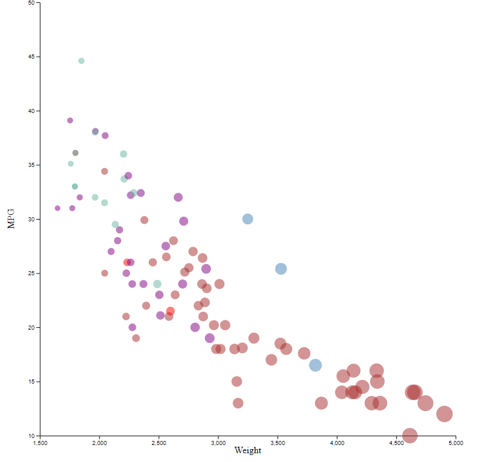
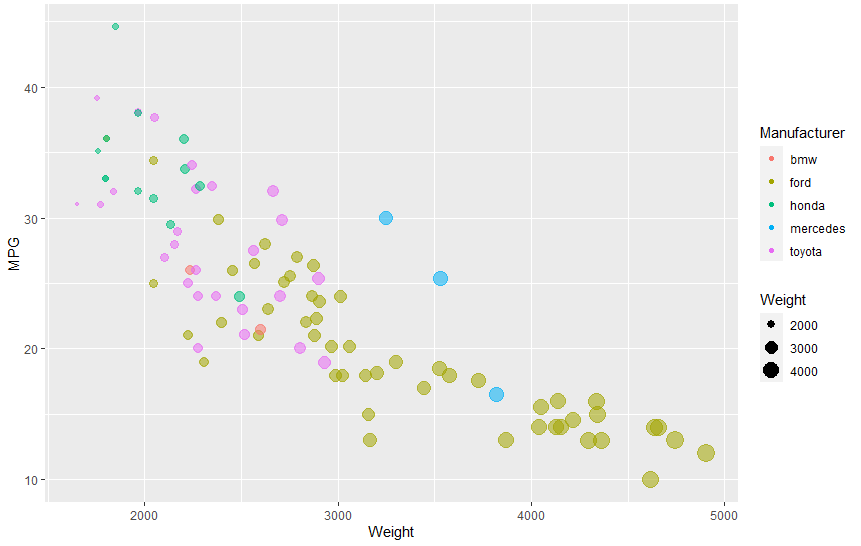
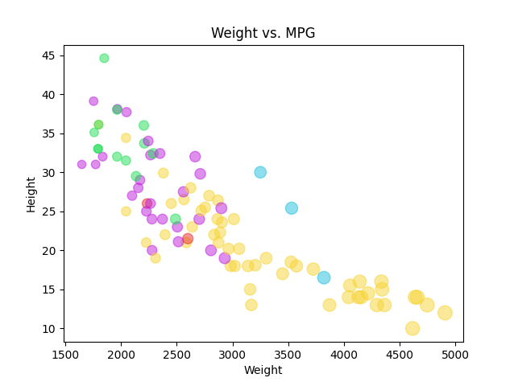
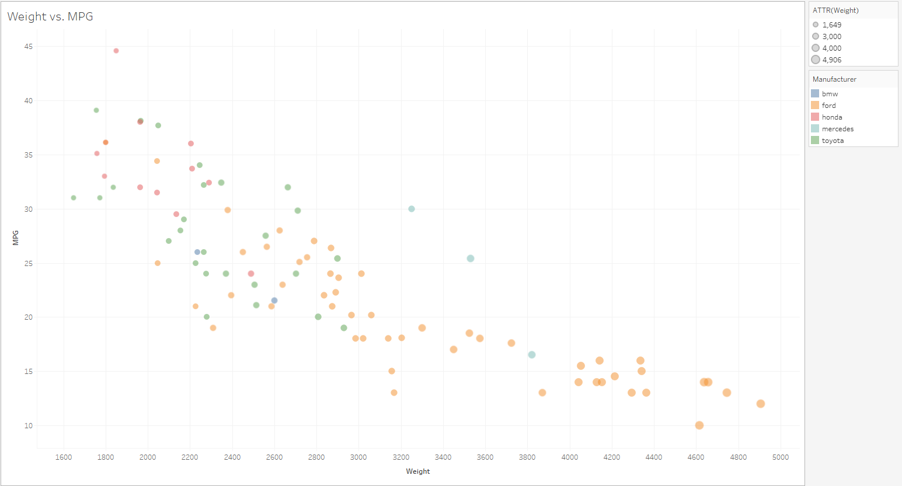
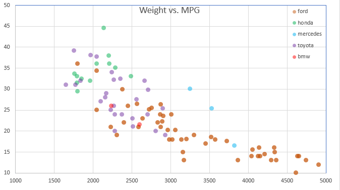

## D3 

D3 is a JavaScript library for manipulating documents based on data. 

To visualize the car dataset, I used d3.csv. The problem is that this function is asyncronous, which can cause the graph to be made before the graph data is populated. In order to fix this, I use a .then function after the d3.csv (d3.csv().then()) in order to solve this issue. 

To set the color of the circles based on the manufacturer, I created a function called setColor which has a switch statement that takes the manufacturer of the marker, and returns a color.

To solve the issue of incomplete data, any points that had x or y values  as "NA", the X value would be set to 100000 which would effectively remove that marker from the plot.

In order to set the size of the marker based on the weight, I would set the R value of the market to the Weight, and then /650 to make the marker size not too big.

## R + ggplot2

ggplot2 is a library for creating visuals from data.

To visualize this data, I used geom_point() to create a pretty looking scatterplot. I loaded the csv data from rawgithub and then used ggplot to create the scatterplot
GGplot makes it extremely easy to create a scatterplot with a built in scale, but I set alpha=False because that wasn't needed to be included in the legend.

## Python + Matplotlib

Matplotlib is a visual graphing library for python, and I use pyplot to create my scatterplot.

In order to correctly color the markers based on manufacturerer, I used a dictionary.
Like D3, I had to divide the Weights in order to make the points not too big for the graph. I then set X and Y axis titles to finish the creation of the graph.

## Tableau

Tableau is an interactive program made to create different visuals, while staying away from coding.

To create this scatterplot, I first imported the CSV data and then added the Weight and MPG data into the scatterplot
To create colors, I separated the data based on manufacturer. This automatically created different colors that I could then modify to have it look like I wanted.
To change the markers based on weight, I added another customizable option and included the markers to be sized by weight.

Many helpful features are automatically implemented, like hoverover

I then added legends for Weight and Color.
I had a lot of fun playing around with Tableau, and could see myself using it in the future.

## Excel

Excel is great for importing data quickly and do computation on multiple rows. I had difficulty separating the groups by manufacturer, so to make it easier for me I deleted all excess CSV data that was not needed for the graph. I need created different groups (after sorting the data based on manufacturer).

I then edited the colors to match the example graph. 

Changing the size of the markers based on weight seemed not possible for the way I was making the data, and Excel had poor documentation on how to do this.

## Technical Achievements

* Fixed the async nature of d3.csv by adding a .then() function after the csv is loaded

* Grouped manufactueres in Excel to group by manufacturer for coloring

* Filted ggplot legends to only show Weight and manufactureres

* Edited Tableau filtering option to allow 50% opacity of markers, as well as coloration

* Used dictionary for color section in matplotlib to streamline the graph creation

* Edited ranges from tableau and excel to better represent the data

##Sources

https://www.d3-graph-gallery.com/graph/scatter_basic.html
https://help.tableau.com/current/pro/desktop/en-us/buildexamples_scatter.htm
https://jcoliver.github.io/learn-r/004-intro-ggplot.html
https://www.excel-easy.com/examples/scatter-plot.html
https://stackoverflow.com/questions/32085531/importing-a-csv-file-into-python-to-make-scatterplots-and-histograms
