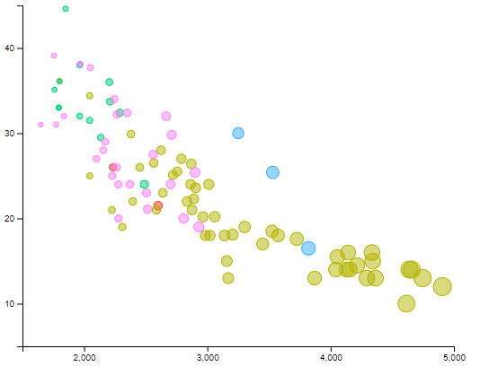
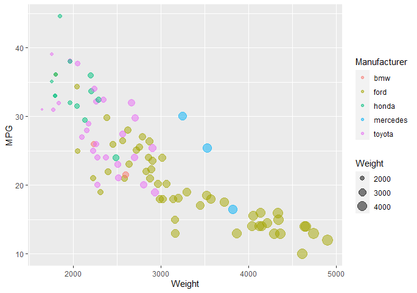
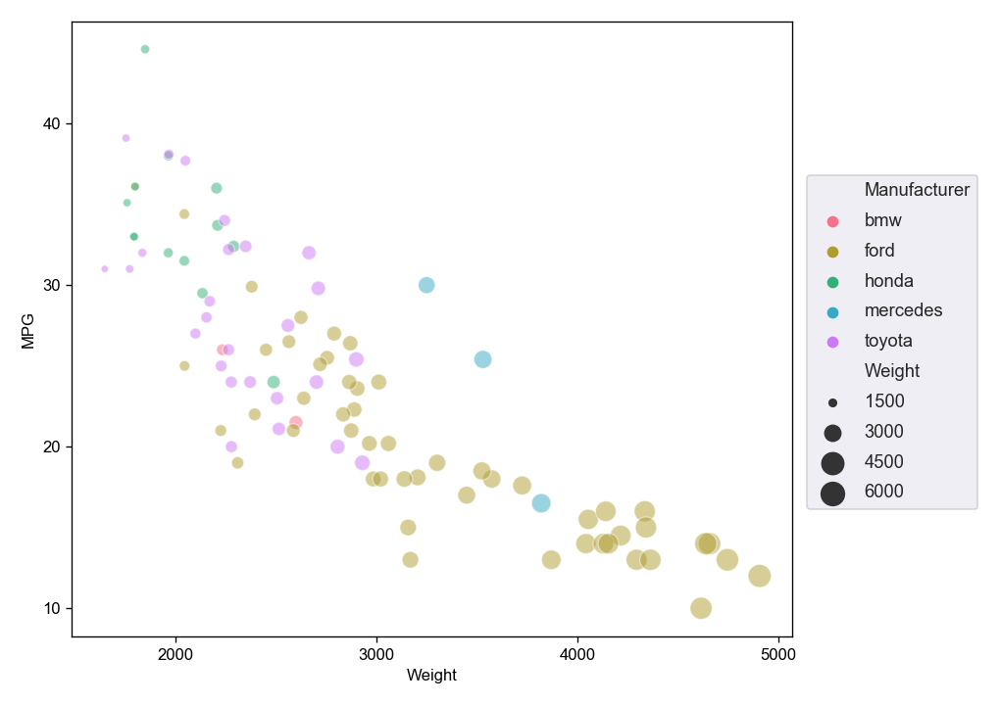
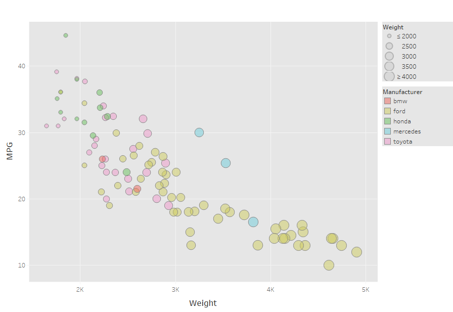

# 02-DataVis-5ways

Assignment 2 - Data Visualization, 5 Ways  

# Way 1: Javascript - D3

d3 is a great tool for creating custom visualizations. For this chart, I appended a circle for each datapoint (loaded via d3.csv), choosing the x, y, size, and color based upon data values. Creating the axes scale, and plotting the points was relatively simple. Putting in the x and y axes the way they were in the original was a bit difficult but very managable. Instead of creating a legend, I had planned to make the chart interactive. My plan was to have the information of each car displayed when hovering over that point. I was quickly able to generate a rectangle right above each point as I hovered over them, but was unable to get text to appear. I then switched to using the 'div' type, and tried various methods I found online. Sadly, I was never able to get a tooltip fully working or displaying. I'll get it to work on a later assignment or after this course.

## Reference Code Used for d3
- https://www.d3-graph-gallery.com/graph/bubblemap_circleFeatures.html
This was my starting point for determining how to adjust the bubble size based upon the Weight value. I followed their procedure of creating a column specifically for it. To do this, i used python to make a copy of the Weight column and scale the values between 2.5 and 10 as those provides sizes consistent with the original.

- https://github.com/d3/d3-axis
I used this source to understand the API for d3 axis

- https://github.com/bumbeishvili/d3-v6-tip
- https://bl.ocks.org/d3noob/180287b6623496dbb5ac4b048813af52
These were the main two sources I followed when attempting interactivity after deciding that my method of creating a rectangle and appending text inside was not the best approach. Unfortunatly, I was unable to get the tooltip working, though code I used which was taken and adapted from these sources remains commented out within my file.

# Way 2: R - ggplot2

It seems to me that this was how the original plot was generated. Using basic plotting functionality generated the exact plot without needing to adjust parameters in order to have the same colors, axes, and legend.

# Way 3: Flourish
[Way 3 - Flourish](https://public.flourish.studio/visualisation/5235975/)

It was my first time using this visualization studio, and everything was intuitive. I was able to match the plot very similarly to the original without much effort. It was also easy to pick the range the axes covered, though slightly more difficulty to uncover the setting to either choose how many tick marks there were or manually input your preference. Lastly, choosing the size variable for the bubble chart was easy, but in the end I was not able to make the size range match that from the original. In the future, I may use this to create quick, interactive plots. Without much effort on my end, the plot looks clean and professional, and can easily be shared on the web. Without a paid version of Flourish, everything is kept public. I will have to keep that in mind for any future applications.

# Way 4: Python - Matplotlib and Seaborn

Using python was relatively simple. I have experience creating scatterplots in python, and was able to quickly get very close. Customizing the x and y ticks a quick one liner. And I also had the freedom to customize the dot size range until it seemed like a perfect match for the original. For the colors, I decided to choose a preset palette which came out a great match. It is easy to create the legend and place it wherever you want. My only difficulty, was customizing the legend. I was unable to make it so that the "Weight" section looked identical. The spacing between the 'Manufacturer' and 'Weight' was also not perfect looking and I could not manage a fix. All in all, The plot quickly came out well enough, and I definetly plan to continue using python. It is super easy to functionalize plotting, which can then be run on many datasets, and easily re-run in the future.

# Way 5: Tableau

Similarly to Flourish, this was my first time using Tableau and it was quick to learn. The ploting looks very professional, and a close match to the original. I was unable to reorder the two legends, and customize the 'Weight' legend to be a perfect match. I now have the student version of tableau, and will certainly come back to it in the future for plotting. From my research, Tableau is very good for spatial/map plotting, which I'll definately make use of some time.

# Achievements:
## Technical Achievements
A technical achievement in this project was creating an interactive plot using Florish. The information for each car can be easily and intuitively displayed by hovering over it's point. This allows for users to know the exact x and y coordinate of every point, as well as the cars name. Without this method, there is no way to display the name of the car. While the manufacturers are categorical, and can be displayed via color, there are too many cars to do so as well (by shape for example). Because of this, the only way to know which car they are looking at without interactivity is to find the coordinates and look it up on a table. This interactivity allows for more information to be displayed than before possible, for one point at a time.

## Design Achievements
My design achievement was using consistent colors across my plots. I used an online color picker to choose suitable options, that fit the original. I was then able to input those hex codes into the various languages and programs I used for the other plots to result in a consistent product. 
