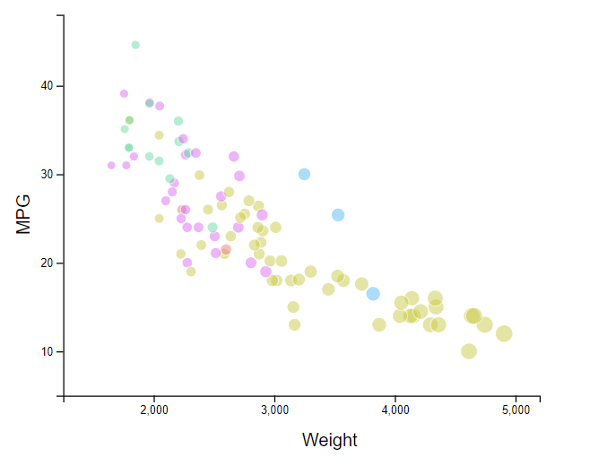
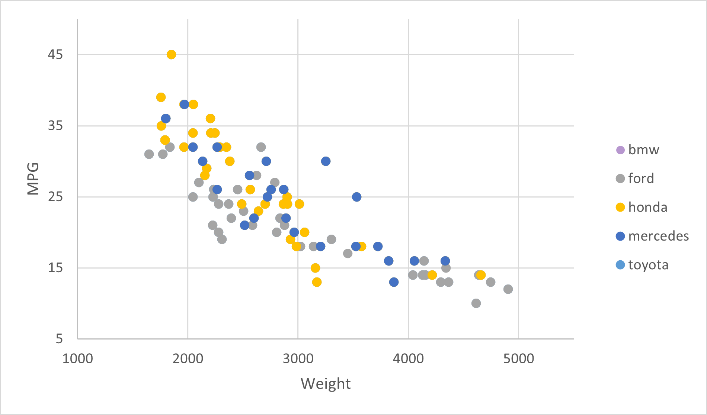
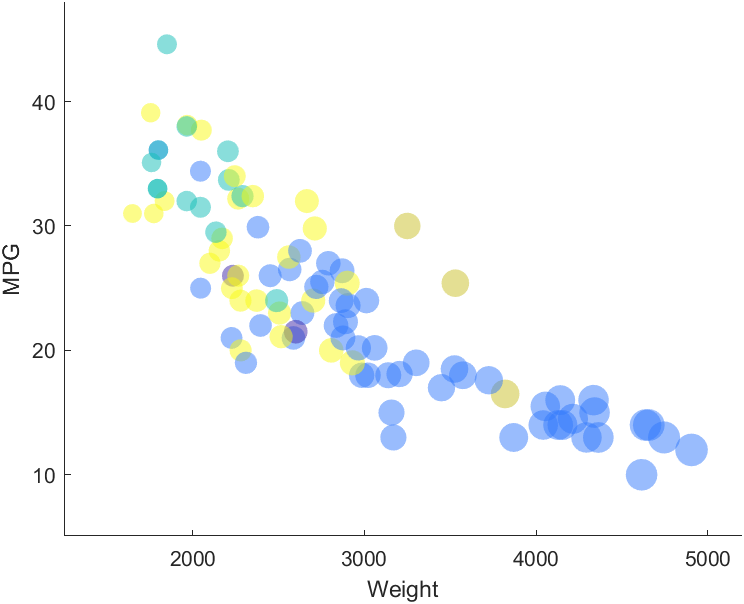

# d3, HTML, Javascript

Resources:

https://www.d3-graph-gallery.com/graph/scatter_basic.html
https://www.d3-graph-gallery.com/graph/custom_theme.html
https://www.d3-graph-gallery.com/graph/scatter_tooltip.html
https://www.digitalocean.com/community/tutorials/js-filter-array-method

After the introduction of d3 last week, I think that really helped me get a hang of things this week to make more progress and become more familiar with the toolset. The resources I used listed above were mostly starter code that were very helpful in formatting and learning about the specific plot we were required to make. It was very helpful in getting me to understand good coding practices when making visualizations with d3. Compared to the other methods of showing visualizations, I really liked how d3 had more of a separative approach when adding filters and other attributes such as the weighted plot points, categorical coloring, and the axis limitations. I thought this library was very good in organizing the different attributes and filters and the code seemed to be more readable than other libraries. Overall, I thought that this method of creating a visualization was really straightforward. This method seemed to work for a variety of datasets as we can specify very clearly what we want in a visualization.

# Excel

Using Excel was surprisingly one of the more difficult methods that I chose this week out of the five ways of replicating the graph. It took much longer than I expected to figure out the Excel tool. The data importing functionality in Excel was very useful for users that aren't as keen on coding. With this, I found it took a good amount of time to figure out that the Excel tool did not process that the "MPG" column has numerical data instead of text or "general" data. If I had more experience with this tool, I think that would be clearer from the beginning, however, it took quite a long time to figure this out. I think that with more use, the filter option on the Excel tool turned out to be very useful especially when it was time to filter out the rows with MPGs of "NA" value. I found it to be somewhat pretty obnoxious when trying to graph all the different colors and linking these categorically with the manufacturer of each car. This took awhile to get used to since we had to create a "series" and basically plot the datasets, after we filter them by manufacturer, on top of one another. I think this method of visualization would be very more useful for smaller datasets since it doesn't have a lot of complex capabilities. While I did try, I was not able to figure out how to plot the points with respect to the weights and the color of each manufacturer was pre loaded from already existing themes and those seemed to be more difficult to deviate from. Excel was, however, more user friendly when trying to add a legend after creating all the separate series. 

# MATLAB

Resources:

https://www.mathworks.com/matlabcentral/answers/72545-how-to-import-csv-file-in-matlab

My MATLAB expereince was pretty simple. After taking a course using and coding in MATLAB, I thought this was a pretty simple task to plot a loaded dataset. With simple if and else statements along with the strcmp (string compare) function, I thought that it was a very easy process in trying to categorize each manufacturer and graphing the data that way. This did make it more difficult to create a legend in order to specify each manufacturer, which is more of a trade off depending on what is more important to the user. MATLAB also has many different functions for all different kinds of plots and it had one for scatter plots as well which was very useful in our case here. It was also very simple to set the x and y limits as those are also built in functions to specify the range of the axis. I think this method of visualization would be very useful for datasets like this one or simpler ones. I don't think the MATLAB library would be very useful in complex datasets especially with its difficulties in fulfilling simple tasks such as creating legends. 
