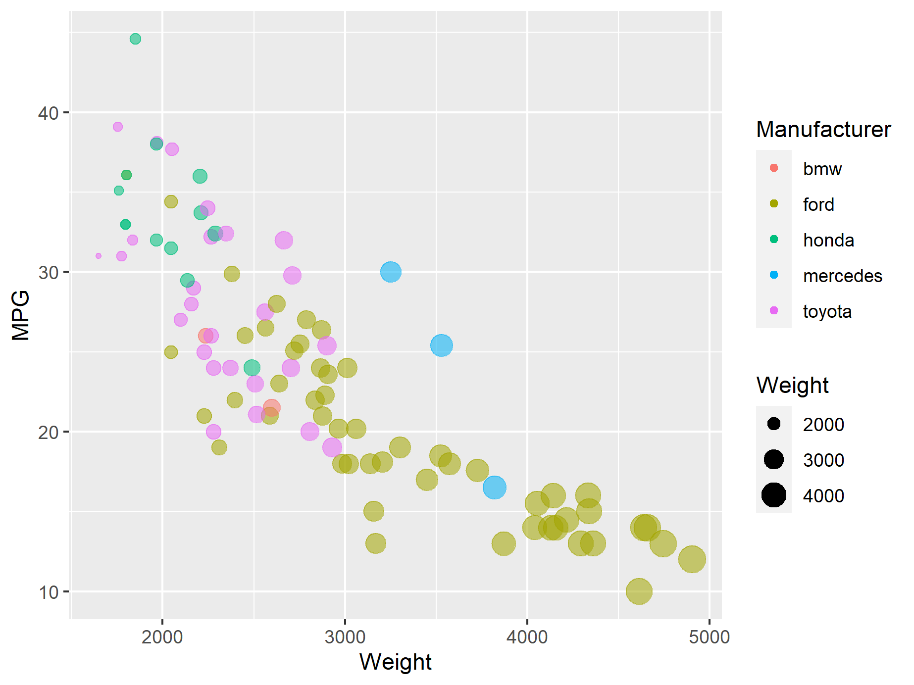
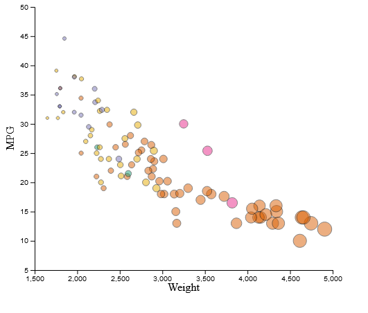
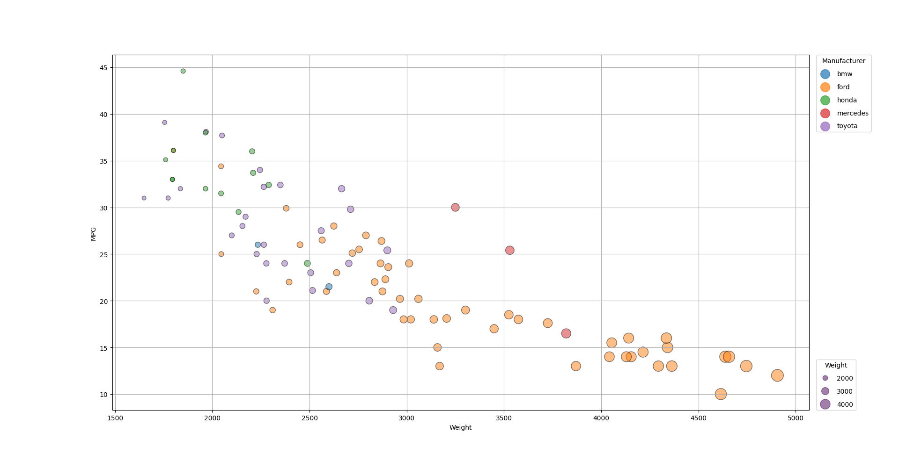
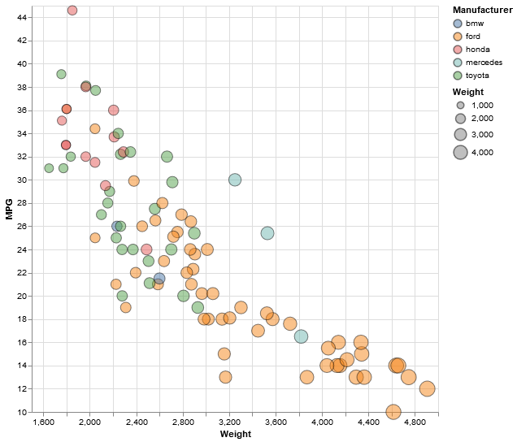
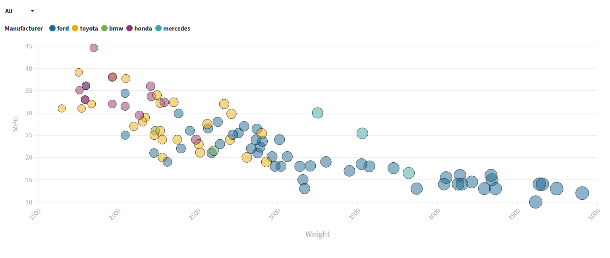

# 02-DataVis-5ways

# R + ggplot2

R is a programming language focused towards use in statistics and ggplot2 is an R library used for data visualization. 

Implementing the chart with these tools was very effortless and required very minimal code. R has a built in method to read CSV files making loading in the data easy. Once loaded in, generating the chart only required the use of three functions in a single line of code. 

I use the `ggplot()` function to generate the initial chart. The axises, their labels and the legend are automatically generated with very little need for further tinkering. Then I use the `geom_point()` function to alter the aesthetics of the chart (changing the color, altering circle size, changing alpha, etc.) as well as generate a legend based on the aesthetic changes. Finally I use the  `guides()` function to add and remove elements from the legend.  By adding the output of each function together in a single line of code, the chart below is created. These tools were simple, easy and pain free to use with little to no hassle and could be very useful in the future.    

# JavaScript + d3

JavaScript is a general purpose programming language primarily targeted towards web browsers. D3 is a JavaScript library used to created interactive data visualizations.

For my implementation,  I used code from [these](https://www.d3-graph-gallery.com/graph/bubble_color.html) [two](https://bl.ocks.org/d3noob/23e42c8f67210ac6c678db2cd07a747e) articles to help me form the base of my visualization and I used code from [here](http://bl.ocks.org/biovisualize/1016860) to add further polish. 

As I have previous experience with the d3, with the first assignment, implementing the chart was very easy. Though through this project I did find other very useful functions such as `scaleLinear()` which I used to limit the maximum and minimum size of the circles. I did have a little trouble with adding the axis labels, though it wasn't that major of a road block. Add the interactivity with both the buttons and tooltips were intuitive and effortless which is something I really enjoy about the library. The interactivity is something that stands out as it is something that isn't present in any of the other tools I used. In the future I think I will definitely look using this library even for the projects that doesn't require it. 

# Python + MatPlotLib + Pandas 

Python is a general purpose programming language, MatPlotLib is a Python library for creating plots and charts and Pandas is a Python library for reading and analyzing data. 

For my implementation, I used the code from [this](https://towardsdatascience.com/customizing-plots-with-python-matplotlib-bcf02691931f) article as a starting point with some additional help from [this](https://matplotlib.org/3.1.0/gallery/lines_bars_and_markers/scatter_with_legend.html) article. 

Creating the chart was very simple to begin with, Pandas made it very easy to import all of the data from the CSV file, however, I did have to manually enter the names of each column.  From there, creating the chart was simple as Pandas imports the data in a format that is compatible MatPlotLib. Plugging the data into MatPlotLib's `scatter()` function, I was able to create the basis for the plot below, even being able to control the aesthetics the circle using the one function. Adding the axis labels and grid were very simple to add and only required a single function to add each. However, adding the legends to chart was a major hassle with no clear solution. While MatPlotLib does have a simple `legend()` function, the outputs derived from it were no where close to usable. This led to me to have to create them manually which turned out to be a big headache. Creating the "Manufacturer" legend was simple, I essentially created another invisible plot to base the legend on. However, trying to create the "Weight" legend would result in the two being combined into one with no clear distinction between them. Thanks to the article mentioned above I was able to create a sort of hack where I create a `dict()` that I then base the legend on. While the tools seemed simple in the beginning, dealing with the legends was a real pain. Based on this experience with it, I'm hesitant to  use it again in the future, despite how popular it and Python are.

# Vega-Lite

Vega-Lite is a high level visualization tool with all code written as JSON files. 

 I using [this](https://vega.github.io/vega-lite/examples/point_color_with_shape.html) example as a starting point and I ran all of my code on [the onine editor](https://vega.github.io/editor/#/custom/vega-lite) 

Vega-Lite was easy to use and there isn't much I can say about my implementation, in a good way. The JSON syntax is really simple to use and there are a plethora of options to use to construct your chart. Being able to do everything in the browser app was very useful and I'm thankful that I can load the CSV file from a URL. The documentation is great and there is a host of examples to look at that will help you solve your question easily.  I would be very interested in using this in the future, especially since, according to the website, Vega-Lite interlopes very easily with its lower level sister project Vega. 

# Flourish

[Flourish](https://flourish.studio/) is a data visualization platform that lets you create charts and graphs entirely within your web browser. 

Flourish was by far the easiest and simplest tool to work with for the project. Creating the chart was as simple as dragging and dropping the CSV file into the browser and then selecting what columns I wanted to represent in the chart. Altering the size and colors was as simple as selecting the columns in the editor and the website knew exactly what I wanted to do with the data and how to handle it. Besides that, everything you see in the chart below is basically how the website creates the chart by default. My only issue I had was with the legend, while I was able to get a legend for the Manufacturers, however, I was unable to create a second legend and, therefore, was unable to create a weight legend. I'm impressed by this website, as mentioned before, the way it effortlessly handled altering size and color was astonishing. Despite my praise I'm not sure if I would use if for future projects. While it creating charts is easy,  some of the limitations it has, such as with the second legend, you are stuck with and can't code your own solution. I would definitely use it if I needed a single hand made chart, though if I wanted to generate many charts, I would probably look for a coding based alternative. 

# Achievements

## **Technical Achievements**
- For my D3 implementation, I have allow the user to select what from a variety of color schemes to display the data in in case they have difficulty viewing the data with a particular scheme.
- For my D3 implementation, I added tool tips whenever the user hovers their mouse over a dot. The tool tip displays the manufacturer, weight and MPG. Additionally, the tool tip has a white background that makes the text easier to see by covering any circle beneath it with a consistent background.
- For my MatPlotLib implemented, I figure out a way to create two seperate legends. 

### **Design Achievements**
- For as many implementations possible, I added an outline around the circles to help distinguish circles that may blend in together otherwise.  
- For my D3 implementation, I have allow the user to select what from a variety of color schemes to display the data in in case they have difficulty viewing the data with a particular scheme
- In my ggplot, d3 and MatPlotLib implementations I made the difference between the smaller and larger dots noticeable so people will see the difference while not making the dots too small as to have them not be viewable. 
- For my D3 implementation, I added tool tips whenever the user hovers their mouse over a dot. The tool tip displays the manufacturer, weight and MPG. Additionally, the tool tip has a white background that makes the text easier to see by covering any circle beneath it with a consistent background.

