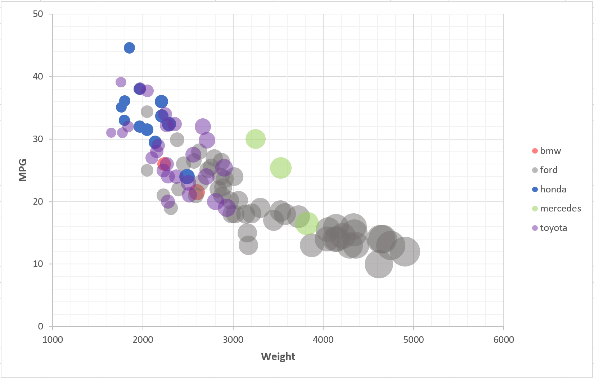
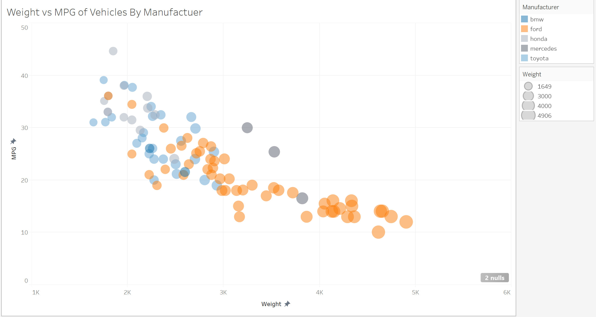
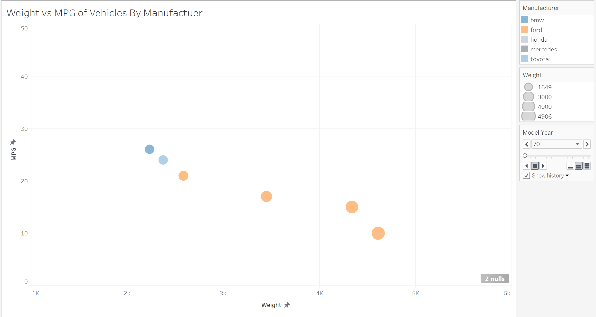

# Assignment 2 - Data Visualization, 5 Ways  
The goal of this project is to gain experience with as many data visualization libraries, languages, and tools as possible.
I used these languages, libraries, and programs to complete the assignment:
 * Excel
 * Tableau
 * R + RMarkdown + ggplot2
 * Python + mathplotlib + pandas
 * Javascript + D3

All following graphs were constructed using the  `cars-sample.csv` sample dataset
# Excel
The first graph I created was made using Microsoft Excel. I've used Excel countless times when visualizing graphical data but this was my first time using it for a weighted scatter plot. My first attempt at making the chart lead to deadends and problems when attempting to color vehicles based on manufacturer. To accomplish this I reffered to [this guide.](https://www.exceldashboardtemplates.com/dynamically-change-excel-bubble-chart-colors/) Utilizing the author's reccomendation of reconstructing the table by leveraging the series feature of excel charts by conditionally building each series using the `IF()` function, I was able to sort the data set into individual series for each manufacturer. Doing this additionally allowed me to produce a legend of manufacturers and their respective colored markers as the legend displays series.

My choice in color scheme for this iteration was to choose solid, contrasting colors in order to identify conflicting markers even with the lowered alpha level(opacity). This was extremely important within the dense, 2000-3000 weight range. Below is the chart I've referenced that has been generated in Excel. 

# Tableau
This was my first time working with Tableau. It's an intuitive and accessible visualization application. Within minutes of downloading I already completed the required aspects of the chart for the assignment which is a testament to the power of Tableau. Connectivity with local datasets is seamless and it's drag and drop tools made constructing the chart seamless. As seen below I was able to generate a chart nearly similar to what was provided as an example graphic in R.

The color scheme for this iteration was made using the color blindness theme provided by Tableau. I felt going this route is important for accessibility. The theme allows for markers to still be distinguishable.

Using the introductory tutorials provided by the application as my own experimenting led me to generating **2** graphics. The difference with the second graphic below is that it includes an animation tool to create pages based on year. The user is able to either manually scrub through years or have the animaiton play in ascending or descending years. When ascending by year, the prior year is included as a lower opacity "trail". Doing this visualizes the trends of MPG and weight of vehicles from the dataset.

# R + ggplot2 + R Markdown
This was also my first time working in R. Getting used to the language, the R Studio IDE, and the ggplot2 and R Markdown libraries was surprisingly more accessible than I originally imagined. R Markdown is similar in nature to those familiar with Jupyter Notebooks.

# Libraries, Tools, Languages

You are required to use 5 different tools or libraries.
Of the 5 tools, you must use at least 3 libraries (libraries require code of some kind).
This could be `Python, R, Javascript`, or `Java, Javascript, Matlab` or any other combination.
Dedicated tools (i.e. Excel) do not count towards the language requirement.

Otherwise, you should seek tools and libraries to fill out your 5.

Below are a few ideas. Do not limit yourself to this list!
Some may be difficult choices, like Matlab or SPSS, which require large installations, licenses, and occasionally difficult UIs.

I have marked a few that are strongly suggested.

- R + ggplot2 `<- definitely worth trying`
- Excel
- d3 `<- since the rest of the class uses this, we're requiring it`
- Matplotlib
- three.js `<- well, it's a 3d library. not really recommended, but could be "interesting"`
- p5js `<- good for playing around. not really a chart lib`
- Tableau
- Java 2d
- GNUplot
- Vega-lite <- `<- recently much better. look for the high level js implementations`
- Flourish <- `<- popular last year`
- PowerBI
- SPSS

You may write everything from scratch, or start with demo programs from books or the web. 
If you do start with code that you found, please identify the source of the code in your README and, most importantly, make non-trivial changes to the code to make it your own so you really learn what you're doing. 

Tips
---

- If you're using d3, key to this assignment is knowing how to load data.
You will likely use the [`d3.json` or `d3.csv` functions](https://github.com/mbostock/d3/wiki/Requests) to load the data you found.
Beware that these functions are *asynchronous*, meaning it's possible to "build" an empty visualization before the data actually loads.

- *For web languages like d3* Don't forget to run a local webserver when you're debugging.
See this [ebook](http://chimera.labs.oreilly.com/books/1230000000345/ch04.html#_setting_up_a_web_server) if you're stuck.

Readme Requirements
---

A good readme with screenshots and structured documentation is required for this project. 
It should be possible to scroll through your readme to get an overview of all the tools and visualizations you produced.

- Each visualization should start with a top-level heading (e.g. `# d3`)
- Each visualization should include a screenshot. Put these in an `img` folder and link through the readme (markdown command: ``.
- Write a paragraph for each visualization tool you use. What was easy? Difficult? Where could you see the tool being useful in the future? Did you have to use any hacks or data manipulation to get the right chart?

Other Requirements
---

0. Your code should be forked from the GitHub repo.
1. Place all code, Excel sheets, etcetera in a named folder. For example, `r-ggplot, matlab, mathematica, excel` and so on.
2. Your writeup (readme.md in the repo) should also contain the following:

- Description of the Technical achievements you attempted with this visualization.
  - Some ideas include interaction, such as mousing over to see more detail about the point selected.
- Description of the Design achievements you attempted with this visualization.
  - Some ideas include consistent color choice, font choice, element size (e.g. the size of the circles).

GitHub Details
---

- Fork the GitHub Repository. You now have a copy associated with your username.
- Make changes to fulfill the project requirements. 
- To submit, make a [Pull Request](https://help.github.com/articles/using-pull-requests/) on the original repository.

Grading
---

Grades on a 120 point scale. 
24 points will be based on your Technical and Design achievements, as explained in your readme. 

Make sure you include the files necessary to reproduce your plots.
You should structure these in folders if helpful.
We will choose some at random to run and test.

**NOTE: THE BELOW IS A SAMPLE ENTRY TO GET YOU STARTED ON YOUR README. YOU MAY DELETE THE ABOVE.**

# R + ggplot2 + R Markdown

R is a language primarily focused on statistical computing.
ggplot2 is a popular library for charting in R.
R Markdown is a document format that compiles to HTML or PDF and allows you to include the output of R code directly in the document.

To visualized the cars dataset, I made use of ggplot2's `geom_point()` layer, with aesthetics functions for the color and size.

While it takes time to find the correct documentation, these functions made the effort creating this chart minimal.

# d3...

(And so on...)

## Technical Achievements
- **Proved P=NP**: Using a combination of...
- **Solved AI Forever**: ...

### Design Achievements
- **Re-vamped Apple's Design Philosophy**: As demonstrated in my colorscheme...
