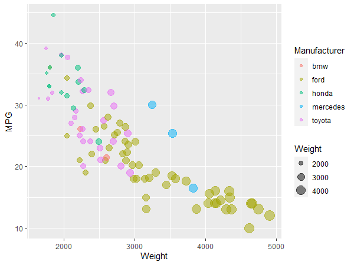
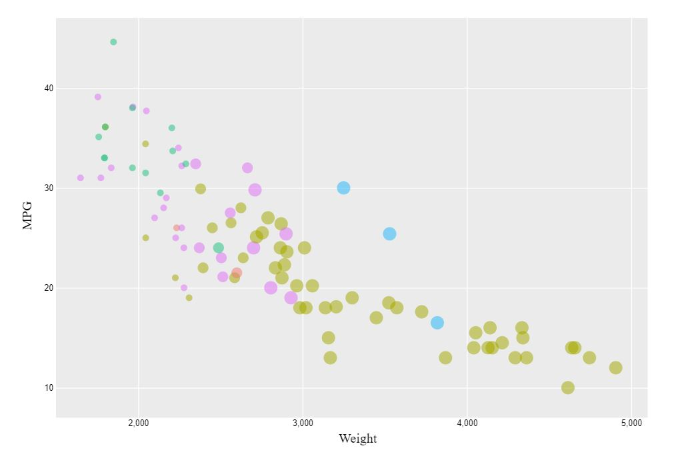
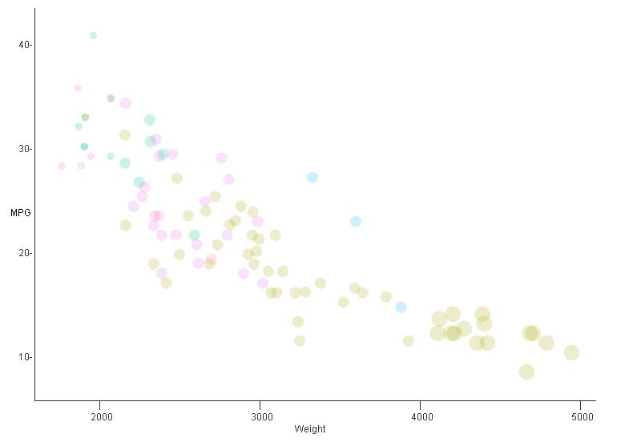
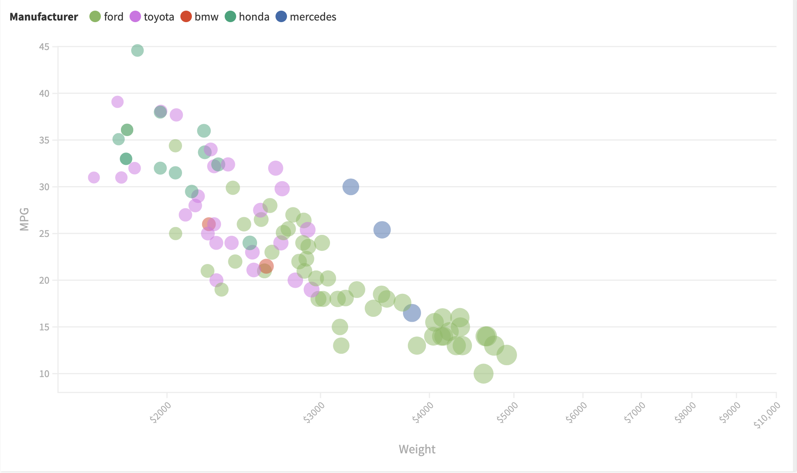

# 02-DataVis-5ways
Assignment 2 - Data Visualization, 5 Ways  
===

# R + ggplot2

To visualize the cars dataset in R, I used ggplot's aes() functionality to draw the circles
in different sizes and colors and geom_point() layer to modify the opacity of the circles

Resources Used:

http://www.sthda.com/english/wiki/ggplot2-scatter-plots-quick-start-guide-r-software-and-data-visualization

https://www.rdocumentation.org/packages/ggplot2/versions/3.3.3

# d3

I used d3.csv() to load the sample csv file into d3. All other factors of this
visualization are made with d3 shape building and data binding.

Templates Used:

https://www.d3-graph-gallery.com/graph/scatter_basic.html

https://www.d3-graph-gallery.com/graph/custom_theme.html

# Java 2d

To visualize this dataset in Java JFrame, I utilized the Graphics2D class.

Template Used:

http://forum.codecall.net/topic/54232-making-scatter-plot-graphs-in-java/

# Tableau

# Flourish
I used the free version of Flourish. Due to some constraints,
the tick marks could not be adjusted.

## Technical Achievements
- **non-requirements**: d3, Tableau, ggplot have a gray colored background and background pane

### Design Achievements
- **colors**: matched the colors of the original reference circles
