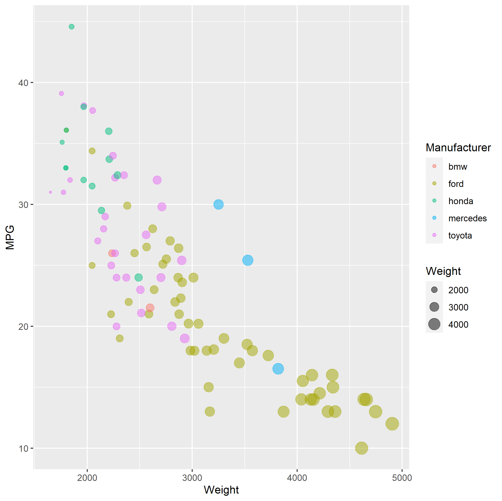
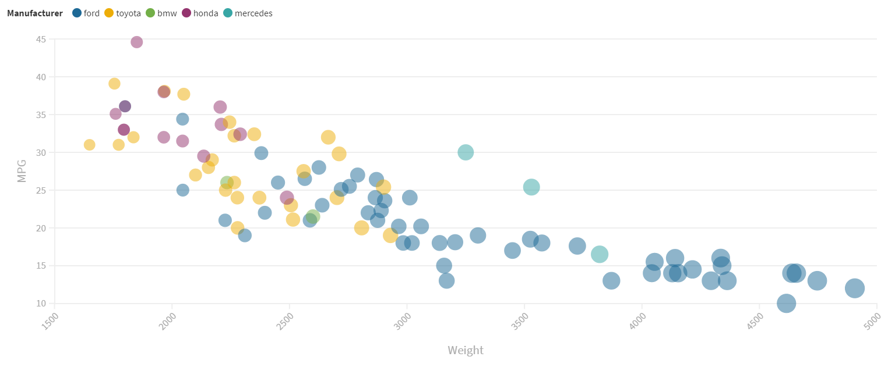
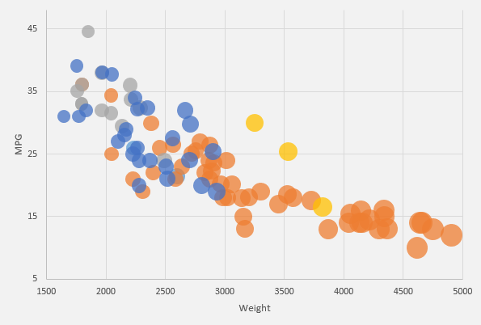

# 02-DataVis-5ways

Assignment 2 - Data Visualization, 5 Ways  
===

features to preserve

- Data positioning: it should be a downward-trending scatterplot as shown.  Weight should be on the x-axis and MPG on the y-axis.
- Scales: Note the scales do not start at 0.
- Axis ticks and labels: both axes are labeled and there are tick marks at 10, 20, 30, etcetera.
- Color mapping to Manufacturer.
- Size mapping to Weight.
- Opacity of circles set to 0.5 or 50%.

features not required:

- The background grid.
- The legends.

Note that some software packages will make it **impossible** to perfectly preserve the above requirements. 
Be sure to note where these deviate.

Improvements are also welcome as part of Technical and Design achievements.

Libraries, Tools, Languages
---

done

- R + ggplot2
- Flourish

next

- Excel
- d3 `<- since the rest of the class uses this, we're requiring it`
- Matplotlib

maybe

- p5js `<- good for playing around. not really a chart lib`
- Tableau <- `<- popular last year`

Tips
---

- If you're using d3, key to this assignment is knowing how to load data.
You will likely use the [`d3.json` or `d3.csv` functions](https://github.com/mbostock/d3/wiki/Requests) to load the data you found.
Beware that these functions are *asynchronous*, meaning it's possible to "build" an empty visualization before the data actually loads.

- *For web languages like d3* Don't forget to run a local webserver when you're debugging.
See this [ebook](http://chimera.labs.oreilly.com/books/1230000000345/ch04.html#_setting_up_a_web_server) if you're stuck.

Readme Requirements
---

A good readme with screenshots and structured documentation is required for this project. 
It should be possible to scroll through your readme to get an overview of all the tools and visualizations you produced.

- Each visualization should start with a top-level heading (e.g. `# d3`)
- Each visualization should include a screenshot. Put these in an `img` folder and link through the readme (markdown command: ``.
- Write a paragraph for each visualization tool you use. What was easy? Difficult? Where could you see the tool being useful in the future? Did you have to use any hacks or data manipulation to get the right chart?

Other Requirements
---

0. Your code should be forked from the GitHub repo.
1. Place all code, Excel sheets, etcetera in a named folder. For example, `r-ggplot, matlab, mathematica, excel` and so on.
2. Your writeup (readme.md in the repo) should also contain the following:

- Description of the Technical achievements you attempted with this visualization.
  - Some ideas include interaction, such as mousing over to see more detail about the point selected.
- Description of the Design achievements you attempted with this visualization.
  - Some ideas include consistent color choice, font choice, element size (e.g. the size of the circles).

Plots
---

# R + ggplot2

Without much experience in R I was quite hesitant to pick up this library, oh man I’m glad I did. The documentation is amazing (https://ggplot2.tidyverse.org/reference/index.html) and was the only thing I needed to replicate this graph in record time, aside from the usual “how make library and code go brrr”. The few lines of code required consisted of exactly, load library, load data, make super crazy all in one amazing plot, and save image. Just like that, legends for the attributes and gridlines built in, I see now why this is such a powerful tool. Especially with a target in mind, finding the functions I needed was a breeze. I do think I would get a little caught up if I did not have such a clear-cut idea of what I wanted to create; thought with some great documentation it looks to be fun to explore.

# Flourish

I looked up Flourish to check it out not realizing that I would be done replicating the plot within the next 5min! Without having to write a single line of code it was only a dozen or so clicks to get the data loaded and plotted just the way I needed. This is a great tool for getting something done in a snap. Although it is quite fast there is a lot of flexibility taken away from having this check box approach. Even something as simple as placing the legend on the right of the graph did not seem possible without writing something yourself and without access to the HTML (unless paid for) there is no room to expand upon what the tool creates for you.

Personally, I would not use this tool very much as I would prefer the flexibility that programming myself gives me.

<a href="https://public.flourish.studio/visualisation/5258253/" target="_blank">Flourish vis</a>

# Excel

Excel would not be my first choice when making a vis. It was easy to separate the data quickly, however, navigating through the same three windows over and over again selecting the data to build the bubble chart exactly the way I wanted was repetitive and tedious. If I were working with a much larger dataset, I would quickly move over to a programming language that would allow me to separate and map data recursively instead of adding each grouping individually.

## Technical Achievements
- **Proved P=NP**: Using a combination of...
- **Solved AI Forever**: ...

### Design Achievements
- **Re-vamped Apple's Design Philosophy**: As demonstrated in my colorscheme...
