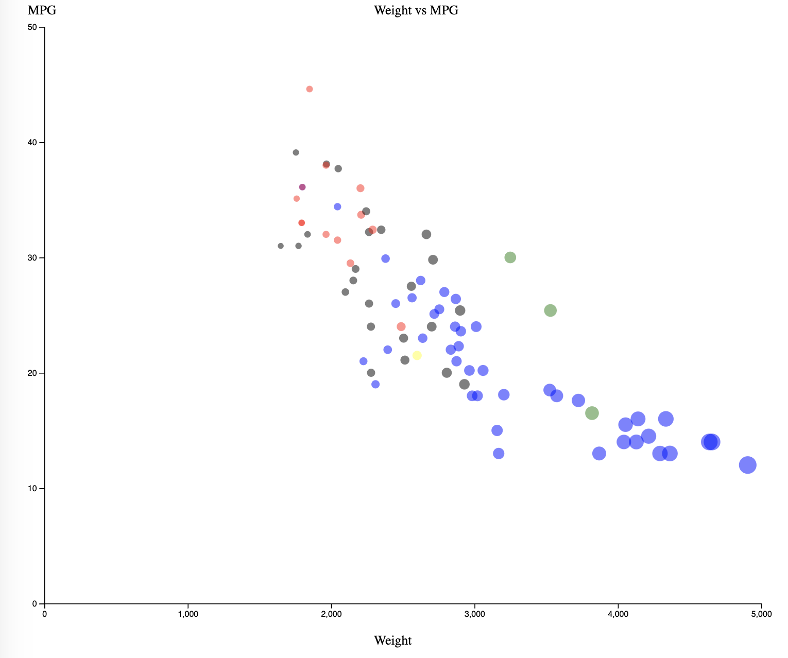
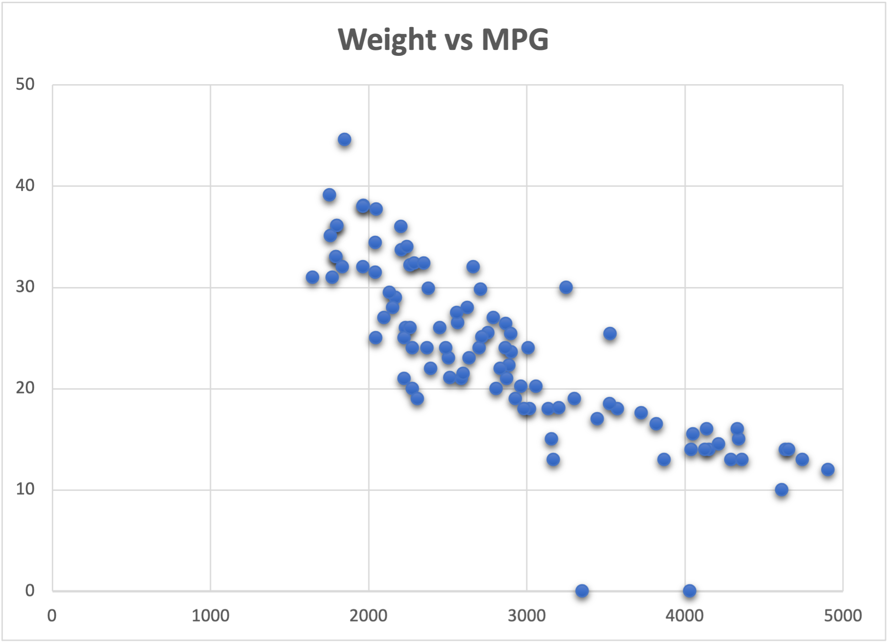
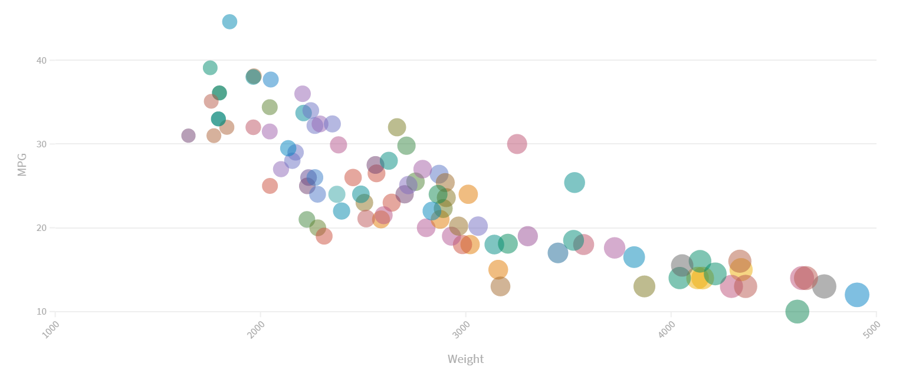
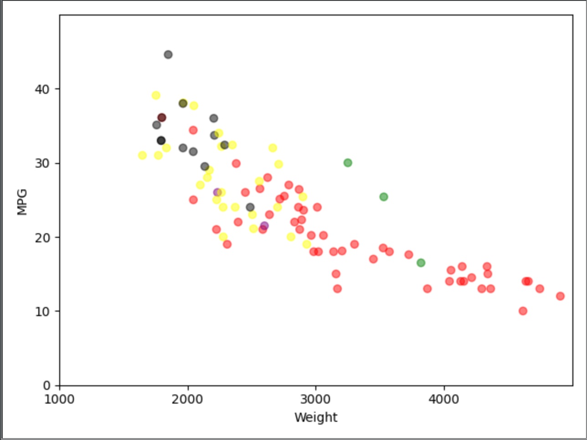
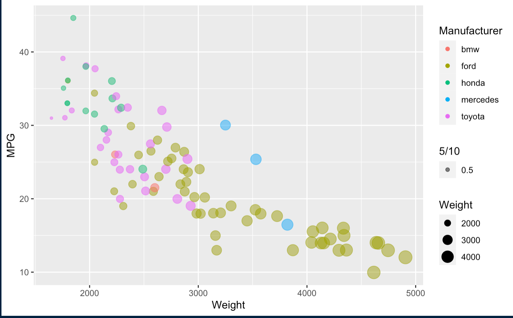

# 02-DataVis-5ways

Assignment 2 - Data Visualization, 5 Ways  
===

Here is the graph that was recreated in D3 with the requirements met. As for design achivements there aren't any super noteworthy unless choosing my own colors counts, I also designed my code in a way that the color uses the manufacturer to pick a color from the array, allowing for dynamic colors. Long term if you would have a lot of manufactureres, this would not be idea but for the scope and design of this project it allows for very quick and simple color changing. In addition to this, I attempted a technical achievement, in mouseover tooltips but could not get it to work correctly.

I struggled a lot with excel as I couldnt find many conventional ways to alter the color of the points based on weight for size and manufacturer for color. In addition to this, I didnt find good or creative ways for the design or technical achievements besides making the points pop on the screen to better display where they are on the grid.

Flourish was pretty straight forward to display correctly, the entire process was very streamline. As for technical and design achievements I picked some colors that just allowed for each individual thing stand out better allowing for better visibility on the graph itself.

The python one was simple to get matplotlib working properly, the only design change that I ended up making was the colors for distinguishing reasons. No tech or design achievements.

Using ggplot2 was very straight forward. It practically did it all for me. No tech or design achievements.
