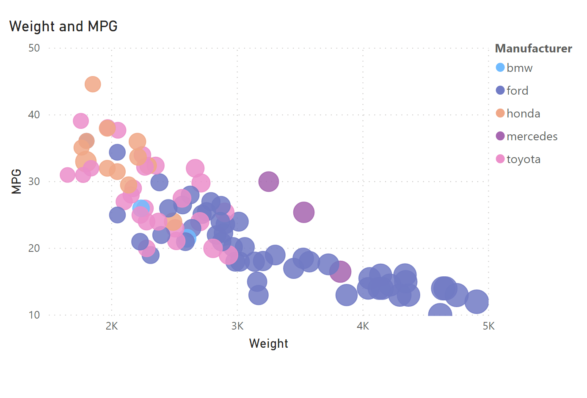
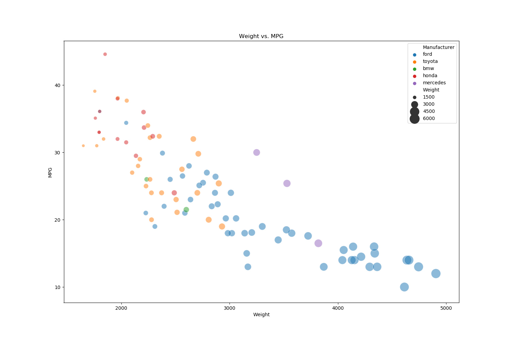
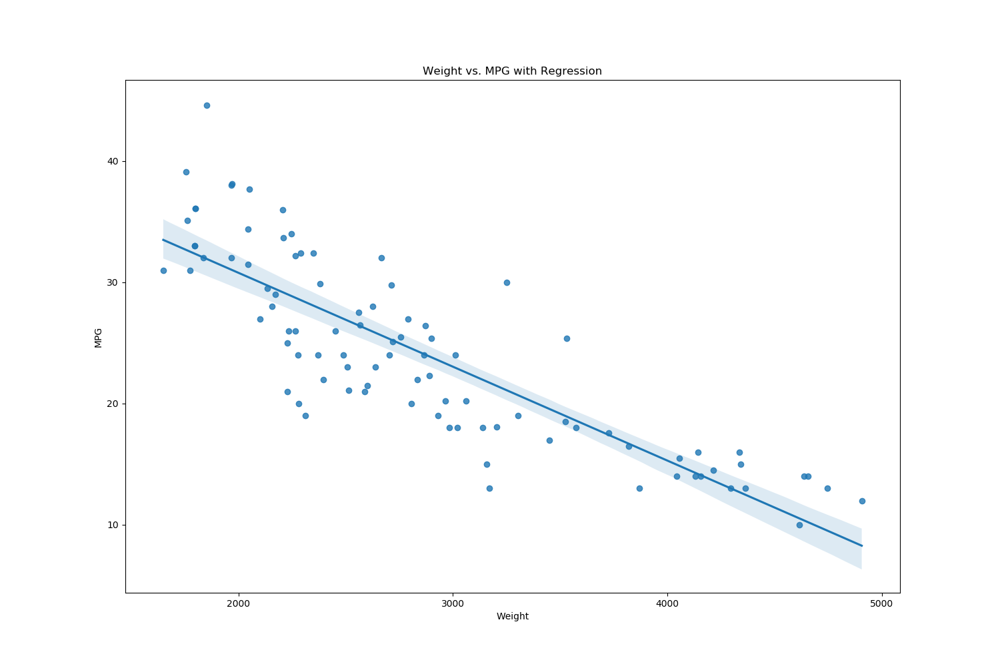
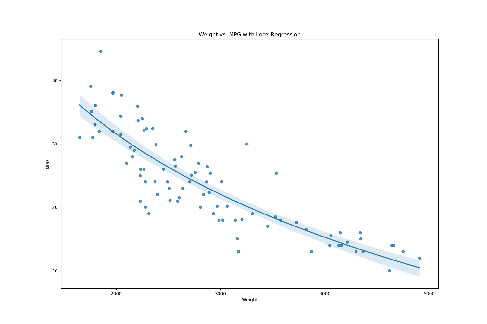

# 02-DataVis-5ways

Clay Oshiro-Leavitt
CS480X

Assignment 2 - Data Visualization, 5 Ways  
===

Readme Requirements
---

# D3js

Javascript + html are a common paring for building web based visualizations. 
D3js is a popular visualization for data visualization built on Javascript.

While d3js is not the simplest to use compared to other platforms like R, Flourish, or PowerBI, the versatility and flexibility that comes with the additional setup required clearly illustarte as to why it is such a popular and common visualization tool. Perhaps one of the best features of d3js is the massive community and widely available documentation. In most instances, the visualization that one may want to create already has a similar example published, so it is easy to find inspiration for how one could implement it themselves.

# Flourish

Flourish is a powerful web based tool for rapidly creating data visualizations.

While there is no code to include (due to the web based nature), I did include a screenshot of the editor in the 'Flourish' directory. To create a visualization in Flourish, one first selects the type of visualization they wish to create from a list of possible options. This then creates a basic sample visualization from a precompiled data set. To upload one's own dataset, they just need to navigate to the 'data' tab in the editor. Flourish is quite convenient with its power and modularity. However, I found some aspects of the UI lacking and difficult to use. For example, to change the demarcations on the axis ticks, one needs to flip a toggle buried inside the axis menus and then change a setting to enable manual control of the setting. After that, the user can either enter the markers manually or set select the number of ticks that should be displayed (changing the range of each tick). There was no indication of this in the UI at all. However, there are some wonderful features - as seen in the created graphic, it was quite simple to produce individual trend lines for each manufacturer's dataset. 

# PowerBI

PowerBI is a powerful business analytics tool developed by Microsoft. 

PowerBI allows for the creation of interactive data dashboards featuring numerous graphical visualizations. Once again, it is trivial to create a bubble graph with this software. However, uploading data was rather fickle. As the dataset was not fully cleaned (some values were missing), PowerBI could not interpret the fields properly so it tried to display the 'MPG' values as strings, rather than numbers. The UI gave no indication of this issue, and would not give an indication of why you could not create a visualization - instead it would just throw a generic error. However, after cleaning the data, it was quite simple to create a bubble plot, with a simple drag+drop mechanism for assigning features to various axes or attributes of the plot.

# Python + Seaborn + Pandas

Python is a general purpose programming language.
Seaborn is a plotting library built on top of Matplotlib in Python.
Pandas is a popular data processing library in Python.

To visualize the dataset, I loaded the csv dataset using the Pandas into a dataframe object. This was then passed to a Seaborn plotting command which allowed me to create a bubble chart with size determined by the 'weight' feature and hue determined by 'manufacturer'. I then made use of Seaborn's Regplot commands to create visualizations featuring regression lines, one linear and one log(x). Frustratingly, these regplots do not have the same modularity as Seaborn's other plots, making it impossible to create a bubble chart or change colors based on another feature.

# R + ggplot2

R is a language primarily focused on statistical computing.
ggplot2 is a popular library for charting in R.

To visualize the dataset, first I loaded the csv into R. I then removed rows containing missing data to clean the dataset. Afterward, I loaded the data into a ggplot command with the aesthetics being determined by the geom_point() layer, with data point size being determined by the car's weight, the alpha of the data points set to 0.5, and the colors of the data points mapped to their respective manufacturer. The figure was then saved as a .png. While R can be rather obtuse with incredibly specific commands and a somewhat strange syntax, it is incredibly powerful and can reduce visualizations down to a single line of code.

# Design Achievements
For this week's project, I decided to explore some additional features that could enhance the design and ease of reading for the visualizations. Perhaps the simplest way of improving a visualization is the inclusion of a title. While trivial to add, a title quickly tells the viewer what, exactly, they are viewing and what information is being presented. 

I also explored the use of trend lines for data representation. In both Flourish and Python, I added trendlines to the data. In Flourish, I added a linear trend line for each manufacturer's car models. Meanwhile in Python, I applied a trend line for the entire sample of cars. Here, I opted to use two types of trend lines - a simple linear trend, as well as a log(x) regression. These regresssions also include an error band for the observations. Regression lines are useful for examining overall trends in the data and can also illustrate more complex patterns underlying the data.

Lastly, I made the design choice to drop datapoints that lacked data (NA). This was done in Power BI, R, and Python. I decided that since the information was missing, there were several ways forward - interpolate a population mean for the value, interpolate a value based on cars from the same manufacturer, substitute them with zeros, or remove them. For this case, I opted to remove the offending entries. In smaller datasets such as this, is can be dangerous to interpolate new datapoints from such a small population. These values may not be truly representative of what they are trying to represent, so it is often better to remove them.

