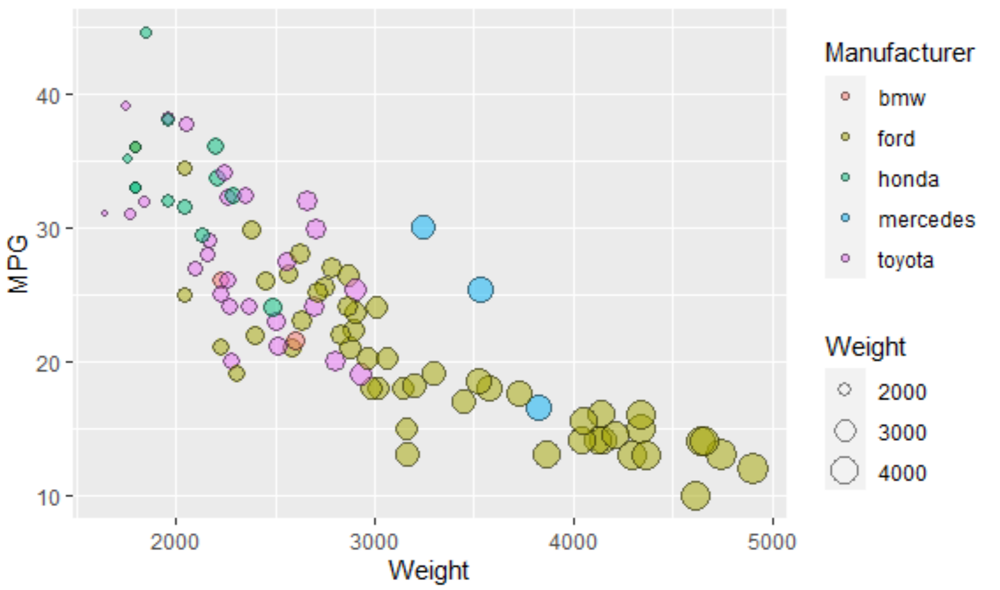
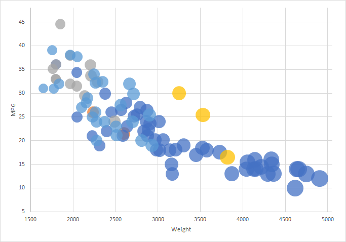
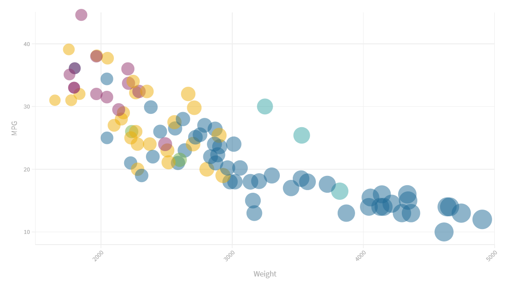
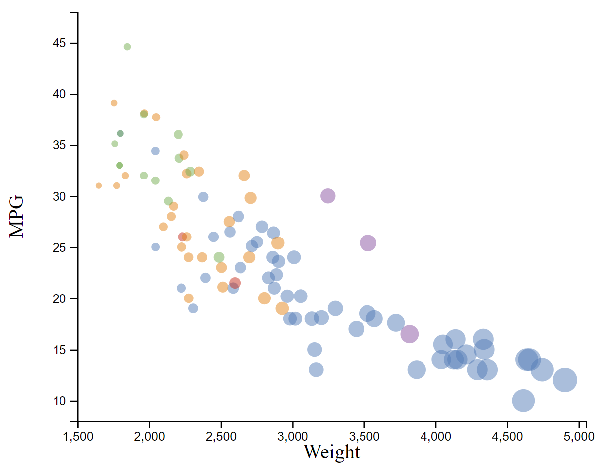
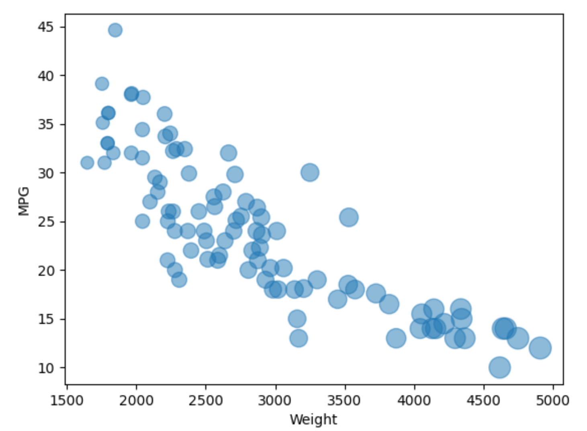

**NOTE: THE BELOW IS A SAMPLE ENTRY TO GET YOU STARTED ON YOUR README. YOU MAY DELETE THE ABOVE.**

# R + ggplot2

R was extremely easy to use. The documentation definitely required a bit of effort to find, but once I got everything, it was as the original readme said: the geom_point() layer made every adjustment to the points trivial. Although not the most intuitive- layers take a bit of effort to wrap your mind around- I could see it being useful for any sort of static scatterplots in the future.

I got started using code from https://jcoliver.github.io/learn-r/004-intro-ggplot.html.

# Excel

Despite myself having a lot of experience with excel, the charts were surprisingly finnicky. The obtuse language around series made it necessary to interface with everything through the GUI, which could be a bit strange. I was also thrown for a loop on choosing a bubble chart vs a scatter plot. That said, it was very easy for me to adjust things like axis titles and scales once the chart was created. I did have to reorganize the data by manufacturer so I could add each manufacturer as a series in order to get different colors (annoying), and I used a garbage massive value which I then hid on the plot in order to get point sizes working properly. It could be useful for very simple plots, but I see it getting too cumbersome with more data and any degree of customization whatsoever.

Said garbage value technique was taken from https://www.extendoffice.com/documents/excel/2345-excel-change-bubble-size.html.

# Flourish

Flourish was perhaps the easiest to use tool of all, with an exremely intuitive GUI and expansive settings. If I ever have to create a static scatterplot from a CSV file (or not, even manual data entering looked intuitive) I'll definitely be using this. No downloads, even! 

The chart can also be found online at https://public.flourish.studio/visualisation/5282200/.

# d3

d3, ironically, proved itself hard to use. Ironically, it was hard for the exact reasons excel was easy- things like axis labels proved extremely difficult, but changing the color and size of the points was very easy. I imagine this is because d3 is more often used for more complex graphics, and primitive things like simple text boxes are a bit clunky. That's my thought, anyway. Setting the circle properties made eveything relating to the points easy. Eliminating the NA values was also strangely obtuse, but I ended up doing it by making sure every item's MPG had an integer value.

My d3 code is a frankenstein of several different sources. I got the procedure for loading files from https://www.tutorialsteacher.com/d3js/loading-data-from-file-in-d3js, a basic scatterplot skeleton from https://www.d3-graph-gallery.com/graph/scatter_basic.html, and the methods to change bubble size and color from https://www.d3-graph-gallery.com/graph/bubble_template.html. I got my hacky method to eliminate non-integer MPG values from https://www.inventpartners.com/open-source/free-web-software/javascript_is_int.

# Python + matplotlib + numpy

The black sheep of the bunch. Setting up the skeleton of a scatterplot with .scatter and .genfromtxt was extremely easy, and so was changing the size by specifying a single parameter. Each of the axes were one line. The accursed colors, though, were hard bordering on impossible- every source I looked for had some kind of wacky solution that involved libraries that undid the elegant solutions for the rest of the plot. Frustrating, and I never figured it out. I won't be going back anytime soon. Installing all those libraries also took a long time, too.

https://www.kite.com/python/answers/how-to-plot-data-from-a-csv-file-in-python served as the backbone for the code.

## Achievements

I did one plot five times in five different tools, three of which were in completely unfamiliar languages. If this doesn't mean anything, I take the -24 with shame.
