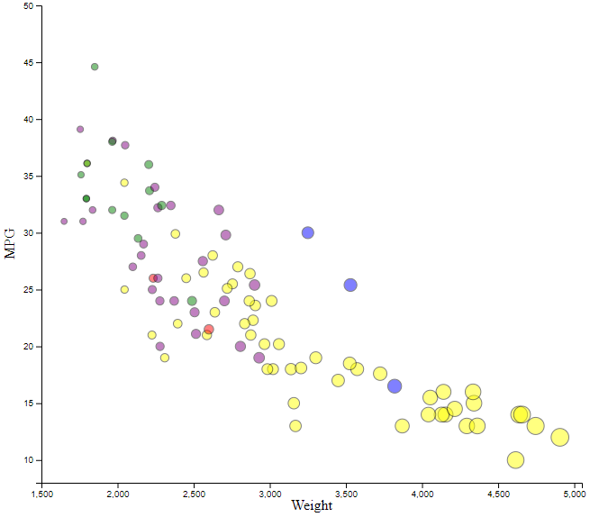
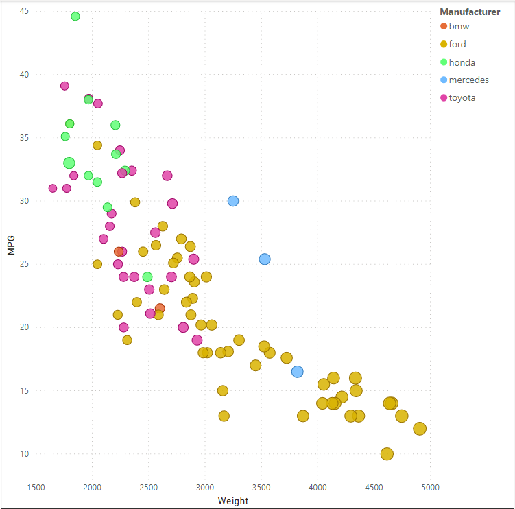

# 02-DataVis-5ways

Nicholas Alescio - Assignment 2 - Data Visualization, 5 Ways  
===

In this project, five visualizations were created for one dataset. Three languages (JavaScript, Python, R) and two visualization tools (Flourish, PowerBI) were used in this project.

# R + ggplot2

R is a language primarily focused on statistical computing.
ggplot2 is a popular library for charting in R.

To visualized the cars dataset, I made use of ggplot2's `geom_point()` layer, with aesthetics functions for the color and size.

Since I had never used R before, it took me a decent amount of time just to figure out how to run a script... eventually I found good documentation and everything worked out!

# d3.js

D3 is a JavaScript library for visualizing data with HTML, SVG, and CSS.

The challenge here was finding a way to make everything actually appear in the location I wanted things to be (my circles kept rendering off the screen). Margins helped me tremendously with solving that issue. I also included some code to hide n/a values. D3, being a JavaScript library, only serves to make JavaScript more powerful and more flexible for any and all vizualization tasks.

# Python + Seaborn

Python is an interpreted language that can be used for pretty much any high-level task, popular due to its vast amounts of libraries. For this viz, the Seaborn library (based on matplotlib) was used. This viz was the most straightforward and caused me the least issues. The only complication I ran into was having to use the pandas library to import the csv, since it was being pulled locally and not over the internet. Because of Python's flexibility and general-purpose nature, I see it being useful for any simple vizualization task.

# PowerBI

PowerBI is a Microsoft tool used for creating vizualizations in the field of business intelligence. Expecting this to be the easiest of the five, PowerBI ended up providing the most issues for me. Issue number one was needing to clean the data in order to display MPG on the y-axis (and also changing the data type of the MPG column, which defaulted to "Text" because of N/A values. Issue number two was trying to figure out how to scale points based on Weight, which didn't end up working out too great because PowerBI doesn't like using individual data points for sizes in their "Scatter" viz.

# Flourish

Flourish is a free, online data viz platform that allows users to quickly create interactive visualizations. This viz took me the least amount of time, and I found it to be very user-friendly (having no experience, it took me ~5 minutes to create the viz I was looking for).

## Technical Achievements
- **Automatic hiding of n/a values in d3**
- **Filtering out n/a values in PowerBI and reinterpreting datatype for MPG column**

### Design Achievements
- **Re-vamped Apple's Design Philosophy**: Haha just kidding, I'm not smart enough for that
