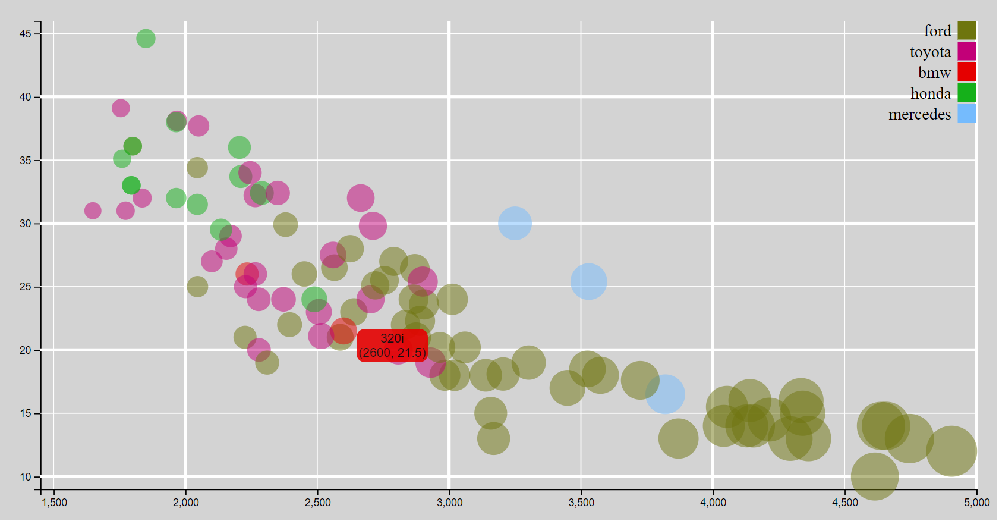
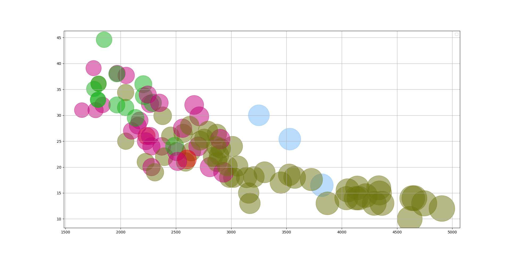
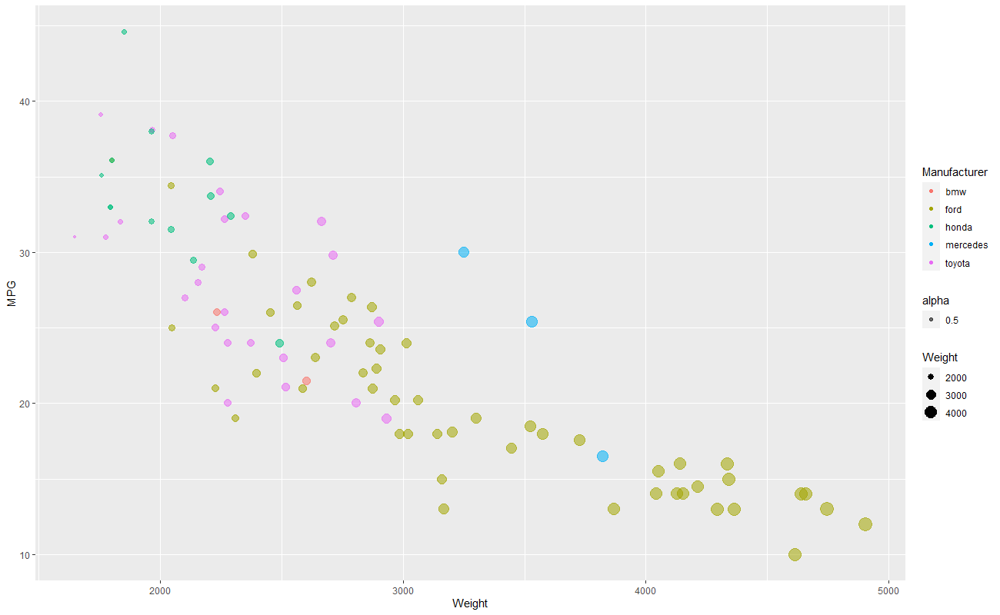
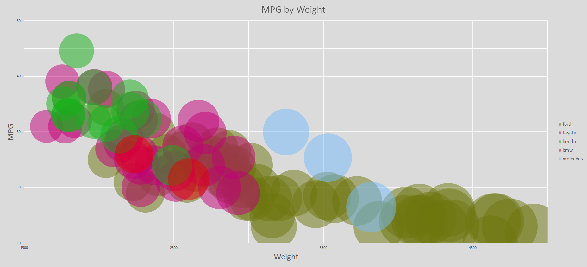
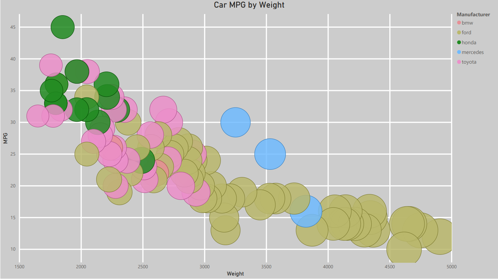
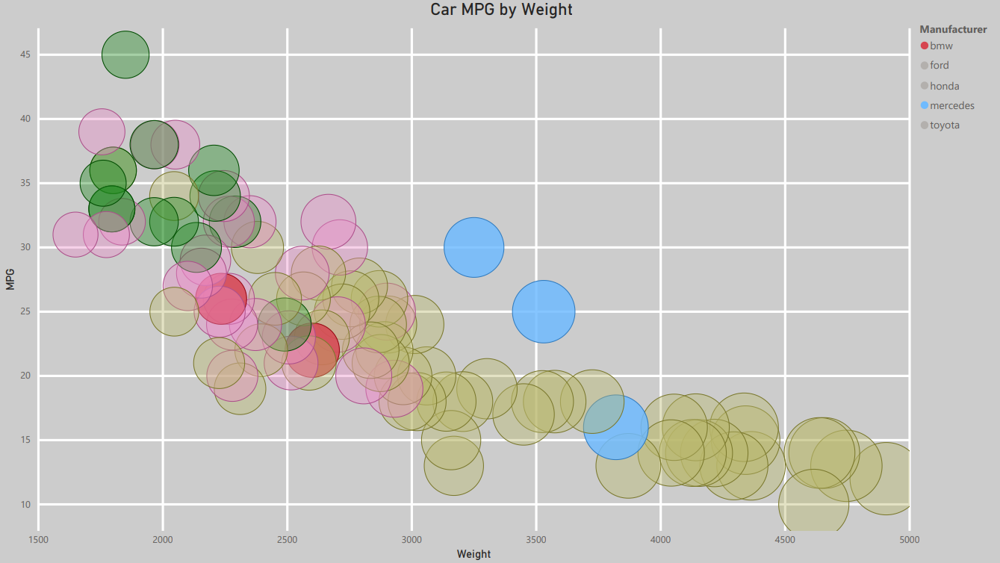
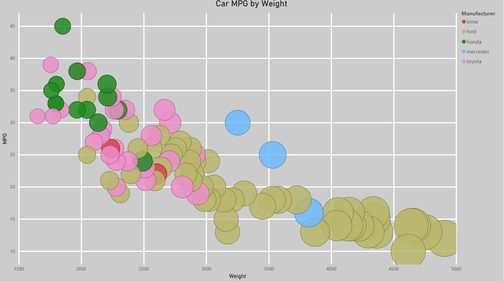
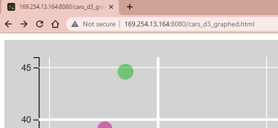

# 02-DataVis-5ways

Assignment 2 - Data Visualization, 5 Ways  
===

# d3
For d3, I initially tried drawing all of the components on the svg, including a polygon as the background. I realized that I was going to have too much trouble making everything from shape primitives, so I found a tutorial using d3 v4, and made modifications to update functions to the current version and to build it out some more. I ended up manually drawing the gridlines using line primitives. I added a tooltip feature from another example I found online, replacing the previous iteration of the feature that I had; the tooltip styling worked a lot better than the info-panel that I had had aligned on the side before.  

## python - matplotlib
I have a healthy amount of  experience with python, numpy, and pandas specifically. And yet, nothing has confounded me quite like finding a good solution to mapping colors to the data has. I eventually came to the solution of
- create an array of the colors to use
- make dataframe with that array and list of unique manufacturers
- merge that dataframe onto the main dataframe on the manufacturers column.
- pass the 'color' column as the color mapping argument
I had a solution before that, but I hated it so much I came back and fixed it after I came up with the join idea.  
9/10, something for everybody

## R- ggplot2
ggplot was deceptively simple to use. I spent a while reading the (somewhat sparse) API, convinced it would be harder to use than that. I had more trouble loading the data into R before realizing that R studio has very convenient virtual environments to operate in, than I had using ggplot. highly recommend for anybody that knows R even a little bit (pretty much everybody that has taken stats 1 here).

## Excel
I tried a couple of different ways of separating the data in Excel to avoid adding multiple series to the graph, but in the end I succumbed to Microsoft's designs and added a different series to the plot for each Manufacturer. Other than that detail, working with charts in Excel is a simple and familiar experience and it would probably be my first choice for exploratory visualization on a new data set, since there's no need to compile anything or read an api, and its more lightweight than something like PBI or Tableau.

## PowerBI
In PowerBI, I had a hard time with scaling the Weight of the cars to the size. I'm not sure what algorithm they use to correlate data to the dot radius, but I had a hard time making the dots feel distinguishable from one another, and they often felt cramped on the graph, even when its width and height were maxed out. I tried one configuration where I first squared the Weight value, and then divided it by 1,000,000 to get a greater range between the higher and lower values, but I wasn't sure about including it in my final configuration in the spirit of staying true(r) to the data. I've included it as the 3rd photo here of the PBI example for demonstration though. In the 2nd image I've demonstrated the beginnings of the built-in filtering and slicing capabilities that PowerBI offers in the interactive environment, something that I consider to be a draw to the product in a business setting.

## template

## Technical Achievements
- d3: I included a package of favicons for the website that are compatible with multiple browser types.
    - The art in the favicon is of the Magic: the Gathering card 'Meren of Clan Nel Toth'. It is illustrated by Mark Winters and is property of Wizards of the Coast LLC.
    - The favicon set was generated from a jpg file and the code in the head tag were both provided by https://realfavicongenerator.net/
    - 
- d3: I added in a tooltip that appears on the mouseover event. The tooltip shows the name, MPG and Weight of the car, and disappears after moving the cursor away.
- PowerBI: basic filtration and tooltip interactivity, along with (see image 3, cars_pbi_scaled.png) a non-linearly scaled set of Weight values to provide more constrast among data points at the low and high ends
- python: I used a sql join to map the colors to the manufacturers. not sure if its an achievement but I woke up to write it down, so I think its pretty cool
## Design Achievements
- I'm sorry that some of them are so ugly
    - especially if you load the html one, its really just *sitting there*

## credits
- http://bl.ocks.org/weiglemc/6185069
  - scatterplot example. updated v4 methods to work with v6
- https://bl.ocks.org/d3noob/180287b6623496dbb5ac4b048813af52
  - tooltip help
