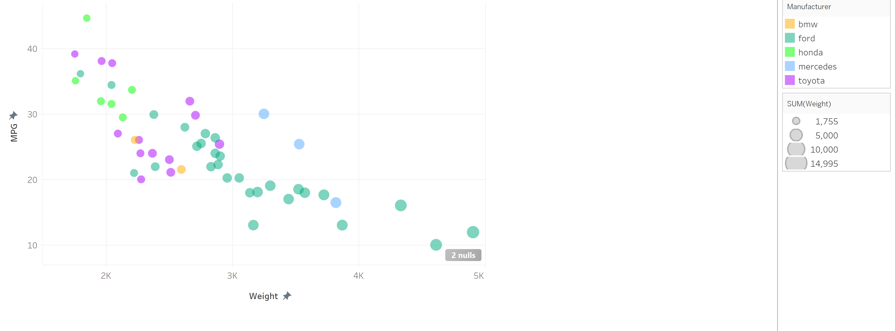

# 02-DataVis-5ways

Assignment 2 - Data Visualization, 5 Ways  
===

Tech used:
3 libraries
  -   D3
  -   R + ggplot2
  -   Java 2d
Other 2
  - Tableau
  - Excel
FIX THE colors

**NOTE: THE BELOW IS A SAMPLE ENTRY TO GET YOU STARTED ON YOUR README. YOU MAY DELETE THE ABOVE.**

# R + ggplot2

Resources Used:

http://www.sthda.com/english/wiki/ggplot2-scatter-plots-quick-start-guide-r-software-and-data-visualization

https://www.rdocumentation.org/packages/ggplot2/versions/3.3.3

R is a language primarily focused on statistical computing.
ggplot2 is a popular library for charting in R.
R Markdown is a document format that compiles to HTML or PDF and allows you to include the output of R code directly in the document.

To visualized the cars dataset, I made use of ggplot2's `geom_point()` layer, with aesthetics functions for the color and size.

While it takes time to find the correct documentation, these functions made the effort creating this chart minimal.

# d3

Templates Used from:

https://www.d3-graph-gallery.com/graph/scatter_basic.html

https://www.d3-graph-gallery.com/graph/custom_theme.html

# Java 2d

# Tableau

# Excel

## Technical Achievements
- **Colored Background**: All Plots have a gray colored background
- **Proved P=NP**: Using a combination of...
- **Solved AI Forever**: ...

### Design Achievements
- **Re-vamped Apple's Design Philosophy**: As demonstrated in my colorscheme...
