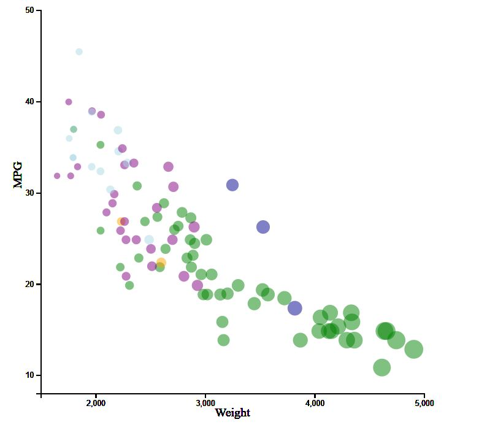
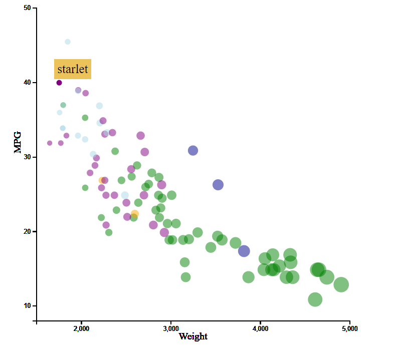
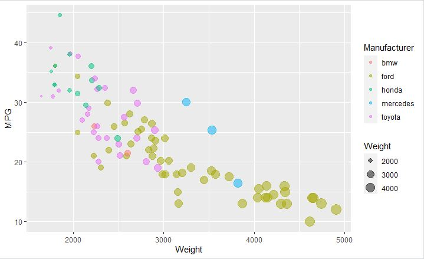
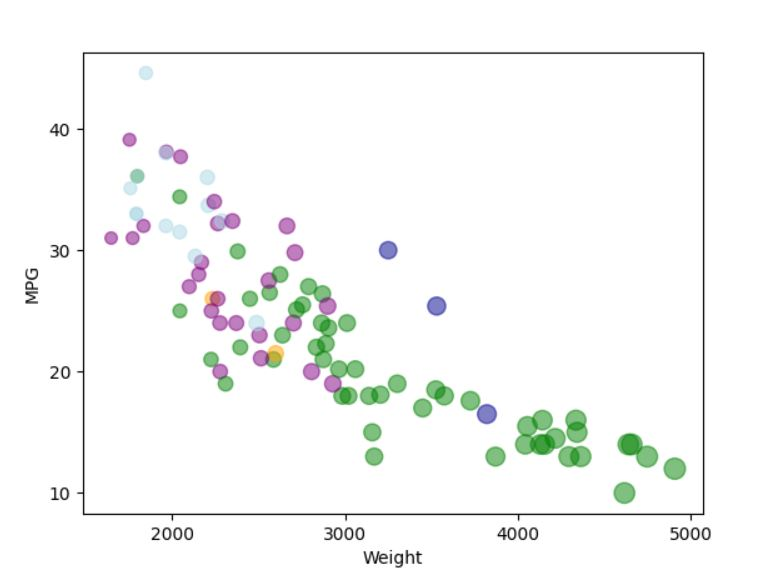
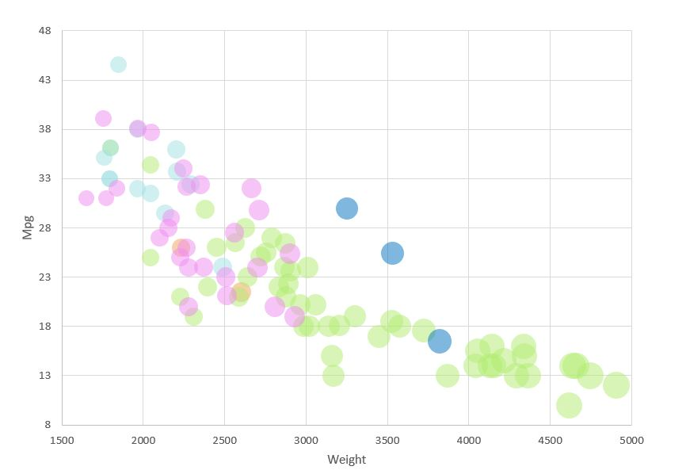
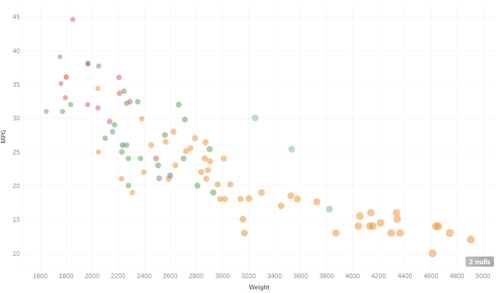

# 02-DataVis-5ways

Assignment 2 - Data Visualization, 5 Ways  
===

In this project, I used the following tools to visualize a scatterplot of Weight vs MPG (Miles-per-gallon) of "cars-sample.csv" data:
1. JavaScript + d3.js
2. R + ggplot2
3. Python + Matplotlib
4. MS Excel
5. Tableau

# JavaScript + d3

The first tool I used here is d3.js. Since I was using d3.js for the second time, it was a bit challenging to get started. I had some problems in terms of loading the csv file from the parent directory (despite using python http.server) and so I moved it in the same directory of the index.html file. Making the actual scatterplot was interesting as I was able to explore the d3.js library such as built-in axis functions. Another interesting thing about the first scatterplot generated was that it was plotting the MPG values marked as "N/A" as well. This did not happen in anyother visualization tools I used. To deal with that, I removed those two data entries as "outliers" as I was using a separate data file for this visualization tool. I also made use of call back functions inside d3 functions to manipulate the size, position and color of dots in the scatterplot.

Here are the screenshots of the visualization:

# R + ggplot2 

The second tool I used here is ggplot2. The visualization took only 5 lines of code in order to be generated (pretty fascinating!). As compared to d3.js, it was easier to read data from the csv file and generate a scatterplot from it. The axes scales got automatically adjusted here. I made use of the ggplot function to use the data and map the axes and colors according to the attributes in the dataset. I used geom_point function to generate the scatterplot and control the size and opacity of dots. This tool automatically took care of the "N/A" values for MPG and did not plot them.

Since I used R for the first time, I made use of the R documentation online in order to get the visualization.

Here is the screenshot of the visualization:

# Python + Matplotlib

The third tool I used here is Matplotlib. This was one of the easiest tools to generate the scatterplot, with minimal lines of code. I used python's dictionary data structure to map Manufacturers with their respective colors. I made use of the pandas library as well to read data from csv file. It was also easy to set the axes scales and labels as compared to d3.js. This tool automatically took care of the "N/A" values for MPG and did not plot them.

Here is the screenshot of the visualization:

# MS Excel

The fourth tool I used here is MS Excel. It was a bit difficult to generate the visualization with the prescribed features in this tool. For generating the basic scatterplot (without any prescribed features), I separated the data attributes: MPG and Weight into a different excel sheet along with a column for the corresponding size of the data point. Setting up the position and opacity was easy but the color part was tough. Somehow, my excel's pivot table feature wasn't working properly and so I had to separately arrange the data according to the Manufacturer attribute in order to generate different colors. It was also not possible to generate the exact tick points like the main image provided to us, so the visualization contains some additional intermediate ticks as well. This tool automatically took care of the "N/A" values for MPG and did not plot them.

Here is the screenshot of the visualization:

# Tableau

The fifth tool I used here is Tableau. It was also an easy tool to used, especially for beginners in visualization because of the UI and "drag and drop" features. The axes scales and the labels were also automatically adjusted according to the input data. The only problem in this was setting the relative difference in sizes of the dots, as it wasn't as much significant as visualizations produced by other tools above. This tool automatically took care of the "N/A" values for MPG and did not plot them.

Here is the screenshot of the visualization:

## Technical Achievements

- Utilized "mouseover" and "mouseout" functions in d3.js for making the visualization a bit interactive. On "mouseover", I utilized d3 "tool tip" function to generate a textbox for labelling the scatter point. On hover, this displays the name of the car for that particular dot. I also increased the opacity of the dot to 100% when the user hovers over it.
- Learned and utilized basic css styles to set the style for the tool tip boxes that appear after the "mouseover" event while using the d3.js tool.

## Design Achievements

- Utilized linear progression function for achieving the size of the dots in all the visualization tools.
- Experimented with different css styles for setting up the tool tip boxes.

