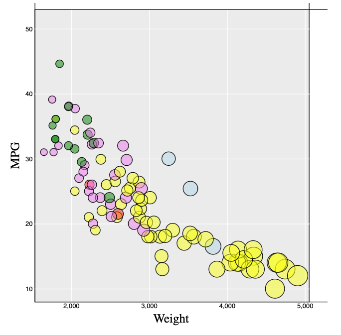
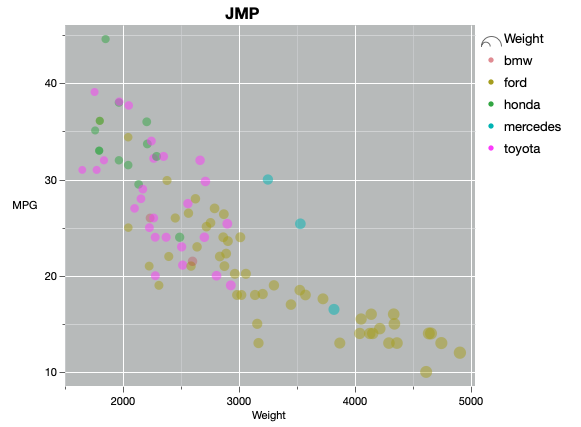
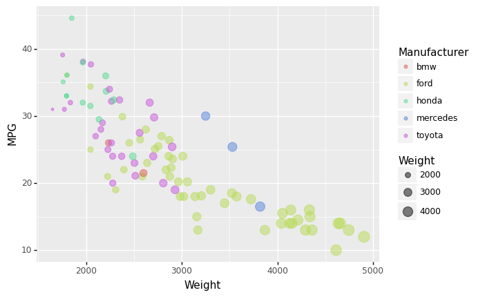
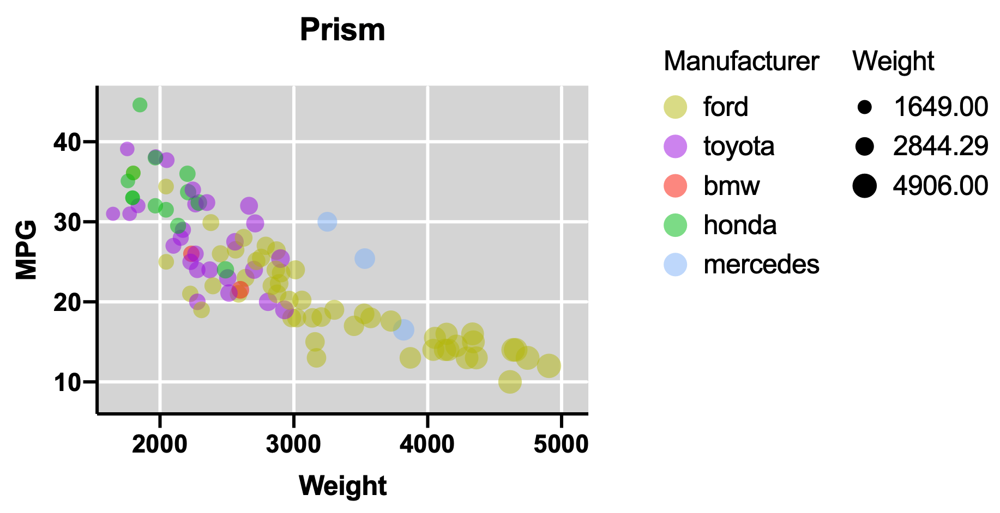
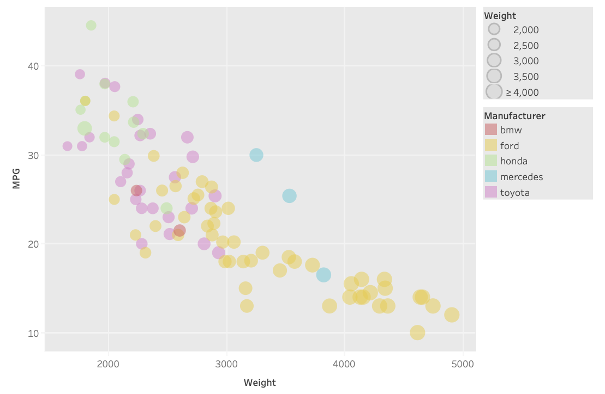

# 02-DataVis-5ways

Assignment 2 - Data Visualization, 5 Ways  
===

d3
---

d3.js is the library that we have mostly been working with in this class. This was the hardest to mimic to ggplot2 style in, and required making background shapes to mimic the plot background grid. Additionally, to map the colors, I implemented a `dict` to hardcode and match the manufacturers to their respective colors.

SAS JMP
---

JMP by SAS is a personal favorite of mine, and what I used to do the major of my data visualization work in medical research. The inuitive GUI and _very_ powerful scripting language make it an amazing tool for pretty much all users, and I would highly reccomend it to anyone looking to plot data. A JMP notebook and the script used to generate the graph is included in the `jmp/` folder. It does require a liscense.

Python ggplot2
---

Using an implementation of ggplot for python by PlotNine, I was able to recreate the plot incredibly simply, and all of the default settings matched as expected. I am very glad to know that ggplot has a good python version because I find switching between languages often a bit challenging.

GraphPad Prism
---

GraphPad Prism is another liscensed software (provided by WPI), and is also _very_ powerful. For this project most of the advanced features were not even touched, but the automatic data validation and checking made the process very smooth.

Tableau
---

Tableau is _yet another_ liscensed software (also provided by WPI _I think_). In my experience this application is made for much larger use cases, and often does not really perform up to competitors for quick uses like this.

## Technical Achievements
- Checked for and handled `NA` values in `d3.js`
- Added background grids to all graphs
- _Hopefully was the first to use JSL_

### Design Achievements
- Constant color _range_ for manufacturers
- Followed the given design? So any achievements should go to ggplot :)
