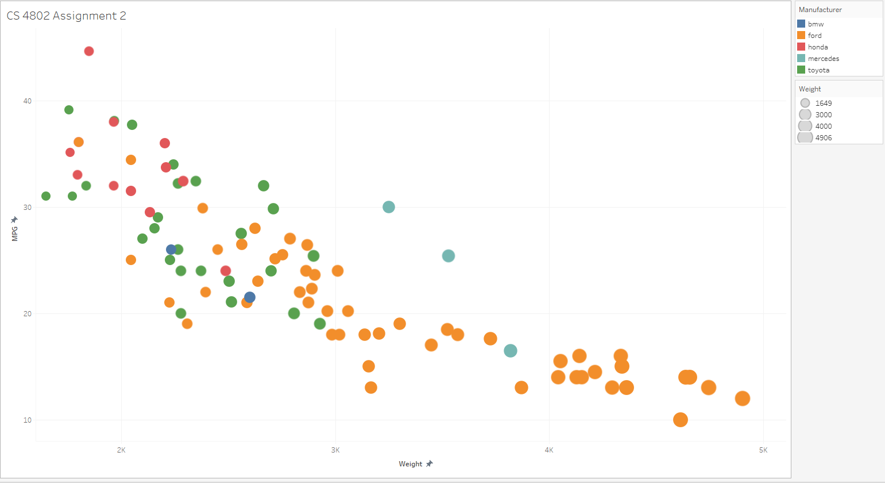

# CS4802 Colby Frechette Assignment 2
For Assignment 2 I was asked to create the same graph, Figure 1, in at least 5 different data visualization tools, both software and libraries. I chose to work with both software and libraries I have used as well as ones I have never used.

\
(Figure 1)

# d3.js
To begin I started with the only required data visualization tool, the d3.js library. Overall, d3.js was by far the worst tool to work with. It was the worst in the way that it's customizability made it difficult to create the look I was going for. It was bad in the way programming in C is bad. I definitely struggled the most with d3 but learned the most from it as well. I actually liked learning about it but wish I could have implemented some interactivity as well as remove the extra data points. Figure 2 shows the output of my d3 graph.

\
(Figure 2)

# Google Sheets
Google Sheets was probably my most familiar software to use, so it was very easy to make the graph I was going for, after I stopped over complicating it. Figure 3 shows my output from Google Sheets. I wish I could have made the axes ticks in the right places, but to my knowledge it is not possible to do so. I did get the colors right though! (well at least the same as d3 🤷)

\
(Figure 3)

# R, RStudio, and ggplot2
I used R with ggplot 2 for a statistics class, so I did not have much of a challenge making the scatterplot here. It came out pretty good, got all the correct colors, everything. Figure 4 shows my output from R and ggplot2.

\
(Figure 4)

# Tableau
Tableau was the first new one for me. I had never used the software, but it was really efficient once I learned what everything did. It took longer than I'm willing to admit, to change a setting, but I eventually got it to look pretty close. As far as I(Google) know, you can't change the opacity of the bubbles which was pretty annoying. Got the legend and grids built in though. Figure 5 shows my output from Tableau.

\
(Figure 5)

# Python, pandas, and matplotlib
Python is a programming language I haven't used in a long time but was pretty easy to remember. It was definitely the most intuitive library I used, and I really enjoyed getting back into Python's simplicity. The chart came out the worst though, and I cannot figure out how to change the colors. Also, Pandas. Figure 6 shows my output from Python, pandas, and matplotlib.

\
(Figure 6)

# Flourish
Flourish was really cool and easy to learn, definitely something I am going to use for other classes as it was super user-friendly. I was able to do everything I needed to and more. Figure 7 shows my output from Flourish with more examples down below.

\
(Figure 7)

# Design and Technical Achievements
d3.js - I added the gridlines and tried to pull the colors from the original graph, which I think I did successfully. I also got a nicer font than Times in there, thank god.

Google Sheets - Kept the same colors as d3, and the bubbles came out nice, it was virtually impossible to do anything else though. Got the legend and gridlines in there though. Kept ticks at the same intervals as the example. Does interaction count here? It was interactive, as shown in Figure 8.

R - Same colors and ring around the bubbles as the example. Virtually (pun) perfect. 

Tableau - There wasn't much to do in Tableau it seemed, but the legend and gridlines are included. I also was able to continue the same colors I used throughout.

Python - I got the gridlines and got mad at the colors. Grrr

[Flourish](https://public.flourish.studio/visualisation/5274074/) - Same colors and ring around the bubbles as the example. Definitely one of the better looking vis' I did. It also made 6 tools. Also interactive!

Common Trends - Removed extra data points, colors, axis labels, fun :).

# Additional Figures
(Figure 8)\

(Figure 9 and 10) Flourish settings\

# Credit to these lovely pages!
https://stackoverflow.com/questions/54175042/python-3-7-anaconda-environment-import-ssl-dll-load-fail-error \
http://www.d3noob.org/2016/08/changing-text-size-for-axes-in-d3js-v4.html \
https://stackoverflow.com/questions/29573481/d3-js-scatterplot-with-different-colors-and-symbols-issues-encountered \
https://medium.com/@kj_schmidt/making-a-simple-scatter-plot-with-d3js-58cc894d7c97 \
https://www.statology.org/matplotlib-scatterplot-color-by-value/ \
https://stackoverflow.com/questions/8202605/matplotlib-scatterplot-colour-as-a-function-of-a-third-variable \

