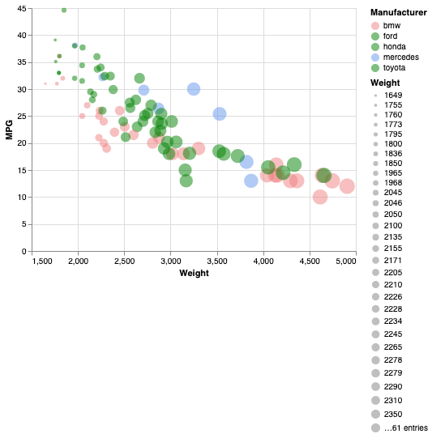
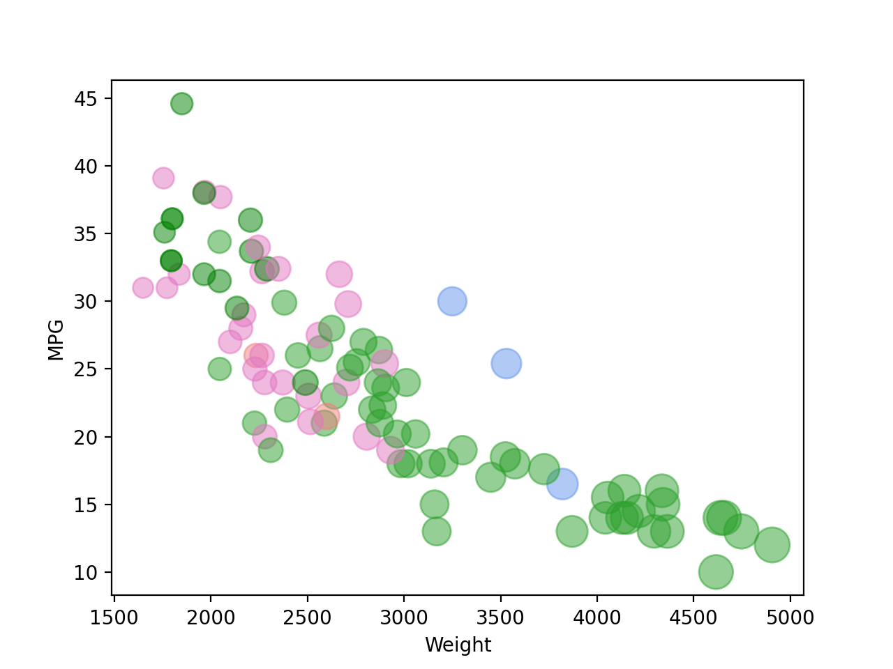
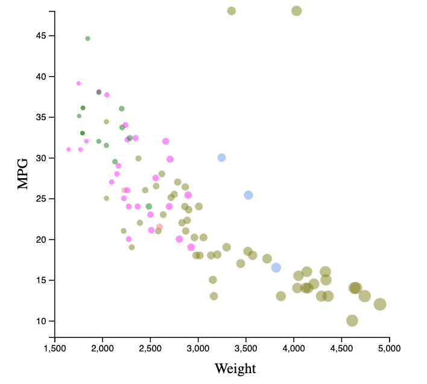
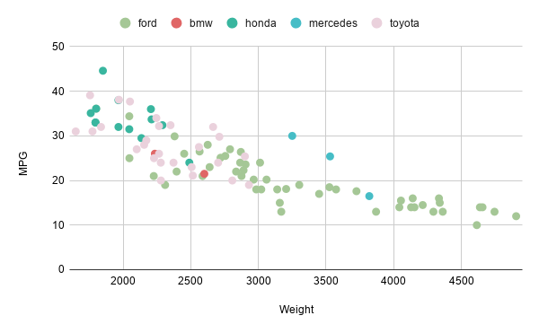
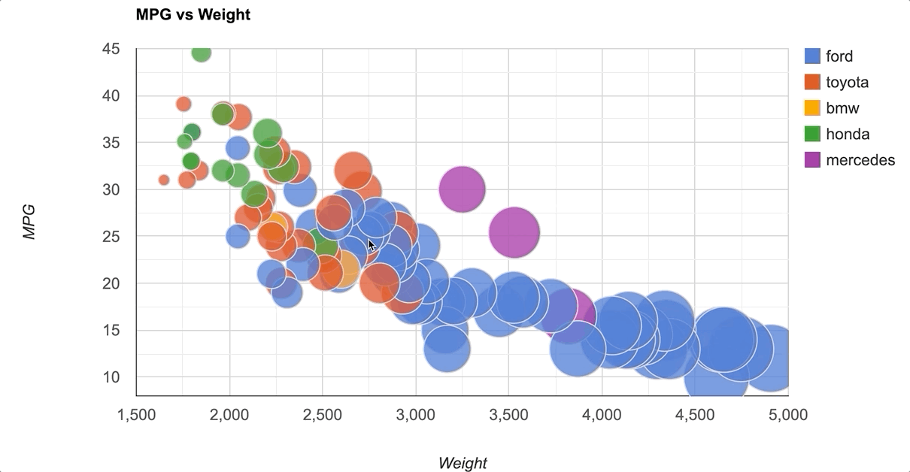
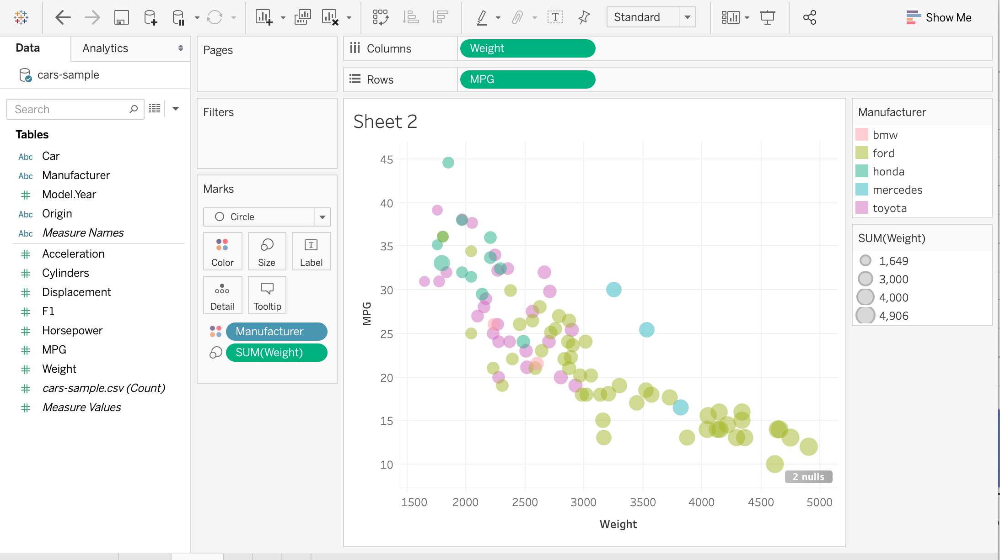

# 02-DataVis-5ways

Assignment 2 - Data Visualization, 5 Ways  
===

The attempted graph: 

---

# R + ggplot2 
I ran into a lot of bugs when trying to set up R and ggplot (and I also learned that most of the help out there is based on RStudio). However, once I got it up and running it was super simple to implement! Really surprised me. R seems to be the tool to use when you just want to visualize things and don't really care about incorporating it into a website. To visualize the data, I used ggplot2's geom_point

I  relied on documentation and this website (https://365datascience.com/tutorials/r-tutorials/ggplot2-scatter-plot/) to implement the visualization

# Python + Altair + pandas
When I saw that Altair/Vega-lite had a Python version, I decided to give it a try! It did take a lot of debugging to get everything installed and ready to go, but it's kind of cool how you can just export the graph to an html file using Python. It also has a lot of possibilities for interactivity. 

Because this library was created for JavaScript, it was a little bit weird to use JS-like syntax for python. 

To correctly load the csv file, I used to pandas library and I put the data I needed in a dictionary. 

I mostly used this website (https://www.geeksforgeeks.org/python-altair-scatter-plot/) to visualize the data. I also relied on the official documentation to figure out the scaling of the circles and to debug. 

# Python + Matplotlib + pandas
Like with Altair, I put the data that was needed in a dictionary for easier use. I ran into some difficulties getting everything set up but once i got it to work it was pretty simple. However, I did run into problems trying to implement the colors (which I eventually figured out and helped me implement it in js). It seemes like Altair is the fancy way of doing visualizations but Matplotlib seems like it has the most resources out there for Python

I used this website (https://pythonspot.com/matplotlib-scatterplot/)

# d3.js 
This is the graph that was made using d3.js. I used the D3.js documentation to create it. Having worked on this after having worked on it in Python, I am starting to appreciate some of the features that JavaScript has that Python does not. Getting the colors to work was a bit tricky but I got it to work because of the work that I did with Python. 

I used this website (https://www.d3-graph-gallery.com/graph/scatter_basic.html)

# Google Sheets + d3
I decided to explore how this would be done with Google Sheets instead of Excel. However, I quickly  realized that you can't add transparency to colors in google sheets charts and you also can't change the radius of the circles. Which looks like this:

However, I did find that Google has documentation to create the charts with JavaScript (https://developers.google.com/chart/interactive/docs/gallery/bubblechart#javascript)! It was pretty cool and I am glad that I looked into it. It was fairly simple to add things to the graph, but I can see how it can get very difficult to do specific things to the graphs. It wasn't too bad to recreate the chart, but I can see how it can get confusing real quick if you want to create your own. 

# Tableau
It was suprisingly easy to make this graph with Tableau. Here's a screenshot of the settings I used and the graph I created: 

# Flourish
Flourish was also really easy to use! I can see how customizing parts of it might be more challenging though.

## Technical Achievements
- **Google API**: Used the Google Graph Documentation to create the chart to allow for the customization
- **Adding Interactivity**: When you hover over the google graph, you can see the specific attributes of the plot

### Design Achievements
- Trying my best to maintain the same color scheme in all of the graphs (except for the Google Graph update with JS) :)
