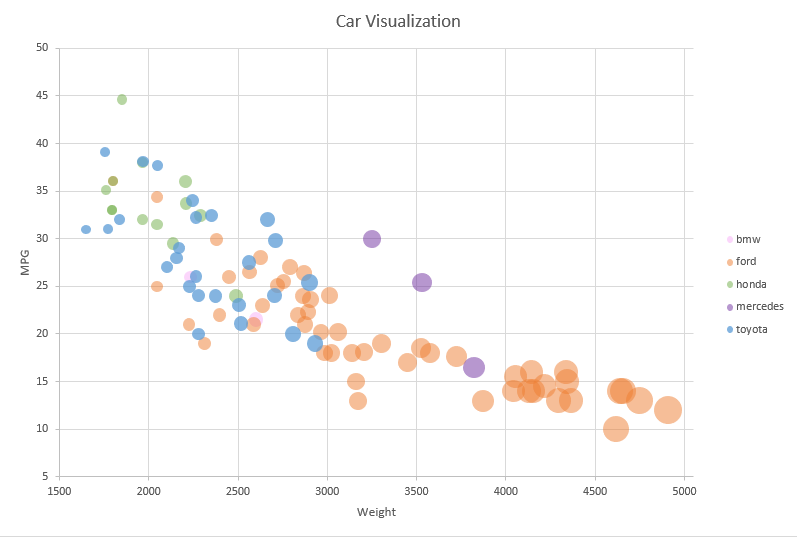
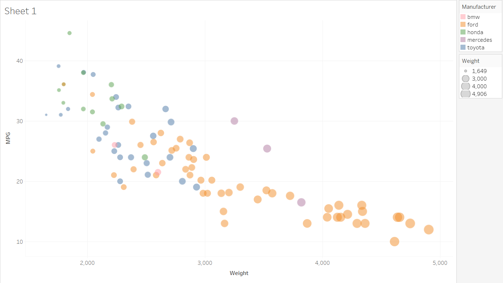
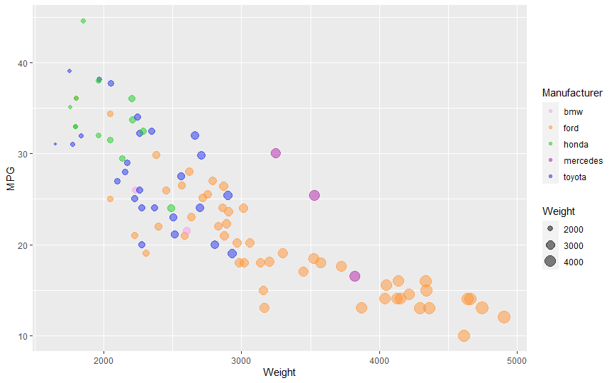

# 02-DataVis-5ways

Assignment 2 - Data Visualization, 5 Ways  
===

# Excel

Microsoft Excel features calculation, graphing tools, pivot tables, and a macro programming language called Visual Basic for Applications. 
I thought this was one of the easier tools to use which is why I started with it. I opened the csv file and added a scatterplot to input the data. I had to add multiple sets of data to group the different manufacturers. That was the only major problem I had with this tool. I have used Excel in the past and plan on using it in the future to create simple graphs from datasets.

# Tableau

Tableau Software is an American interactive data visualization software company. The tool was extremely easy to use and user friendly. I think I enjoyed using this tool the most. I was able to drag the values I wanted to display from a list and place them to display the plot. It automatically generated the legends on the side but I was unable to figure out how to change the scale of the weight legend as it starts at 1,649 and ends 4,906 instead of even numbers. I would definetly use this tool in the future.

# Javascript and d3

D3.js is a JavaScript library for producing dynamic, interactive data visualizations in web browsers. I had a lot of trouble with this tool and trying to figure out where to start. I eventually found some resources to help me get started. I also had problems with centering the labels on the axes and it took me a while to figure out what values needed to change. This was not my favorite tool but we will have to use it in class so I will definitely be using it in the future. I added the file to Github pages so this link also shows the plot: https://vygrasso.github.io/02-DataVis-5Ways/d3/index

# R and ggplot2

R is a language primarily focused on statistical computing.
ggplot2 is a popular library for charting in R.
To visualized the cars dataset, I made use of ggplot2's `geom_point()` layer, with aesthetics functions for the color and size. This was my first time coding in R so I googled a couple of resources to help with the syntax. I had trouble reading in the csv file so I changed the path to the link from GitHub. I thought it was great that the tool automatically created the legends and assigned colors for the manufacturers. However, I wanted specific colors assigned to the manufacturers so I looked up the scale_color_manual function. This tool was pretty easy to use once I understood the syntax and realized I could use RStudio to run the code. I would use this tool in the future.

# Python and Matplotlib

Matplotlib is a plotting library for the Python programming language. I had the most trouble assigning colors to the manufacturers and had to try different techniques and made different functions until I found a resource that explained dictionaries and map. As this was my first time coding in Python, there was a learning curve. I also found a resource that helped generate a legend for size of the dots. I would probably use this tool again.

# Technical Achievements
- **d3** Added a remove null function to check for any null values in mpg or weight columns
- **ggplot** Used manual color to adjust what colors were assigned to each manufacturer
- **matplotlib** Added a legend for weight to show what the size of the dots represented

# Design Achievements
- **All**: I chose different colors for each manufacturer and kept it consistent across all 5 plots

# Resources
Javascript and d3
--
http://learnjsdata.com/read_data.html
https://github.com/d3/d3-fetch/blob/v2.0.0/README.md#csv
https://stackoverflow.com/questions/15988455/how-can-i-change-the-radius-and-opacity-of-a-circle-in-d3
https://www.d3-graph-gallery.com/graph/scatter_basic.html
https://stackoverflow.com/questions/11189284/d3-axis-labeling

R and ggplot
--
http://monashbioinformaticsplatform.github.io/2015-11-30-intro-r/ggplot.html
https://rpubs.com/lokraj/github_csv
http://www.sthda.com/english/wiki/ggplot2-scatter-plots-quick-start-guide-r-software-and-data-visualization
http://www.sthda.com/english/wiki/ggplot2-colors-how-to-change-colors-automatically-and-manually

Python and matplotlib
--
https://stackabuse.com/matplotlib-scatterplot-tutorial-and-examples/
https://www.w3schools.com/python/pandas_plotting.asp
https://www.w3schools.com/python/python_functions.asp
https://matplotlib.org/3.1.1/gallery/lines_bars_and_markers/scatter_with_legend.html#sphx-glr-gallery-lines-bars-and-markers-scatter-with-legend-py
https://stackoverflow.com/questions/16247761/how-to-equate-a-string-in-python-to-a-number
https://kanoki.org/2019/04/06/pandas-map-dictionary-values-with-dataframe-columns/
