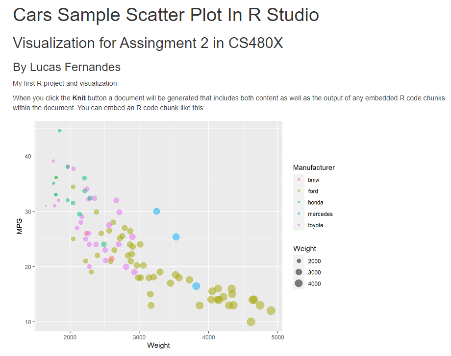
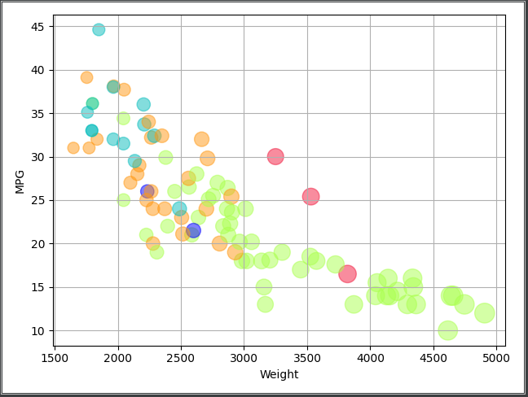
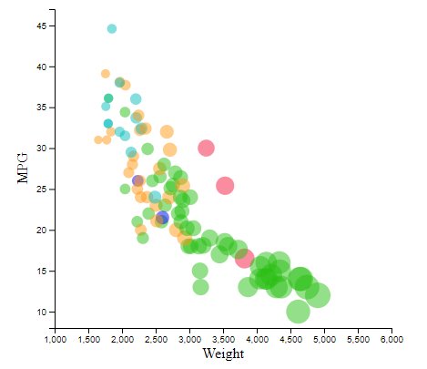

# Assignment 2 - Data Visualization, 5 Ways  
The goal of this project is to gain experience with as many data visualization libraries, languages, and tools as possible.
I used these languages, libraries, and programs to complete the assignment:
 * Excel
 * Tableau
 * R + RMarkdown + ggplot2
 * Python + mathplotlib + pandas
 * Javascript + D3

All following graphs were constructed using the  `cars-sample.csv` sample dataset
# Excel
The first graph I created was made using Microsoft Excel. I've used Excel countless times when visualizing graphical data but this was my first time using it for a weighted scatter plot. My first attempt at making the chart lead to deadends and problems when attempting to color vehicles based on manufacturer. To accomplish this I reffered to [this guide.](https://www.exceldashboardtemplates.com/dynamically-change-excel-bubble-chart-colors/) Utilizing the author's reccomendation of reconstructing the table by leveraging the series feature of excel charts by conditionally building each series using the `IF()` function, I was able to sort the data set into individual series for each manufacturer. Doing this additionally allowed me to produce a legend of manufacturers and their respective colored markers as the legend displays series.

My choice in color scheme for this iteration was to choose solid, contrasting colors in order to identify conflicting markers even with the lowered alpha level(opacity). This was extremely important within the dense, 2000-3000 weight range. Below is the chart I've referenced that has been generated in Excel. 

# Tableau
This was my first time working with Tableau. It's an intuitive and accessible visualization application. Within minutes of downloading I already completed the required aspects of the chart for the assignment which is a testament to the power of Tableau. Connectivity with local datasets is seamless and it's drag and drop tools made constructing the chart seamless. As seen below I was able to generate a chart nearly similar to what was provided as an example graphic in R.

The color scheme for this iteration was made using the color blindness theme provided by Tableau. I felt going this route is important for accessibility. The theme allows for markers to still be distinguishable.

Using the introductory tutorials provided by the application as my own experimenting led me to generating **2** graphics. The difference with the second graphic below is that it includes an animation tool to create pages based on year. The user is able to either manually scrub through years or have the animaiton play in ascending or descending years. When ascending by year, the prior year is included as a lower opacity "trail". Doing this visualizes the trends of MPG and weight of vehicles from the dataset.

# R + ggplot2 + R Markdown
This was also my first time working in R. Getting used to the language, the R Studio IDE, and the ggplot2 and R Markdown libraries was surprisingly more accessible than I originally imagined. R Markdown is similar in nature to Jupyter Notebooks which I've worked in previously. Generating the chart was incredibly easy using `ggplot()` in order to generate the chart which is identical to the example provided. With lack of experience and time I decided to not modify any aspect of the chart any further. The color scheme used is the default from ggplot. I learned R's syntax for creating the plot [here](https://rpubs.com/damiebahnmi/164539) and got a general introduction to RMarkdown from [RStudio's website.](https://rmarkdown.rstudio.com/articles_intro.html)

Using RMakrdown's render function I did *knit* the file to an HTML page and captured the result which can be seen below.

# Python + mathplotlib + pandas
Moving into more familiar territory I used the [panda's library to import the CSV data](https://www.datacamp.com/community/tutorials/pandas-read-csv) into my project and then produced the chart using mathplotlib. I learned the library from its [documentation](https://matplotlib.org/stable/api/_as_gen/matplotlib.pyplot.scatter.html). I did first test panda's scatter method but I found it more limited and decided to focus on mathplotlib as I hoped there was more documentation concerning customization. My efforts were still limited with mathplotlib, it was a challenge coloring data based on the manufacturer but that was resolved by having `color=Manufacturer.map(colors)` which map a dictionairy of colors linked with each manufacturer. Beyond that I was unable to adjust any other aspect of the chart besides addint axis titles. The color palette I used was from [cooler.co(link contains the palette)](https://coolors.co/29bf12-abff4f-08bdbd-f21b3f-ff9914) which is radom color palette picker. On the site I choose the protanopia color blindness mode and then modified the first color to be blue in order to add more contrast as originally there was two shades of green.

# JavaScript + D3
I'm definitely still in the learning phase when working with D3 and had to utilize some tutorials to start myself out on this project. Using [this guide](https://www.d3-graph-gallery.com/graph/scatter_basic.html) as my starting point I was able to overcome the obstable of rendering a basic scatterplot. To further iterate on it I modified the data function to conditonally check all records in the CSV to remove any value that was NaN(Not a Number) from the MPG column. I also modified the margin's of the scatterplot in order to include the axis labels. Including these labels was harder than I originally imagined as it was a bit of a guessing game setting the right position for the label. I additionally included a `switch` statment to easily modify the color of each manufacturer using the same color palette I used when working in Python. Below is the chart I created!

# Technical Achievements
- Able to acheive nearly requirement in excel
- Created animated graphic in Tableau

# Design Achievements
- focus on color-blind and contrasting color palettes throughout most graphics
