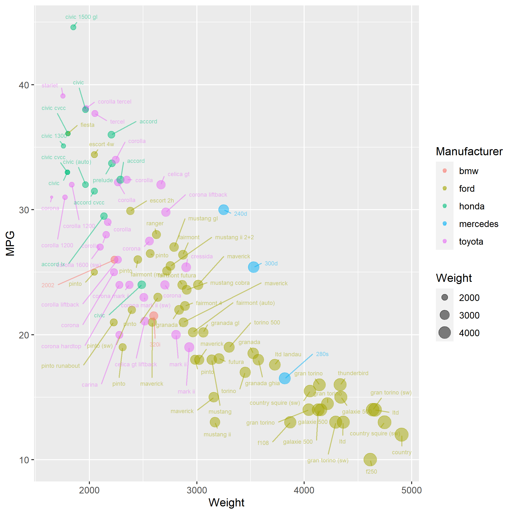

# Assignment 2 - Data Visualization, 5 Ways

See [https://nyoma-diamond.github.io/02-DataVis-5Ways/index.html](https://nyoma-diamond.github.io/02-DataVis-5Ways/index.html) for full / interactive versions of visualizations.

## Javascript + D3

D3 was probably the most difficult of the methods I used to build the visualization. Since it operates much closer to the actual displaying page it is significantly more verbose. This means that creating the plot was harder, but it also gave me the power to do a lot more custom. A feature of D3 that I made use of to get the colors right is the `scaleOrdinal` method, which allowed me to create a function that would assign a color to each of the manufacturers automatically from one of D3's built in color schemes. By using D3, I was also able to add tooltips that appear whenever you hover over a dot that are much more verbose than I could with other tools (if I could add tooltips at all).

## Flourish

Flourish was the easiest of the methods I tried to make a good looking and interactive visualization of the data. Flourish allows for a sort of "plug and play" setting of values, making it really easy to build the exact visualization I wanted. Flourish also gave me the option to make it so you can hide certain manufacturers so you can focus on a particular one to look at (e.g. by clicking on "toyota" in the legend, all the dots representing other manufacturers will be hidden). One problem I had with Flourish is that while you can make the dots change size based on a value, the change in size isn't particularly distinct, even when you have the minimum size set very low and the maximum size set very high. This is probably something that could be resolved by using the API instead of the web tool, but I don't have the time or experience to try and figure out setting that up for this assignment.

## Python + Matplotlib

I actually have a little experience with matplotlib, so creating a visualization using python was relatively straightforward and easy. Additionally, `pandas` (a data analysisis library for python) actually has methods built in to automatically create matplotlib figures. This allowed me to import my data using `pandas` and instantly create a figure using `pandas`'s `plot.scatter` method without ever actually touching the matplotlib library directly. I only imported and messed with the library to get a legend properly set up. This said, actually getting the legend set up was not trivial, as it required doing some strange workarounds to make it display the things I wanted how I wanted them, and in the end I was still unable to make a legend for the size of the dots, which I spent multiple hours trying to do before giving up. Another thing which I wish was better (and there may be a way to do this I just don't know about) was assigning colors to each of the manufacturers. Unlike D3 where there was a `scaleOrdinal` method I could use, I had to manually assign colors to each manufacturer using a dictionary. This isn't a problem per se, but it would be nicer to use a method that could do this for me based on a pre-determined color scheme.

## Excel

Spreadsheet applications like Excel are what I have the most experience with. That said, Excel is not straightforward to use, and required a lot of roundabout hacks to get it to display the data in the way I wanted. In the end however I got it to display the data cleanly as intended, in addition to also displaying a regression for the data. One of the interesting things about Excel is it is simultaneously very verbose, but also very terse. It requires you to be very specific with what you want to get things right, often requiring you to set things manually (e.g. as far as I know there aren't really any readily available color pallettes to swap between, you have to set colors manually), but also doing a lot of things for you (e.g. setting up chart axes and legends and such).

## R + ggplot2

While personally not my language of choice, R and ggplot allowed for the shortest visualization setup out of all the methods, requiring only a single line of code after importing all the necessary data and libraries. To create the visualization I used `ggplot` with `geom_point` to get all the dots set up in a way I liked. I also imported an extra library, `ggrepel`, to create labels for the data points, allowing you to look at the chart and quickly see what car each dot actually referred to. This also meant you could get this information without needing it to be interactive though at the cost of making the visualization a bit more cluttered.

## Technical Achievements

- By making clever use of other libraries in python such as `pandas` and `sklearn` or libraries in R such as `ggrepel` I was able to greatly simplify could that might otherwise be significantly more complicated. No reason to write code that someone else has already written for you. For example, in my python code I made use of `sklearn`'s `preprocessing` package to deal with scaling the weight values similar to how `scaleLinear` works in D3. This allowed me to greatly simplify code that would otherwise be a lot more complicated and/or confusing.
- To improve the ability of the viewer to get information about individual datapoints, I created tooltips that appeared when hovering over them. This works by creating a hidden textbox that will track the mouse and become visible when the cursor hovers over a data point, and go invisible when the cursor leaves the data point (or change values if it moves to a different data point).

## Design Achievements

- In my D3 visualization, I overcame a problem that occurred in my Flourish visualization, which was that I wanted to get more information about a particular datapoint of interest and make it obvious to tell which one I was looking at. A problem with Flourish's interactability (at least as I was able to set it up) is that it doesn't highlight which datapoint you're hovering over, making it hard to tell what datapoint you're looking at if multiple overlap. Additionally, you're limited on what data you can display when hovering using Flourish. In my D3 visualization I was able to fix these problems by including the data that was missing when hovering and highlight the data points.
- In my R/ggplot visualization I resolved the problem of wanting information about each datapoint in a different manner. Since ggplot produces a static image, interactability isn't really possible. To deal with this, rather than attempting to have interaction, I used a different R library (`ggrepel`) to create labels for each datapoint. Unfortunately at the cost of making the visualization slightly more cluttered, I was able to display more information than I would otherwise. This also helps overcome the problem of when multiple dots overlap perfectly, making it very difficult to get information about them through interaction (e.g. an entry for the civic cvcc overlaps perfectly with an entry for a civic, and another entry for a civic cc overlaps perfectly with an entry for a fiesta).
- In my Excel visualization I also chose to add a regression. This provides extra information about how a vehicle's weight and its mileage are correlated. This required a bit of bodging as Excel will not let you take a regression like this normally. Typically if you try to do this you will only be allowed to get regressions representing each individual category, or in this case, manufacturer, not the data as a whole. To resolve this, I created another invisible series that contained all the data and made the regression using that.
- In my Flourish visualization I was able to enable interactability that lets the user look at specific manufacturers of their choice. By selecting a manufacturer in the legend, all data points for other manufacturers will be hidden. This allows the user to get information about the data that might otherwise be much more difficult to identify.
