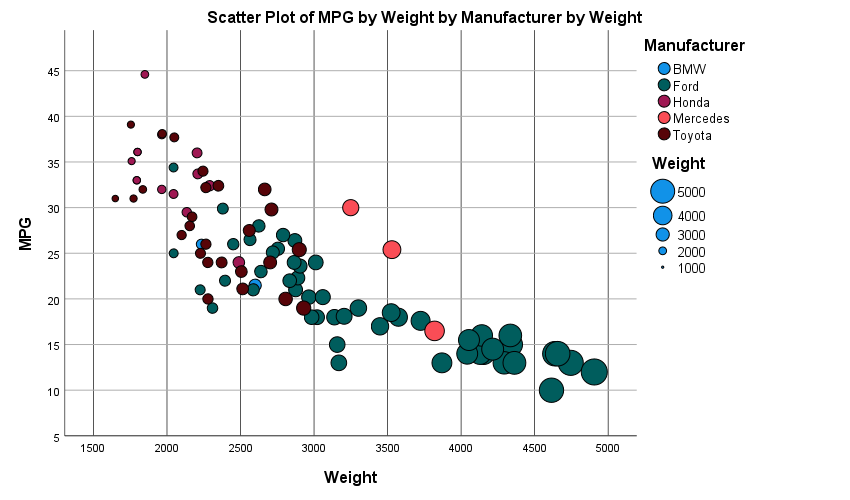

# 02-DataVis-5ways

Assignment 2 - Data Visualization, 5 Ways  
===

Matplotlib + Seaborn + Pandas + Jupyter
---

Python datascience tools are by far where the majority of my experience lies. Seaborn + Pandas in a Jupyter notebook is my go to for assignments like this as they provide an easy way to import datasets and generate plots. In fact, I've used this toolset to generate this exact plot with an unabridged version of the dataset previously. Seaborn is a datavis library that extends Matplotlib to make nicer looking charts that interface better with other tools like Pandas, my go-to dataset creation and manipulation library.

R + ggplot2 + R Markdown
---

The R + ggplot2 + Rmd workflow is incredibly similar to the Python-based one described above. It's fairly simple and it allowed me to create the scatterplot quickly and with ease. Despite all this, I still prefer the previous method due to the surplus of quality data analysis tools available for Python. R + Rmd and Python + Jupyter fill a similar niche for me and, if given the choice between the two, it's unlikely I'll pick this method in the future.

d3
---

My d3 visualization is just a basic scatterplot without any extra features like grid lines or a legend. While I don't find d3 hard to use, it can be very tedious, especially in small projects like this. I think d3 really starts to shine when paired with helper functions or libraries to simplify the SVG generation. As the goal was just one static chart, I do not think d3 was the best tool for the job. Despite d3's shortcomings on projects like this, I will continue to use d3 when I need to generate dynamic data visualizations in the future.

Excel
---

Excel was by far my least favorite tool to work with for this project. I have used Excel quite a bit in the past, and am well acquainted with its many limitations. I was initially going to attempt to control the size (and maybe color) of each point with a VBA script as there is no good built-in way to do so, but abandoned that idea after spending more time than I should have struggling to get the manufacturer labels to play nice with the plot. I should have spent more time figuring out bubble charts, but I desperately wanted to be done with Excel. I know I will have to use Excel more in the future, but I will always pursue alternative tools first.

SPSS
---

Visualizing the data using SPSS took surprisingly little time. I have never used SPSS before (only PSPP, a FOSS counterpart), but it was easy to import and plot the data. As a license SPSS is provided by WPI, I will definitely use it again in the future. The only quirk in importing the cars-sample.csv into SPSS was that I had to select and re-label the columns to convert the dataset to SPSS's format.

---
## Technical Achievements
- Dynamically linked the CSV dataset to the Excel sheet

### Design Achievements
- Themed Matplotlib's usually ugly plots with Seaborn
- Generated a nice [looking table for the Rmd notebook](ggplot2/ggplot2.html)
