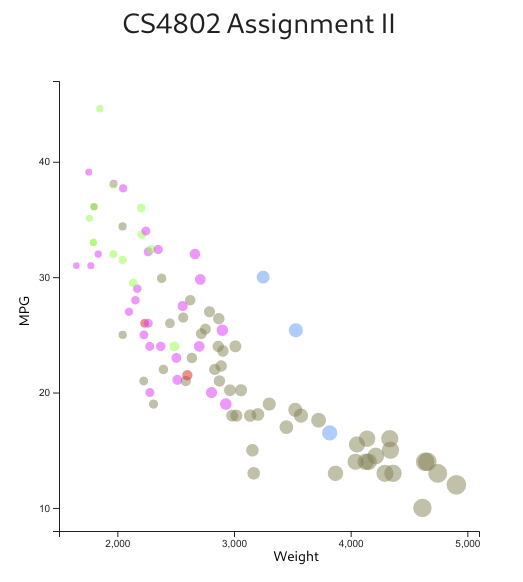
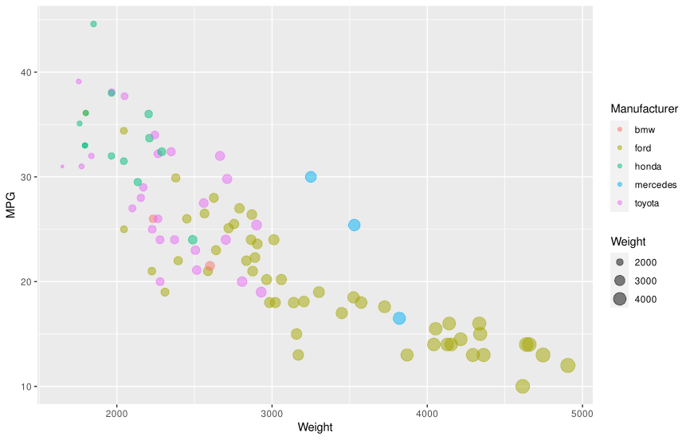
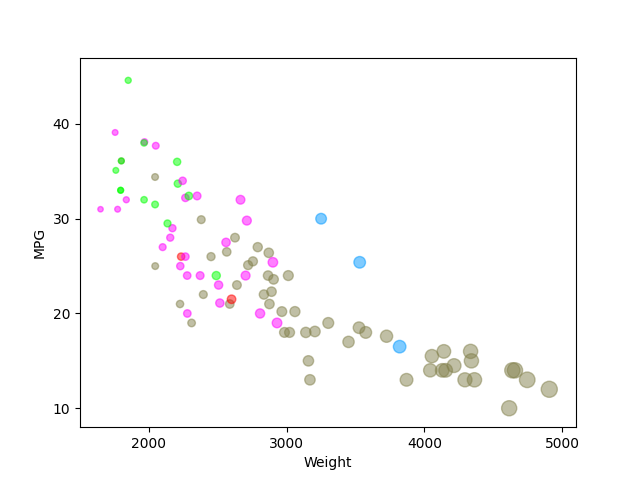

# Overview

For this project, I implemented the graph in five different ways:
- JavaScript + d3
- R + ggplot2
- Python + matplotlib
- Tableau
- Excel

# JavaScript + d3

JavaScript is the primary web scripting language, and d3 is a library for JavaScript that is designed to assist the user in implementing visualization. In order to implement this graph, I used the d3 documentation and d3's example scatter plots.

To visualize the cars dataset, I first loaded the csv using d3, filtered it to remove cars with N/A as MPG, used d3 to create an svg graph with labeled axes and tickmarks, and placed the cars on it as a scatter plot. The cars are colored based on manufacturer and sized based on weight. Additionally, this is the implementation with the technical & design achievements.

# R + ggplot2

R is a language targeted at statistic modeling and computing, and ggplot2 is a very popular library for graphing in R. In order to learn the basics of using ggplot2, I used [this](http://r-statistics.co/Complete-Ggplot2-Tutorial-Part2-Customizing-Theme-With-R-Code.html) tutorial.

To visualize the cars dataset, I made use of ggplot2's `geom_point()` layer, with aesthetics functions for the color and size.

# Python + matplotlib

Python is a simple scripting language that I am sure you are familiar with. As for why I used matplotlib, I had previously used it in my introduction to artificial intelligence class and felt that it would be a simple choice because I was somewhat familiar for it.

I used matplotlib's `scatter()` function in order to display the scatter plot, with some variables attached to each car specifying its size (precalculated, based on weight of car) and color. Additionally, cars with an MPG listed as "N/A" were filtered out. Of note is that the tick marks were explicitly specified in this implementation.

# Tableau

Tableau is a set of tools for designing visualizations, and I specifically used Tableau public. I learned how to use Tableau from Tableau's own documentation.

I created the graph by importing the data into Tableau, adding weight as a column and MPG as a row, then linking weight to size and manufacturer to color. From there, I made some minor aesthetic tweaks such as adjusting the ticks and setting the opacity. In addition to the image below, a live version of my Tableau implementation of the project can be found [here](https://public.tableau.com/profile/dyllan.cole#!/vizhome/CS4802AssignmentII/Cars).

# Excel

Excel is a spreadsheet program used for many different tasks. Thankfully, I already knew how to use Excel from a wealth of previous experience.

To create the graph in excel, I first manipulated the data some; I stratified it by manufacturer and removed cars with an N/A MPG value. I then created a bubble plot with each manufacturer as a series and manually set the color / alpha values for each one. The size of the dots on the bubble plot was linked to a value derived from the weight of the cars. Unfortunately, Excel did not allow for me to both have the correct ticks displayed and start the graph from a non-zero value; due to this, the ticks are at incorrect locations.

## Technical Achievements
Please note that these achievements are all on the JavaScript / D3 version

- Tooltip appears when mousing over a dot on scatter plot
- Tooltip shows the information associated with the car
- Cars with N/A MPG are filtered out

### Design Achievements
Please note that these achievements are all on the JavaScript / D3 version

- Graph is centered in page with title
- Used materialize.css to make tooltip follow Google's material design language
