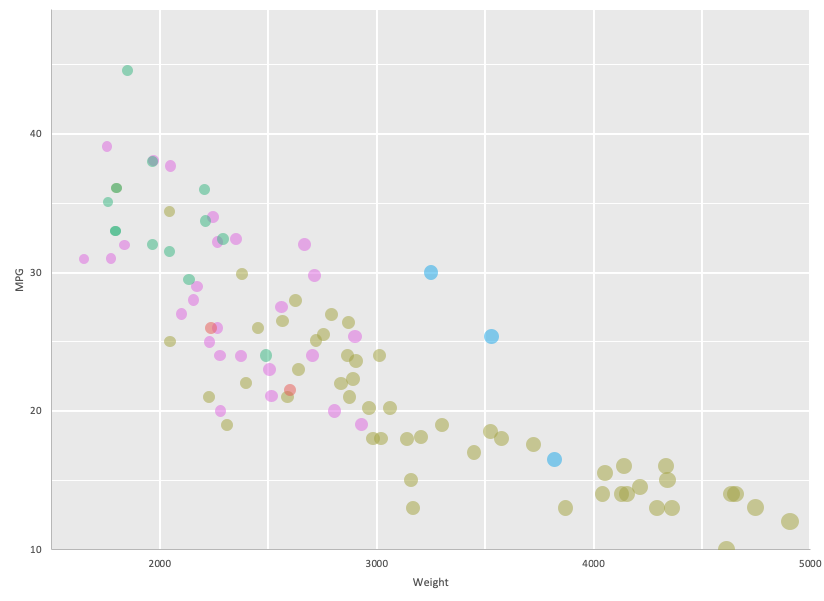
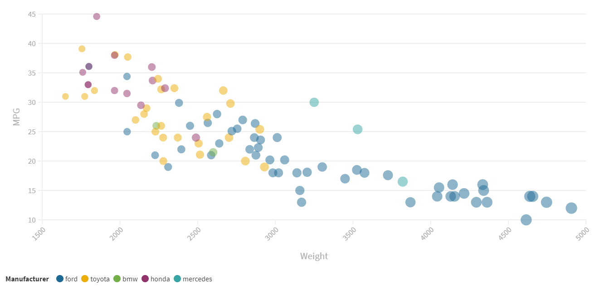
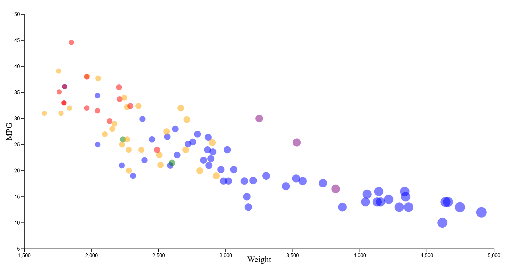
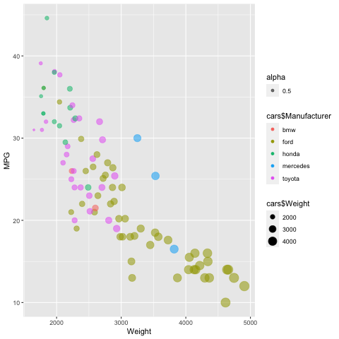
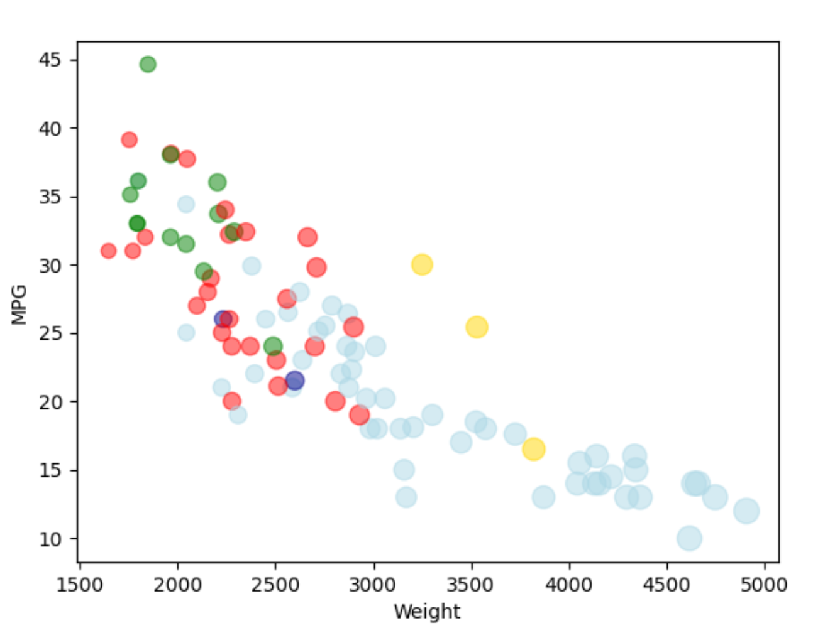

# Excel
Microsoft Excel is the basic data tool we all know and love (or hate). It's mostly graphical, although has potential for coding in it's own language (which I didn't dive into). 
I simply imported the .csv into Excel and saved it as a .xlsx. Excel was surprisingly difficult to work with to get certain features that were part of the basic requirements for this graph. 

While getting the points in as a scatterplot was relatively easy, the requirements to have the point size vary by the weight and the point color vary by the manufacturer was difficult to achieve. To get different colored points, you effectively have to create a different data series for each category (manufacture) of car. Using Excel IF statements this was relatively easy to accomplish, but still annoying. I had to create new columns of data for MPG and Weight for each manufacturer individually, and add them as their own series. 

In addition, I came to the realization that scatterplots in Excel don't have support for varying point sizes by data, and instead you have to use "bubble charts," which are essentially scatter plots with this extra functionality built in. So I changed the chart to a bubble chart, which promptly made all of the points humongous :/. After finding the scaling control for the points, I got them down to a more reasonable size. Unfortunately there appears to be no way to adjust the "breadth" of the scale, so to speak, so there's less of a difference between the size of the points for the lightest and heaviest care than I would like.

All of that being said, other options such as adding axes labels and adjusting the scale of the axes were pretty simple to manipulate. 

UPDATE: Just wanted to add, after having concluded the project, that Excel was BY FAR the most unintuitive and frustrating tool to use out of the ones that I chose. This is somewhat ironic considering I did it first thinking it was going to be one of the easiest. 

# Flourish
Flourish is an online tool for creating data visualizations that has both free and premium subscription options for use. An account is required to sign up, but overall the website seems rather substantial in the amount of visualization options it provides. I used the simple scatterplot option to set this graph up.

In comparison to the other GUI tool I used (Excel), Flourish was WAY easier to use. Like, stupidly easy to use. I was able to import the .csv file easily, and immediately was prompted to choose which columns I wanted to map to the X axis and Y axis. In addition, I was also immediately prompted with options to assign axes to use for point size and point color data. Similar to Excel, however, I couldn't locate an option to adjust the difference between smallest and largest point size, so the difference is rather subtle. Still, this took me a fraction of the time it took to set up in Excel, and even made the addition of a legend for the manufacturers a simple click to add. It also truncated and adjusted the scales of the axes completely automatically with no input from me. 

# Javascript and d3
Sources/tutorials consulted while making this plot:
https://bl.ocks.org/d3noob/5680dd0089abdc5b15f188d5efe48852
https://bl.ocks.org/d3noob/f46a355d35077a7dc12f9a97aeb6bc5d
http://bl.ocks.org/weiglemc/6185069
https://www.d3-graph-gallery.com/graph/scatter_basic.html

Using d3 to construct this scatterplot was faily involved, but had its strengths in comparison to other tools (like Excel). Importing the data from the CSV was surprisingly easy to accomplish, and d3 also makes it really easy to iterate through the data and add the points using the select all -> data -> enter -> append methodology. Structuring the import this way also allowed to add conditions farily easily, so it was pretty easy to assign different colored points to the different manufacturers using a simple series of if statements. It was also easy to using d3's built in linear scale functions both for plotting the points on the axes and for customizing the scale of the point sizing. 
If there's any weakness for d3, it's the relative complexity of adding the axes themselves and the labels. This required a fair amount of attribute changing for svg text which I was not really familiar with outside of the tutorials I was consulting. In the end it all made sense but it was still a little complex to understand. 

# R and ggplot2

Tutorial consulted while making this plot: http://www.sthda.com/english/wiki/ggplot2-scatter-plots-quick-start-guide-r-software-and-data-visualization

(Yes I am well aware this plot looks nearly identical to the example we were given. This was generated in my R environment, I swear!)

Using the ggplot2 library with the programming language R, it was shockingly easy to generate. Importing the .csv file was easy after I figured out that you needed to escape the backslashes in the directory to the file. The simple ggplot() command to generate the plot made is simple to set the axes and the properties for the point, and was easy to understand as soon as I figured out that "aes" was short for aesthetic mapping. ggplot makes it super simple to indicate "x=Weight, y=MPG", and automatically built the axes. I completely guessed how to map the color to the manufacterer property and got it right ("color=Manufacturer"), which speaks to how intuitive it was to achieve plot features like that. And the cherry on top of the whole thing was the automatic labeling of the axes and generation of legends, completely unprompted by me. Definitley an easier experience than I was expecting!

# Python and Matplotlib

Resources consulted: 
https://matplotlib.org/stable/api/_as_gen/matplotlib.pyplot.scatter.html
https://stackoverflow.com/questions/46614526/how-to-import-a-csv-file-into-a-data-array
https://stackoverflow.com/questions/903853/how-do-you-extract-a-column-from-a-multi-dimensional-array

Python and Matplotlib were probably the most difficult to work with out of the three scripting style tools that I used for this project. While importing the csv itself was relatively easy, working with the data generated was difficult. Additional code was required to "tease" out the columns in the CSV, using a special function to send the desired columns to their own arrays. In addition, the data from the .csv file came through as strings and had to be converted to doubles. 

Setting the variable colors and point sizes had easy and difficult aspects. While it was easy to add those conditions to Matplotlib's plt.scatter() command, the arguments required that the size data and color data be put in exactly (as opposed to assigning colors to categories and scaling size based off of the weight data). As a consequence, additional arrays had to be created mapping manufacturers to specific colors, and applying a scale factor to the weight data (dividing by 30 seemed to work ok). 

That being said, in comparison to some of the other tools, it was very easy to add axis labels and the scales and tick marks for the axes were generated completely automatically. 

## Technical Achievements
- **Filtering of "NA" points within Python and Matplotlib**: 
Python and Matplotlib required significantly more work than the other tools to filter out the data points where MPG was listed as "NA". While the other tools filtered these out automatically, for Matplotlib I had to manually traverse the carMPG array/column using a for loop, marking indicies where the MPG was listed as "NA". Then, another for loop popped the MPG, Weight, and Manufacturer arrays at the "bad" indicies. In addition, I ran into an issue where the index of cars to be popped changed because popping shifts the entire array. To compensate for this, the "currentIndex" variable in the second for loop had to be decremented whenever a popping action occured.
While I understand that there was no specific requirement for handling the "NA" cars a certain way, I wanted to set it up this way to match the other plots I created using different tools. In addition, I wanted a solution that worked even if the data set changed (I could have manually removed the specific problematic rows in this data set, but I wanted a more substantial solution). 

## Design Achievements

