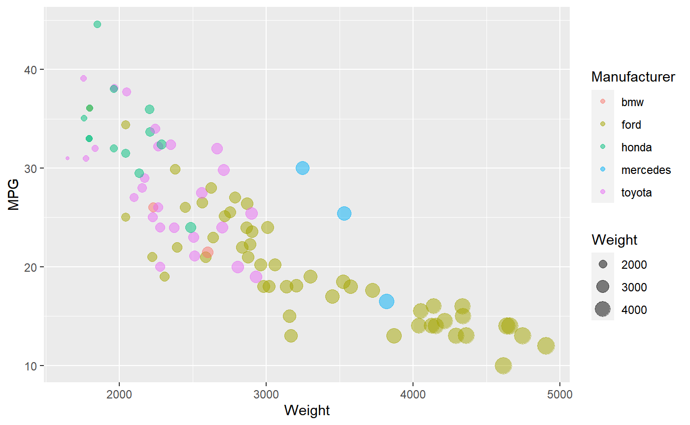

# Excel
Microsoft Excel is the basic data tool we all know and love (or hate). It's mostly graphical, although has potential for coding in it's own language (which I didn't dive into). 
I simply imported the .csv into Excel and saved it as a .xlsx. Excel was surprisingly difficult to work with to get certain features that were part of the basic requirements for this graph. 

While getting the points in as a scatterplot was relatively easy, the requirements to have the point size vary by the weight and the point color vary by the manufacturer was difficult to achieve. To get different colored points, you effectively have to create a different data series for each category (manufacture) of car. Using Excel IF statements this was relatively easy to accomplish, but still annoying. I had to create new columns of data for MPG and Weight for each manufacturer individually, and add them as their own series. 

In addition, I came to the realization that scatterplots in Excel don't have support for varying point sizes by data, and instead you have to use "bubble charts," which are essentially scatter plots with this extra functionality built in. So I changed the chart to a bubble chart, which promptly made all of the points humongous :/. After finding the scaling control for the points, I got them down to a more reasonable size. Unfortunately there appears to be no way to adjust the "breadth" of the scale, so to speak, so there's less of a difference between the size of the points for the lightest and heaviest care than I would like.

All of that being said, other options such as adding axes labels and adjusting the scale of the axes were pretty simple to manipulate. 

# Flourish
Flourish is an online tool for creating data visualizations that has both free and premium subscription options for use. An account is required to sign up, but overall the website seems rather substantial in the amount of visualization options it provides. I used the simple scatterplot option to set this graph up.

In comparison to the other GUI tool I used (Excel), Flourish was WAY easier to use. Like, stupidly easy to use. I was able to import the .csv file easily, and immediately was prompted to choose which columns I wanted to map to the X axis and Y axis. In addition, I was also immediately prompted with options to assign axes to use for point size and point color data. Similar to Excel, however, I couldn't locate an option to adjust the difference between smallest and largest point size, so the difference is rather subtle. Still, this took me a fraction of the time it took to set up in Excel, and even made the addition of a legend for the manufacturers a simple click to add. It also truncated and adjusted the scales of the axes completely automatically with no input from me. 

# d3
Sources/tutorials consulted while making this plot:
https://bl.ocks.org/d3noob/5680dd0089abdc5b15f188d5efe48852
https://bl.ocks.org/d3noob/f46a355d35077a7dc12f9a97aeb6bc5d
http://bl.ocks.org/weiglemc/6185069
https://www.d3-graph-gallery.com/graph/scatter_basic.html

Using d3 to construct this scatterplot was faily involved, but had its strengths in comparison to other tools (like Excel). Importing the data from the CSV was surprisingly easy to accomplish, and d3 also makes it really easy to iterate through the data and add the points using the select all -> data -> enter -> append methodology. Structuring the import this way also allowed to add conditions farily easily, so it was pretty easy to assign different colored points to the different manufacturers using a simple series of if statements. It was also easy to using d3's built in linear scale functions both for plotting the points on the axes and for customizing the scale of the point sizing. 
If there's any weakness for d3, it's the relative complexity of adding the axes themselves and the labels. This required a fair amount of attribute changing for svg text which I was not really familiar with outside of the tutorials I was consulting. In the end it all made sense but it was still a little complex to understand. 

# R + ggplot2 + R Markdown

R is a language primarily focused on statistical computing.
ggplot2 is a popular library for charting in R.
R Markdown is a document format that compiles to HTML or PDF and allows you to include the output of R code directly in the document.

To visualized the cars dataset, I made use of ggplot2's `geom_point()` layer, with aesthetics functions for the color and size.

While it takes time to find the correct documentation, these functions made the effort creating this chart minimal.

# d3...

(And so on...)

## Technical Achievements
- **Proved P=NP**: Using a combination of...
- **Solved AI Forever**: ...

### Design Achievements
- **Re-vamped Apple's Design Philosophy**: As demonstrated in my colorscheme...
