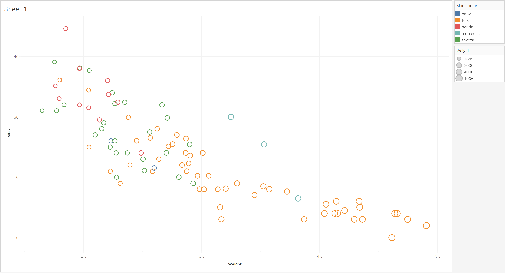

# Overview

(TBD)

# JavaScript + d3

(TBD)

# R + ggplot2

R is a language targeted at statistic modeling and computing, and ggplot2 is a very popular library for graphing in R. In order to learn the basics of using ggplot2, I used  tutorial.

To visualized the cars dataset, I made use of ggplot2's `geom_point()` layer, with aesthetics functions for the color and size.

# Python + matplotlib

Python is a simple scripting language that I am sure you are familiar with. As for why I used matplotlib, I had previously used it in my introduction to artificial intelligence class and felt that it would be a simple choice because I was somewhat familiar for it.

I used matplotlib's `scatter()` function in order to display the scatter plot, with some variables attached to each car specifying its size (precalculated, based on weight of car) and color. Additionally, cars with an MPG listed as "N/A" were filtered out.

# Tableau

Tableau is a set of tools for designing visualizations, and I specifically used Tableau public. I learned how to use Tableau from Tableau's own documentation.

# Excel

## Technical Achievements
- A
- B

### Design Achievements
- C
