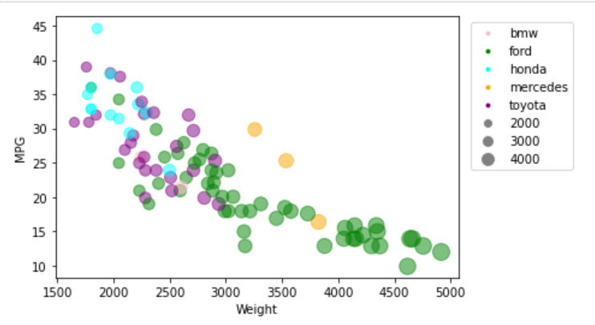
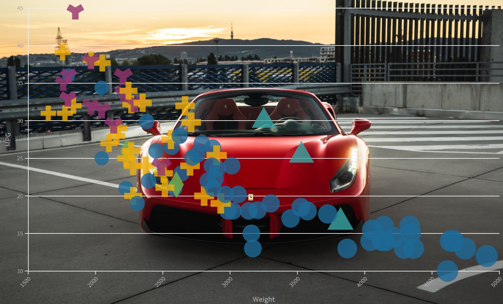
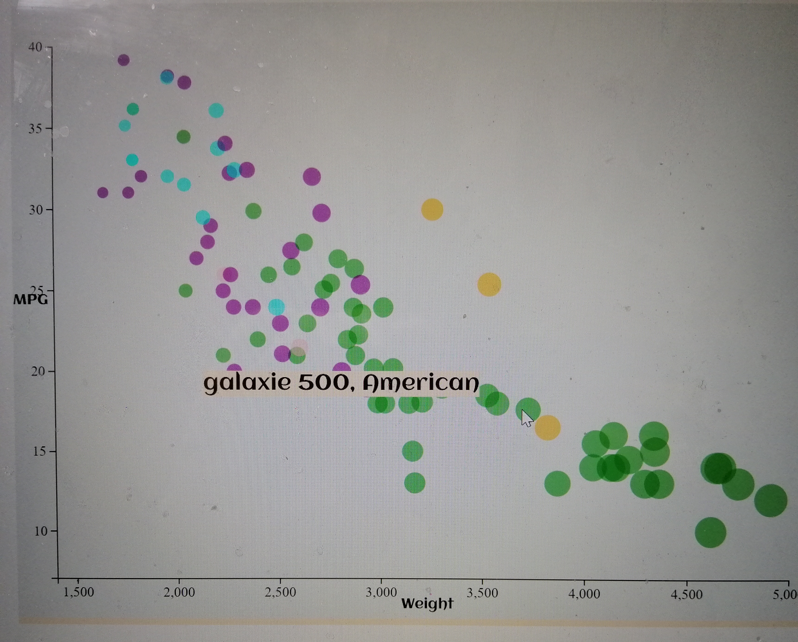
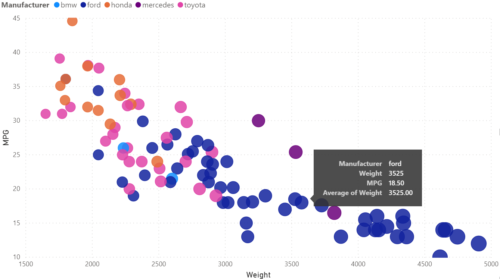
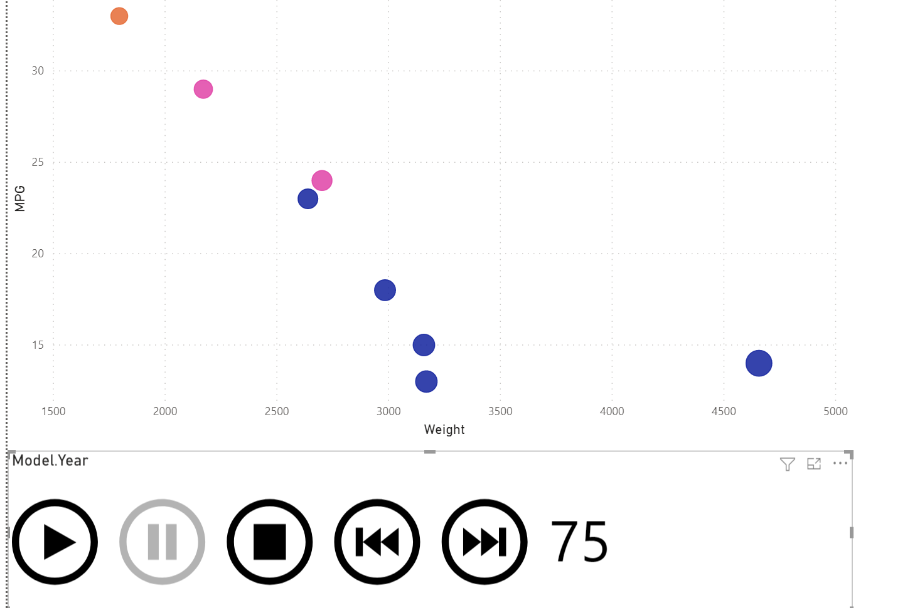

# 02-DataVis-5ways

Assignment 2 - Data Visualization, 5 Ways  
===

# ggplot2
R is a language and environment especially for statistical computing
 and graphics (cited from R official website). It is a very powerful
 tool to analyze data and create visualization to present data. This 
 is my first time to try R, and how concise and convenient it is
 surprised me. The core part to draw the scatter plot is actually
 a piece of one-line code. Combined with R, I used `ggplot2` package
 which is a data visualization package in R. I first retrieved the
 data from sample csv file by using `read.csv()` function and then 
 used `ggplot()` function to draw the points on the graph and assigning
 different colors and sizes based on the Manufacturer and Weight, 
 respectively. With R and ggplot2, the legend is also quite easy
 to draw.
 
 
 
 # Python+matplotlib
 I had the experience of draw maps and graphs with Python before,
 so this part was not very difficult to me. I imported `pandas` 
 as to read the sample csv file and store the data as a dataframe.
 Then I iterate over the dataframe to draw each point. To draw the points,
 I imported `matplotlib`, which is a powerful library for plotting in Python.
 To draw the legends, I used `matplotlib.Line2D` and took each line as a
 single legend (for example, pink circle represents bmw) and combined 
 them together.
 
 
 
 # Flourish
 So far Flourish is the easiest tool I used to create the scatter
 plot, as I have no need to write code by myself. All the functions I
 wanted to use, including drawing x and y axis, x and y labels, loading data, 
 mapping each data as a circle, changing the colors and sizes, etc. I can
 also easily change the background to be an image and design different
 shapes for different Manufacturers.
 
 
 
 # JavaScript+d3
 As this course is basically all about creating wonderful data visualization
 webpages, `JavaScript` and `d3` are requisite. Different from other tools, 
 with JavaScript and d3, I have to write a lot of code to make it work.
 The x and y axis, axis labels, canvas for the graph and circles need
 to be all written by myself. But with the previous experience of assignment 1,
 things get a lot easier. I created a svg and added axis, labels and shapes to it.
 I also created tooltips so that when the mouse hover over a point, there will
 be a message pops up; and when the mouse moves away, the message disappears.
 
  
  
 # PowerBI+PlayAxis
 Finally is the PowerBI, a super great tool for data visualization.
 When I did my MQP, I used PowerBI to visualize the data and present to
 my sponsors. Before plotting, the first thing to do is to load data, which 
 can be done by one click. Then go back to the visual page and choose the right
 visual. In this case I chose the `scatter chart`. The following is the screenshot 
 of the complete scatter plot. There will also be tooltips showing up when the 
 mouse hovers over a circle.
 
  
 
 Besides the basic scatter plot, I also made an animation about it.
 By clicking on the "start" button in the play axis at the bottom, 
 the scatter chart will be played based on the Model Year. For example, in
 the following screenshot, the circles represent the cars that are in
 the Model Year of 75. Later I will attach a link to a video showing the
 animation details.
 
  

## Technical Achievements
- **Tooltip**: 
Sometimes when we look at a chart, we want to know the details about
each circle (or other shapes representing a point). For example, in 
this assignment, we have a general understanding about the weight, Manufacturer and MPG based on
the color, size and x-y position of each point. But what about the Origin, 
the Model Year, or the specific car name? These can't be seen on the chart.
With tooltips showing up when the mouse hovers over the points, the issue
can be resolved. In my JavaScript+d3 scatter plot, when the mouse
hovers over a point, there will be a tooltip telling you about the 
specific car name and the origin of the car. In my PowerBI+PlayAxis
scatter chart, when the mouse hovers over a point, there will be details
 about the value of weight, Manufacturer and MPG.
 
- **PowerBI Animation**: 
So far, except PowerBI, all the other tools or languages I used
created a still chart that nothing moves or animates. However, 
sometimes we also want to see how about the data change in a specific
timeline. I created an animation in PowerBI with an imported visual,
`PlayAxis` and set the timeline to be the Model Year. If you want
to know what the chart will look like in different model years and how
does the car market changes in different years, click on the play
axis and PowerBI will display an animation for you. Here is the link to the video about the animation: https://drive.google.com/file/d/1dhFP5L0mWwXELgy-mj9SIxv996v3G7Ks/view?usp=sharing

## Design Achievements
- **Web Page with Google Font**: 
Font plays an important role in web pages. When coding with HTML and
JavaScript, there is a default font. It is very formal, but also looks
boring. For most of the web pages, there are many texts. If we could
use a more interesting font, the users might be more willing to stay
on the webpages. In my JavaScript+d3 scatter plot, the x and y axis name 
(Weight and MPG) are in a Google Font called `Aclonica`. Also, if
you hover your mouse over the points, you will also see that the
text in the tooltips are in the font of `Aclonica`.

- **Different Shapes in Flourish**:
We are seeing a lot of scatter plots with a single shape. Here in
all of my other plots, the shape is circle. However, in Flourish, there
is an option to choose different shapes for different kinds of points.
I not only make different colors for different Manufacturers (for example, 
blue for ford), I also make them to be different shapes. 'Y' represents
honda, '+' represents toyota, diamond represents bmw, circle represents ford,
 and triangle represents mercedes. This looks a lot more fun, doesn't it?
 Also, don't worry about the size. For each shape, the size is still based
 on the weight.
