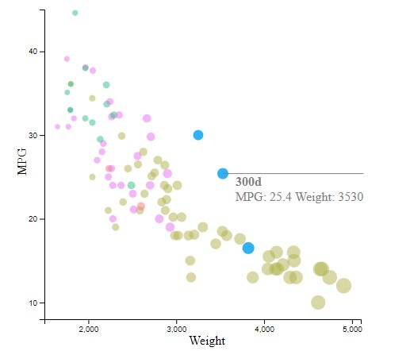

Assignment 2 - Data Visualization, 5 Ways  
===

# Excel

Excel is an extremely common tool used for making charts. So I thought I should finally make something using it.

Imputing the data was easy, but I had to do some manipulation. 
I sorted the data by the manufacturer and manually created each series group. 
I also deleted the values where the MPG was NA, since those bubbles would show up.
Excel did not immediately recognize the data MPG as numbers, so I had to edit each box.

Excel has okay axis controls, but it lacks direct control. I was able to replicate the scale, 
but I could not find a method to set the axes correctly. 
I could not set the axis intersection value lower than the minimum since it would default to the minimum. 
If I changed the minimum, then all the numbers would change. 
If I could fix the axes, the background would fix itself.
Getting tick marks without lines seems impossible, I saw some hacks for it that worked in older versions of excel.

In the future I would use Excel for quickly putting in data to see what it looked like or
trying out different types of vis with the same dataset.

# d3

D3 is the main library we are using in this course, so it was an easy choice for this project.

Using d3 feels a lot more manual. There are no plots, instead, I had to position the data,
axes, and axes labels. With this control it takes a lot of tweaking to get the right plot, but 
in return I have a lot of control over positioning. Adding additional functionality can be tricky,
but it is always possible to make the vis interactive.

In the future I would use d3 for creating an interactive vis, when I have already decided exactly 
what I am making.

# R and ggplot

R with GG plot was the library used to create the original vis. So it should be able to re-create it.

I found re-creating the graph to be easy once I understood how ggplot worked. 
I am surprised I needed only 5 lines of code. 
Though it was only easy because the vis used R's default color scheme.
If the colors, font, axis, or other elements were different, 
it would be difficult to re-create the vis in R.

In the future I would use R if I need to make a simple static vis, or a quick plot.

# JFreeChart 

I have coded a lot of Java so I thought it would be easy to use a library there to make a chart.
JFreeChart sounded like a good library for making charts.

Turns out, I was wrong. It took a lot of set up for the project to run.
First, JFreeChart relies on Maven, so I had to make my project into a Maven project to manage Maven dependencies.
Then, JFreeChart does not distribute the jar, so I had to build it using Maven.
Next, I found that the CSV class for JFreeChart was very bare bones, it expects all the attributes to be floats
and could not parse the CSV. 
Finally, I found another library to read the CSV called OpenCSV, so I could start making the chart. 

The actual library functionality was not too hard to use.
The axis names were easy to set, but the colors were hard to figure out.
In many cases the library provided too many methods to choose from.

In the future I would use JFreeChart if I found a good reason to use it.
The set up took a long time, but I like the result.

You can run the jar to remake the chart, 
see ./JFreeChart/JFreeChartCarSample/chart.jar

Design Achievements
--

The design achievement for this project was matching the color scheme as closely as possible. 
I first tried to pick colors directly from the image using a simple color picker. 
Unfortunately, the colors produced looked faded compared to the image, since the circles need to 
have 50% transparency, on a light-colored background. 

To get the actual colors I used a simple screen color picker tool I found, to match the output colors. 
I took my first vis in Excel, added the matching light grey background, and the 50% circle transparency.
With this simulation, I slowly changed the color inputs to match the color of the picture.

This produced the following color hex codes I used for all my vis recreations:

bmw: #F77973 

ford: #B0B24B

honda: #31BC80

mercedes: #2FB1F6

toyota:	#E86DF1

The color picker I used:  
https://download.cnet.com/ScreenColorPicker/3000-2383_4-75796638.html

Technical Achievements
---

The technical achievement for this project was adding group highlighting and annotations to the d3 plot.

The group highlighting changes the opacity to 1.0 for the selected brand when hovered over,
and changes the opacity back to 0.5 when not hovered over.
To do this process I added a class to each circle that represents its manufacturer. 
Then I used d3 to select the manufacturer class.
Finally I used d3 color to change the opacity of the manufacturer's color. 

The annotations adds the car name, MPG, and Weight to a circle when moused over.
I used d3 annotations to add the annotation.
I displayed the annotation this way because it does not cut off any information for any of the data points.
Adding more information from the CSV is doable but I think it would be too much information.

D3 annotations was interesting to use, it somehow works in d3-v6, even though it is meant for d3-v4;
so there may be some features I did not explore that no longer work.

D3 Annotations:  
https://d3-annotation.susielu.com/