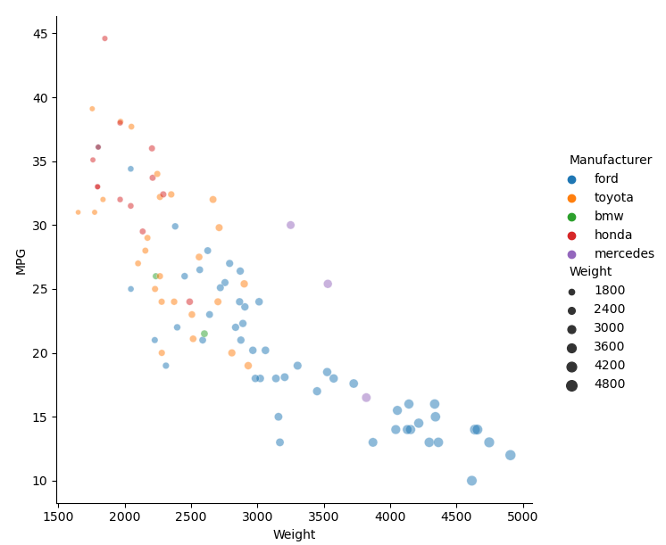

# Assignment 2 - Data Visualization, 5 Ways

## Libraries, Tools, Languages

You are required to use 5 different tools or libraries.
Of the 5 tools, you must use at least 3 libraries (libraries require code of some kind).
This could be `Python, R, Javascript` :heavy_check_mark: or `Java, Javascript, Matlab` or any other combination.
Dedicated tools (i.e. Excel) do not count towards the language requirement.

- R + ggplot2 :heavy_check_mark:
- Excel :heavy_check_mark:
- d3  :heavy_check_mark:
- Matplotlib :heavy_check_mark:
- Python + Seaborn :heavy_check_mark:
- Matlab :heavy_check_mark:

## Other Requirements

0. Your code should be forked from the GitHub repo. :heavy_check_mark:
1. Place all code, Excel sheets, etcetera in a named folder. :heavy_check_mark:
1. Your writeup (readme.md in the repo) should also contain the following:

- Description of the Technical achievements you attempted with this visualization. :heavy_check_mark:
- Description of the Design achievements you attempted with this visualization. :heavy_check_mark:

# R + ggplot2

# Excel

# d3

# Matplotlib

# Python + Seaborn

# Matlab

## Technical Achievements

- **xyz**: 
- **xyz**: 

### Design Achievements

- **xyz**:
