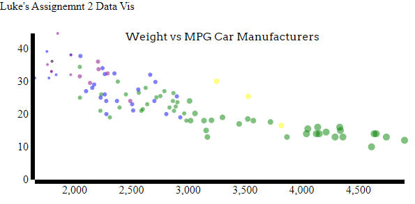

# Python

Python is by far my favorite overall programming language, especially when it comes to data manipulation. Using a few different common libraries (numpy, pandas, mathplotlib) I was able to pretty quickly put together a graph similar to what was asked.

It was easy to make the graph look nice, color code based on manufacturer and even add a legend. What was not easy was scaling the size of the individual dots. If you look at plot.py you can see some commented out code trying to fix this problem but to no avail. I'm sure I would be able to successfully scale the size of the dots given more time.

# Excel

Excel was a program I thought would be rather easy to create a graphic with. Unfortunately, with my lack of excel expertise it ended up taking longer then expected, allthough I do feel as if I could do something similar in excel much faster now.

Looking at the graph, you can see it has been color coded based on manufacturer with a legend at the side. This was the only other program I was also unable to figure out a way to scale the size of each individual point. Looking at my excel file (data vis.xlsx) you can see how the points were grouped up, running some quick commands allowed me to group not only by manufacturer but also by weight. Unfortunately, even though I was able to group by weight, I still was unale to scale the size based off of that.

# Flourish

Having never used this program before, it was remarkably easy to import my data and get a graph created. I was able to hit every necessary point for this project with ease using Flourish. Grouping my manufacture and scaling size based on weight were both only a few clicks away. Allthough, I do recognize the limitations this software comes with in comparison to an actual coding language like d3 (javascript) or python.

Looking at the graph, you can see the grouping by manufacturer with the legend at the top as well as the scaling of size based off of weight. Making the points transparent was another quick change using Flourish. 

# Scatterplotonline

After using Flourish, I wanted to see if I could find another online graphing tool with similar features. This led me to using a few different websites and eventually landing on "scatterplotonline". This software was also very easy to use for basic graphic needs. It categorized all the columns by itself for use in drop down menus for things like "Scaling size of points based on []". This made meeting the assinments requirements easy while also allowing quite a few different options.

Looking at the graph, the points were grouped by manufacturer and colored with a legend in the top right. The points were scaled based on weight and given half opacity. 

# d3

Best for last. d3 was by far the most interesting tool to use for this assignment. The amount of customization and options you have is daunting. I decided to try and recreate the graphs I had already made and then add some more functionality to try and test what is possible withing d3. 

Looking at the graph, you can see it is quite basic and similar to my other graphs, just that alone was a much harder feat in comparison to something like Flourish or scatterplotonline. The difference being, after getting that basic functionality of the graph, I was able to expand upon that and add extra data, I'll talk about this in the Achievements section below.

## Technical Achievements
- The majority of my graphs had legends (excluding d3)
- d3 graph functionality
  - Mousing over a point on my d3 graph will do 2 things:
      - change the opacity to 1, making it stand out
      - tooltip donut will pop up and tell you which car it is you're looking at

### Design Achievements
- Majority of my time was spent making them look better, rather then getting them to work.