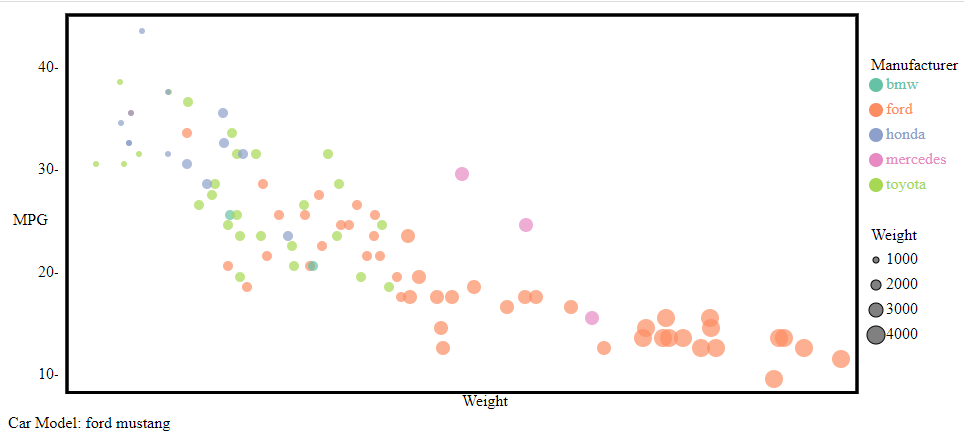

# 02-DataVis-5ways

Assignment 2 - Data Visualization, 5 Ways  
===

# R + ggplot2

R is a language primarily focused on statistical computing.
ggplot2 is a popular library for charting in R.
R Markdown is a document format that compiles to HTML or PDF and allows you to include the output of R code directly in the document.

To visualized the cars dataset, I made use of ggplot2's `geom_point()` layer, with aesthetics functions for the color and size.
The fact that this can be done in one line of code, while d3 is over 100 (at least in my naive experience) makes this very valuable for plotting. The lack of customization is the tradeoff. 

# d3

d3, as we know, is a javascript library for creating visualizations. d3, unlike many of the other solutions/tools used, is not built specifically to make a scatter plot, so most things had to happen by hand. 

d3s tools make it simple to produce the points in the proper locations based on the weight and mpg attributes, but it can be tricky to load the csv data properly. 

However, the difficulty of producing a legend is difficult to understate. Even axis tic marks and titles were difficult to tackle, because you have to use workarounds. I used a '-' character for the vertical axis tic marks. That is how you know things got desparate. This was by far the most code I wrote out of the 5 ways, however, the most customized. 

# matplotlib

matplotlib is a python library used for plotting data, so an ideal choice for this task. The documentation is easily searchable and was really nice to use for changing the color and size of the different dots.

I took a quick and hacky approach to this one, especially where it relates to the size chart legends. I used a for loop to change the generated titles in a pretty yucky way but got it to work! Which was nice.
Here it is!

# tableau

Tableu is a piece of proprietary software that actually worked quite well for this dataset. There were built in tools for exactly what I needed, and a handy drag and drop interface that saved my night...

I had a bit of trouble due to its default summing function that applies to new measures. Also the water is a bit muddied between dimensions and measures, I didn't get that right away. 

# excel

Microsoft Excel is a tried and true tool for data manipulation and analysis. Once you arrange the data into 3 columns, the easiest way to color code the data was using the series feature. There are handy built ins that let me sort the data by manufacturer so I can easily create the different series. 

I don't think this means anything, but the excel plotting brought me the least joy to see the final product, I'm not sure if its because I've used the tool before, but thought I would mention it. 

## Technical Achievements
- **Added Selection to d3 vis**: when you hover over a point in the d3 vis, it shows you the name (make/model) of the car below the chart. 
- **Data Cleaning**: Some of the data had invalid (NA) data. Cleaned this data out so that it would not mess up any of the tools vis. 

### Design Achievements
- **d3 visualization**: Actually included the legend and axis titles in d3. This might not seem like much, but to me, including these features is an important design feature, and an achievement because it was tricky to perform. Also (as listed above) implemented the hover over feature. This is also a design achievement because I believe people might want to know what cars lie on the extremities of the graph, and need a way to see what each data point is. 
