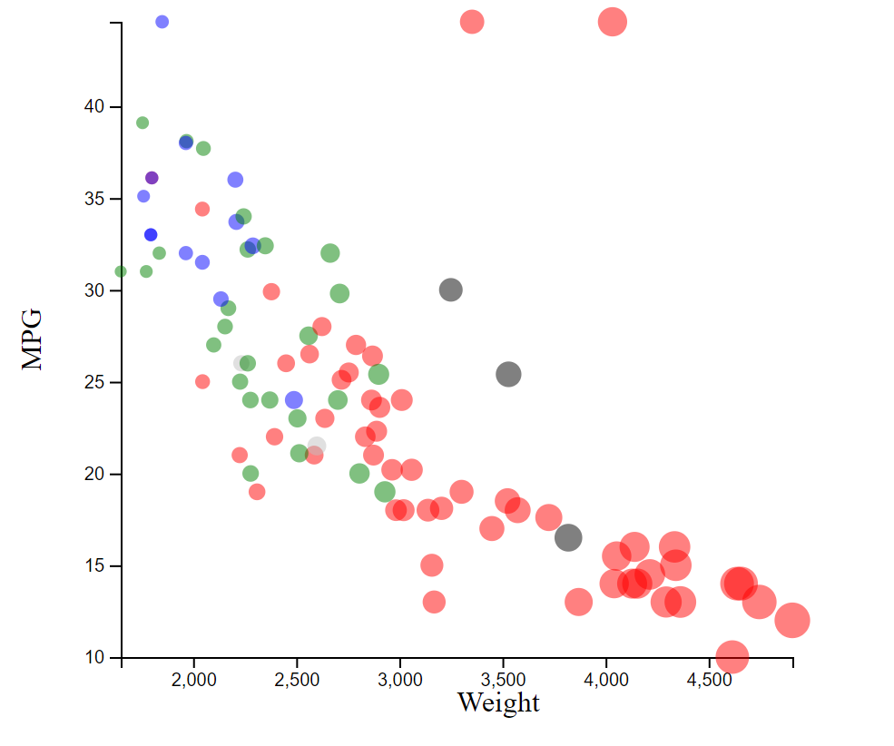
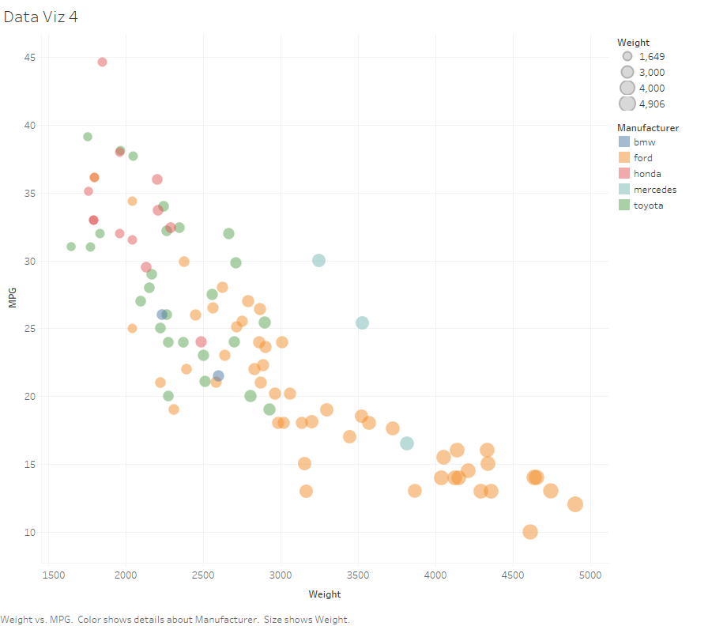

# D3

The first data vizualiation tool I used for this assignment was D3. Since I am relativley new to D3 it took me some time
to get used to the syntax and anon functions. But after that I found the data visualization pretty simple. It was challenging
to understanding how the data was imported from CSV into JSON object. But overall, the tool is powerful and I see myself 
using it again

## Technical achievements: 
For the technical achievement I animated the graph to make it look like the graphical points
are bouncing. This animation is delayed based on the color/company that the point is from. 

## Design achievements 
For the design achievement I added tooltips to the data points that contained more specific information
on that data point. The tooltip contains that car name, MPG, and Weight. 

# Excel

The second tool I used was Excel. Coming into this course I had used a fair amount of Excel and assumed that a task 
like this would be fairly simple to accomplish. However, I was mistaken. This program is not well suited for a graph like this
It is challenging to group series by color, and change the size of the point based on the weight. This required a lot of data
manipulation in the CSV file. I would only use Excel for simple 1 to 1 relationship functions. [X, Y]. 

## Technical Achievements
NA
## Design Achievements
NA

# R + ggplot2

The third tool I used was R and ggplot2. This was very simple to use, and it made this viz extremely simple to accomplish. 
As you can see everything was accomplished in a single line of code using ggplot library and the geom_point() function. 
For intensive viz projects I would most certainly feel comfortable using R + ggplot again. The power of the tool was unmatched
compared to the others used in this assignment. 

## Technical Achievements
NA
## Design Achievements
NA

# Python + matplotlib + (pandas)

The fourth tool I used was Python and matplotlib. This was also very similar to use and it made this viz simple to accomplish. 
The hardest part of using this libary was learning how to extract information from the pandas library dataframe. However, despite this
it still did not require any data manipulation. I found that matplotlib with pandas was as simple to use as ggplot2.

## Technical Achievements
NA
## Design Achievements
NA

# Tableau

The last tool I used was tableau. Tableau is tool similar to excel, but with more flexibility in terms of data presentation. 
I enjoyed learning this new tool and was surprised with the complexity of the data analysis tools, and data presentation tools. 
Once I learned about the GUI and was able to get myself oriented, constructing a graph was done within a few clicks. Overall, 
I would use Tableau over Excel any day (still not as good as ggplot2 and python though). 

## Technical Achievements
NA
## Design Achievements
NA