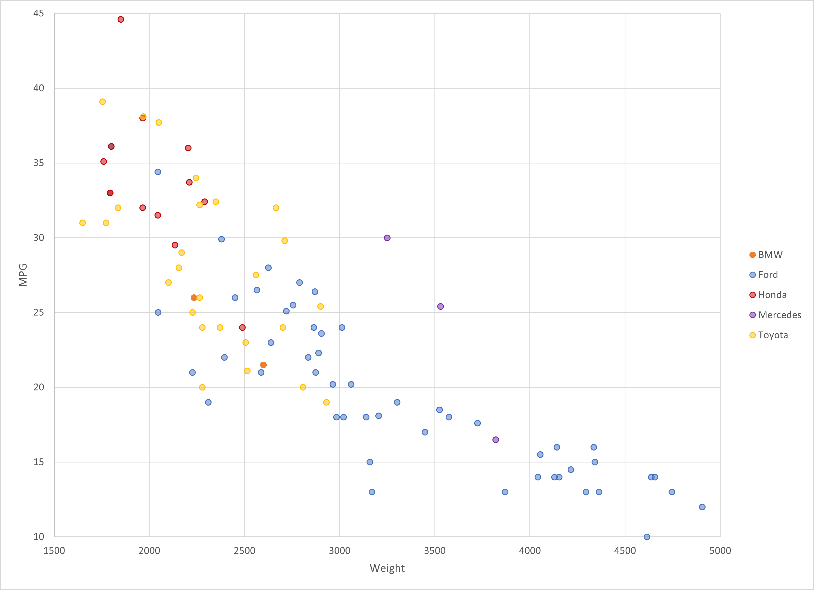

# Assignment 2 - Data Visualization, 5 Ways

## Libraries, Tools, Languages

You are required to use 5 different tools or libraries.
Of the 5 tools, you must use at least 3 libraries (libraries require code of some kind).
This could be `Python, R, Javascript` :heavy_check_mark: or `Java, Javascript, Matlab` or any other combination.
Dedicated tools (i.e. Excel) do not count towards the language requirement.

- R + ggplot2 :heavy_check_mark:
- Excel :heavy_check_mark:
- d3 :heavy_check_mark:
- Matplotlib :heavy_check_mark:
- Python + Seaborn :heavy_check_mark:
- Flourish :heavy_check_mark:

## Other Requirements

0. Your code should be forked from the GitHub repo. :heavy_check_mark:
1. Place all code, Excel sheets, etcetera in a named folder. :heavy_check_mark:
1. Your writeup (readme.md in the repo) should also contain the following:

- Description of the Technical achievements you attempted with this visualization. :heavy_check_mark:
- Description of the Design achievements you attempted with this visualization. :heavy_check_mark:

# R + ggplot2

I created my plot using RStudio, which is an integrated development environment for R. R is a language and environment for statistical computing and graphics. To make this chart I used ggplot2(), which is a data visualization pakage that allows you to break up a graph into its components to customize.
Before I was able to plot, I had to read in the cars-sample.csv file.
I have used R and RStudio in multiple classes and projects, so I did not find it difficult to plot the cars-sample data.

# Excel

Excel is a widely used tool for spreadsheets and graphing. For this tool, I imported the neccessary columns (Manufacturer, Weight, MPG), and created scatter plot using the numeric data in the Weight and MP columns. From there I created categores based on the distinct manufactures. Each manufacturer was colored ith respect to the original graph specification.
I would consider Excel to be an easy tool to create a scatterplot visualization. The customization of the chart was easy to do since the UI was straightforward.

# d3

# Matplotlib

# Python + Seaborn

# Flourish

[Link to Visualization using Flourish](https://public.flourish.studio/visualisation/5281299/)  
Flourish is an online data visualization and storytelling tool. This tool allows you to import a dataset and create charts accordingly. Within Flourish, you can categorize the data and assign colors to specific categories. For the case of the cars-sample dataset, I assigned each car manufacturer it's own color.
I was unable to figure out how to weight each data point, but when you hover over a specific data point you can get the actual coordinates.
Since this was my first time using Flourish, it took a little bit of trial and error to configur the visualization to the correct specifications.

## Technical Achievements

- **Extra Visualization**: I completed 6 total visualizatons of the cars-sample.csv data. My extra chart comes from Flourish.

### Design Achievements

- **Color Consistency**: Matched (as close as I could) the colors from the original specification in all of the charts.
