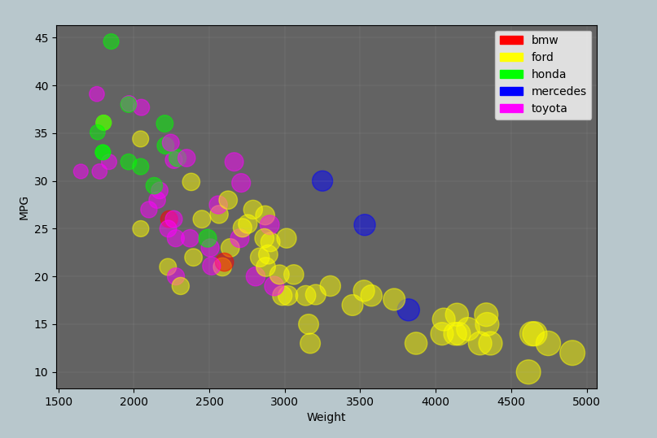

# 02-DataVis-5ways

Assignment 2 - Data Visualization, 5 Ways  
===

Plots
---

# R + ggplot2

Without much experience in R I was quite hesitant to pick up this library, oh man I’m glad I did. The documentation is amazing (<a href=https://ggplot2.tidyverse.org/reference/index.html>ggplot2</a>) and was the only thing I needed to replicate this graph in record time, aside from the usual “how make library and code go brrr”. The few lines of code required consisted of exactly, load library, load data, make super crazy all in one amazing plot, and save image. Just like that, legends for the attributes and gridlines built in, I see now why this is such a powerful tool. Especially with a target in mind, finding the functions I needed was a breeze. I do think I would get a little caught up if I did not have such a clear-cut idea of what I wanted to create; thought with some great documentation it looks to be fun to explore.

# Matplotlib

Matplotlib was a bit more familiar territory for me. I have use some of the library and Python in a previous class, so I was able to load the csv and make a scatter plot fairly quickly. The documentation came in quite handy for scaling the points and coloring them. After a while I came back to add the grid lines and the legend *see Design Achievement*.

Docs: <a href="https://matplotlib.org/api/_as_gen/matplotlib.pyplot.html" target="_blank">Matplotlib.pyplot</a>

# D3

I still have a lot to learn when it comes to D3 and the syntax is still a bit tricky. I was able to find a simple scatter plot example (<a href=https://www.d3-graph-gallery.com/graph/scatter_basic.html target="_blank"> Basic scatterplot in d3.js</a>) that really helped me get started. It’s still a handful jumping between HTML, D3 and JS docks, but, before long I was able to replicate the plot.I still have difficulties lining things up with divs and margins and makes for a lot of “Magic” numbers that hurt code readability.

# Flourish

I looked up Flourish to check it out not realizing that I would be done replicating the plot within the next 5min! Without having to write a single line of code it was only a dozen or so clicks to get the data loaded and plotted just the way I needed. This is a great tool for getting something done in a snap. Although it is quite fast there is a lot of flexibility taken away from having this check box approach. Even something as simple as placing the legend on the right of the graph did not seem possible without writing something yourself and without access to the HTML (unless paid for) there is no room to expand upon what the tool creates for you.

Personally, I would not use this tool very much as I would prefer the flexibility that programming myself gives me.

<a href="https://public.flourish.studio/visualisation/5258253/" target="_blank">Flourish vis</a>

# Excel

Excel would not be my first choice when making a vis. It was easy to separate the data quickly, however, navigating through the same three windows over and over again selecting the data to build the bubble chart exactly the way I wanted was repetitive and tedious. If I were working with a much larger dataset, I would quickly move over to a programming language that would allow me to separate and map data recursively instead of adding each grouping individually.

## Technical Achievements
- None this time around :(

### Design Achievements
- For a while I had been making graphs with matplotlib without gridlines, legends, or even labels. Finally, I decided to end this madness by taking advantage of powerful tools like plt.grid, plt.legend, and patches. Though my colors could probably use some work I think this turned out to be one of the better-looking graphs.
