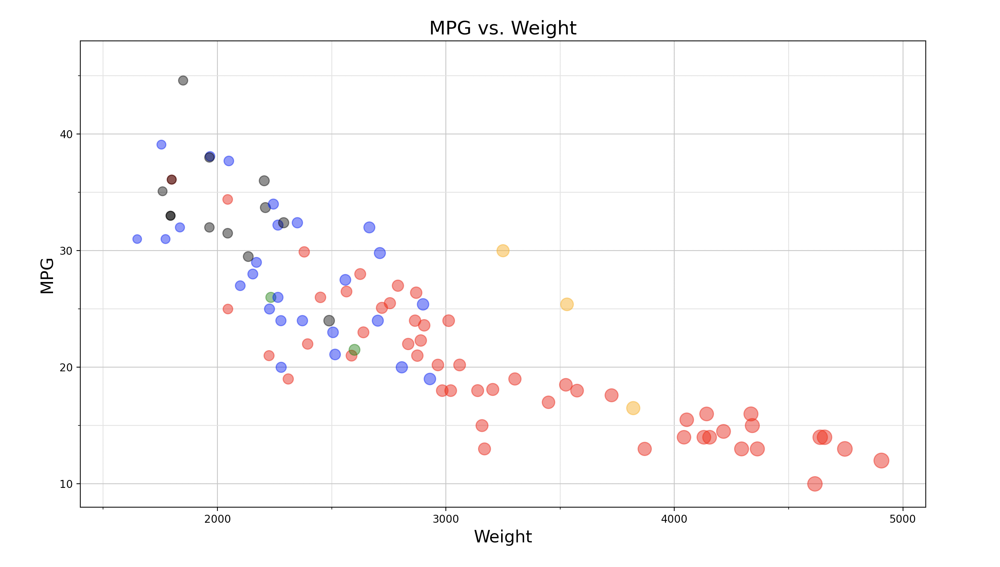

# 02-DataVis-5ways

Assignment 2 - Data Visualization, 5 Ways  
===

# d3

Using d3 was slightly more difficult for me than the rest of the visualizations simply because the documentation was new and somewhat confusing. After learning the ropes and getting the hang of things, I quickly found a way to complete the task. In the future I would consider using this tool for similar plots or visualizations where appearance matters. The plots are easy to stylize how I want. The trickiest part was probably figuring out how to get the major and minor axes correct, so to get that to work I had to implement a few functions in odd spots, where I'm pretty sure there would be a better way to do it in the future.

# Python

Python was relatively easy for me as I have been coding in Python for a few years now. I would consider using this tool if my visualization were very data intensive. Python is good at handling data and makes it easy to store data in an array of data structures. Handling large data sets is very easy with Python. The main challenge that I had to work with was using the plot object versus using the axis object. The difference between them was a little confusing but I believe I stumbled upon the correct usage for both.

# Excel

Excel was fairly quick for me, but was frustrating to find the correct graph settings. I used only the GUI provided, but if I had used google scripts it may have made the process a little easier. I would see this tool being useful if a graph needed to be whipped up quickly, but if stylistic preferences are very niche or specific, google sheets can most likely not achieve this.

# R

R was relatively easy for me to use. The only difficult part was figuring out that the RStudio IDE had a "Plots" tab where the output was stored. I spent an embarassingly long amount of time figuring out how to get any kind of output from ggplot2. I would probably use R if I wanted to make a simple graph or plot since it doesn't take very many lines of code to create an output. 

# Flourish

Flourish was super easy to use! The GUI provided on the webiste was extremely easy to use, and my only complaint is that sometimes the options tab on the right hand side of the screen gets long and cluttered. I would use this website in the future if I need to quickly set up a graph since it was very simple and easy to use. The designs look very professional, however if I wanted very specific stylistic attributes I would probably use something more diverse such as d3 or matplotlib in Python.

# Technical Achievements
I tried to achieve some technical feats in Python, which happened to be my downfall. I attempted to use matplotlib to create the bubble plot and have actions where you could mouse over certain data points or add labels, but with the way I set my code up this was very hard to implement. I ended up spending hours trying to get anything to work, before realizing I needed to re-write my code entirely. I ended up abandoning this idea and decided I wanted to add on-click abilities in d3 since I was familiar with javascript, however I was pressed for time and did not implement this feature. In short, I am a technical failure... this time :)

# Design Achievements
In excel, I could not figure out how to scale the bubble sizes down as I believe they would all be mapped to a certain range. I did, however manage to achieve this with every other method! In flourish and R this was easy, but with Python and d3 I struggled a bit. I learned how to normalize a range and map it to a differnt range in order to manipulate bubble size. As for colors, I chose simple but definite colors for each manufacturer. I was originally using pastel colors, but with the 50% opacity they became very similar in shade. My roommate who is colorblind walked by my computer and pointed out that he could barely tell that some of the bubbles were different colors. I decided to make the colors as defined as I could while still preserving the 50% opacity rule. I also tried to preserve the axis requirements as much as possible. In python and d3 specifically I had a hard time creating both major and minor axes because labeling axes was difficult and convoluted (especially in python), however I managed to learn some new things about each method and achieving that small goal.

