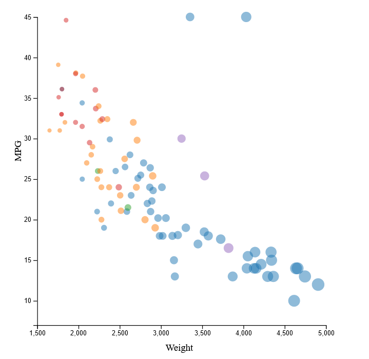
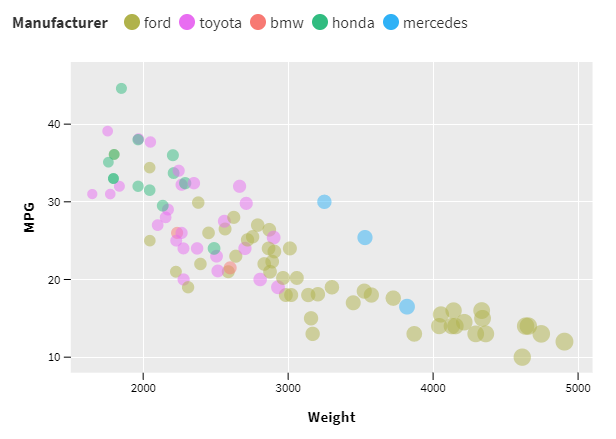

# 02-DataVis-5ways

Rachael Sallie 

# Vega-lite
For Vega-lite I started my code from the following template: https://vega.github.io/vega-lite/tutorials/getting_started.html

I found Vega-lite relatively easy to use, after reading through some of it's documentation. 
In order to encode each aspect of the graph (x axis, y axis, color, and size) I just had to provide the field and type 
from the given data. The data was easy to provide, just needing the url. I did have to do some guesswork with tickcount to provide the same tickmarks as the original image, as 5 for some reason provided many more ticks on one axis. 
Overall, Vega-lite seems like an easy way to make a variety of graphs by using different mark types like bar, line, circle, among many others.

# d3
The following code acted as a helpful starting point: https://bl.ocks.org/d3noob/5680dd0089abdc5b15f188d5efe48852

Of all 5 methods of graph creation I used, d3 was the most difficult. However this is due to the code example I was 
referencing being from an old version of d3. Trying to produce a similar graph with the same methods was not working, 
and for the longest time I could not understand why. Once I realived, it wasn't too hard to use when using examples and 
document from the correct version. However, as far as I'm aware, axis labels can't be added as simply as other 
libraries, so I had to fiddle with text placement to get the labels into a reasonable position. I could see d3 being
more useful for visualizations requiring fine control over each aspect, that other tools may not have the options to customize.

# ggplot2
This guide was my main source for learning ggplot2 syntax: https://bookdown.org/rdpeng/RProgDA/basic-plotting-with-ggplot2.html

Among the libraries used, ggplot2 cause the most initial confusion, but was the easier to generate a graph with after 
I got used to the syntax. It was very different from the programming languages I'm familiar with, but it ended up requiring the least amount of code to generate my graph with. It seems like a very easy way to generate plots from data, though I don't know if it supports interactivity and would have to dive deeper into the language. I picked this
library for my design and teach achievements, which I will describe later.

# Tableau 

I enjoyed using this tool a lot. After importing my data, it was simple to drag and drop attributes to different parts of the graph, as well as properties like color and size. It seems like it would be useful for generating graphs quickly 
to look for interesting trends. The graph came built in with the ability to hover over datapoints and see more information. Overall it was pleasant to use and I didn't run into any issues trying to recreate the graph.

# Flourish

Flourish was another easy to use tool. I simply had to supply the relevant column for x values, y values, colors, and size, as well as changing opacity, and that was enough to recreate the graph. Between the two non-library tools, I enjoyed using Tableau more than Flourish, but both are simple to use and don't have any glaring problems. Though, like 
Tableau, it's unable to get the fine tuning of a visualization that you could do with a code library, it does its job 
well and is another quick way to generate graphs.

# Tech Achievements:
In ggplot2, I cleaned the data to remove rows containing null values in Weight or MPG. I filtered the data again to find the cars with the highest MPG and highest weight. 

# Design Achievements:
To add more information to the visualization, I used shapes to display the country of origin for each vehicle. 
It was interesting to see that Japanese cars tended to weigh less and have a greater MPG while American cars weighed 
more with less MPG. I also attached labels to name the specific cars with the greatest MPG and the greatest weight. 

