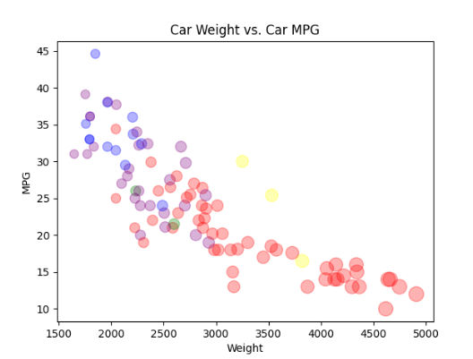

# 02-DataVis-5ways

Assignment 2 - Data Visualization, 5 Ways  
===

# R + ggplot2

R is a language primarily focused on statistical computing.
ggplot2 is a popular library for charting in R, having never used R before, I was a bit apprehensive, however, it turned out to be relatively
straightforward to use. The nicest part of R in my opintion is the ease at which it converts the csv file, as in the user does not need to
remove incomplete rows. The built in ggplot features were used to create the different sizes, the colors were selected using a color picker on the 
original graph give in the assignment in an attempt to create an image as close to the original as possible.

For R I used information from this webpage: https://statisticsglobe.com/plot-in-r-example as well as the R documentaion on import and graphing: http://lib.stat.cmu.edu/R/CRAN/manuals.html

# Excel

Excel is a very easy to use program that I am very familiar with, however, its usefullness peters out as you get into more complicated situations.
I imported the csv file, removed all of the columns that I was not using, and ordered the data by manufacturer, I used the excel scatterplot with 3
data inputs to assign the weight/25 to be the size of the width of the dots scaled to 25, this allowed me to make the graph increase the size of the dots as the
weight increased.

# Python + matplot

Python is a versitile language that is very intuitive and has a lot of great addons, such as matplot. 
I used matplot to make a plot, it is very simple to use matplot, and nothing was needed to take care
of the rows with missing variables. I created a color set and mapped the classes to the colors, I also
used viridis in the cmap to automatically change the intensity of the color.

For matplot I used information from: https://kanoki.org/2020/08/30/matplotlib-scatter-plot-color-by-category-in-python/

## Technical Achievements
- Used the three input excel scatterplot to make the size of the dots increase with vehicle weight.
- Created the color set and mapped the colors to it in python.
- Used viridis for the cmap.

### Design Achievements
- Downloaded the given graph and used a color picker to select colors for the Rplot graph
