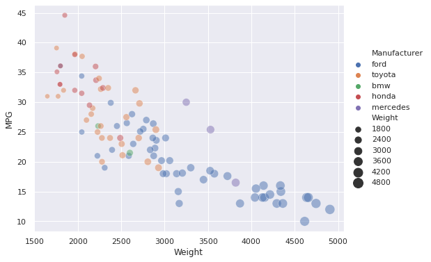
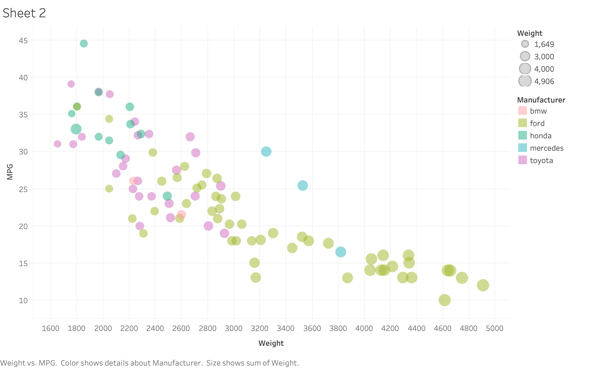

Assignment 2 - Data Visualization, 5 Ways  
===

# d3
  
d3 is a Javascript library that levages SVGs and HTML to build web-friendly data visualizations. To access the given data I used d3.csv(), for which I needed to run a local server to enable HTTP. I served the CSV as well as my d3.html locally in d3.js. Althrough creating the axis of the plot were difficult at first, I was able to follow along with <code></code> to get me started. After plotting the data, I was able to customize the graph and data points, and used <code></code> to help with the gridlines.

# excel
 
Mirosoft Excel is a spreadsheet software that contains tools for calculation, formulas, and graphing. To access the given data I opened the CSV in a new sheet and manually deleted the "NA" rows and extraneous columns. After experiementing the basic scatterplot, I decided to use the bubblechart, which allowed easier mainipulation of the data point sizes. That being said, although the sizes of the data points are different, it isn't as obvious as some of the other graphs. Except for the data point sizes, Excel was an simpler software to replicate this chart with, as it was already a familiar tool. 

# matlab
 
Matlab is a programming langauage and computing enviroment by MathWorks which supports complex calculations, algorithms, and graphs. I accessed the CSV using the readTable function, and then parsed the data to remove "NA" rows and separate the data by manufacturer to plot different series with unique colors. Being unfamiliar with Matlab, I struggled the most with this tool. I had wanted to plot all the data at once and change the color based on the individual point's manufacturer data, but after many different attempts decided to go with the simpler, albiet less consise, method of plotting each manufacturer's data separately.  

# matplotlib
 
Matplotlib is a Python library for graphing and data visulization. I used the Python library pandas to read in the CSV, and plotting the scatter was as simple as calling a single function. Due to my familiarity and the gentle learning curve of both Python and matplotlib I found this to be one of the easier methods of replicating the graph, and encountered no issues. 

# tableau
 
Tableau is a visual analytics platform focused on generating data visualizations. Despite having never used it before, I found it extremely intuituve to created highly customizable graphs. I was especially impressed with how it allowed me to scale the size of the data points using the size range feature, which allowed me to make the smaller data points even smaller (and vice versa for the larger data points) to highlight the difference between the two and get it as close as possible to the sample graph. 

## Technical Achievements
- **Plot Background**: Added the gray background and white gridlines for all plots. Please note that for some tools this was not possible to complete in it's entirity - I found that matlab and tableau did not support the customizable minor gridlines. 

### Design Achievements
- **Re-vamped Apple's Design Philosophy**: As demonstrated in my colorscheme...

- change colors 
- standardize fonts 
- add back tick marks 