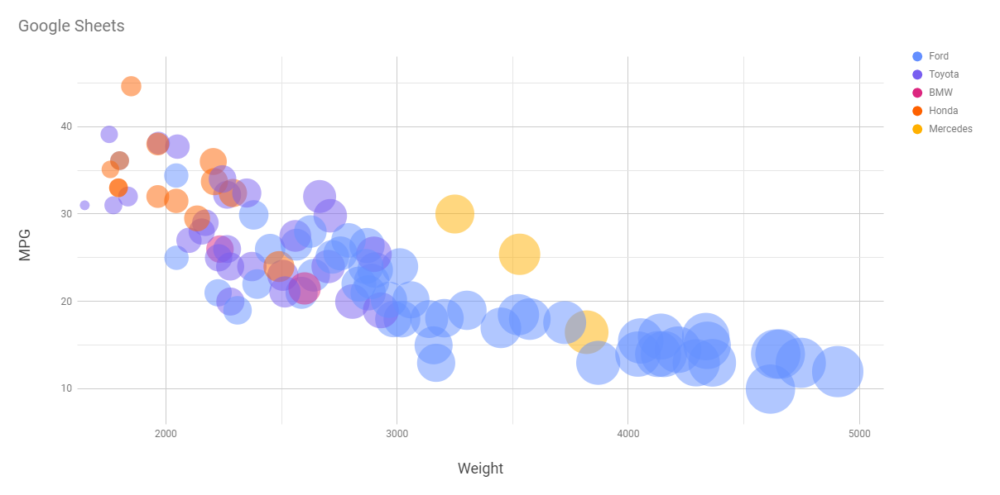

# 02-DataVis-5ways

Assignment 2 - Data Visualization, 5 Ways  
===
Original Visualization:

# d3

d3 is a javascript/html library used for creating data visualizations. Being inexperienced with all of the above, I find d3 a bit more challenging than other methods of generating charts.

# R & ggplot2

R is a programming language designed for use in statistics and managing datasets. Ggplot2 is a library for R that makes it easier to create better looking graphs. Given that the original visualization was made in R, using ggplot2, it was fairly straightforward to recreate almost perfectly.

# Google Sheets

Google sheets is very similar to excel in terms of functionality, but I find it easier to use since it's browser based and free. Google sheets has built in methods fpr generating graphs from datasets, with the caveat that will often default to the wrong type of chart, and will require some tweaking.

The bubble chart layout works well for the original image we're trying to replicate, so I used that. I had to tweak and label the axes, and disable the labels on the individual bubbles, but after that, it was pretty much done.

# Flourish

Flourish is an online tool for creating visualizations. Out of all the tools I used in this assignment, Flourish was the easiest to use, but it still retained plenty of functionality and versatility.

One neat thing about Flourish, was that it had a built-in method for enabling/disabling visibility of specific colors/manufactureres.

Unfortunately, you can't download the visualization in .html format with a free account, but I can see Flourish being extremelly useful in a professional context.

## Technical Achievements
- For the d3 implementation, users can mouse over the bubbles, and a tooltip will display the model of car that bubble represents.

### Design Achievements
- Made use of colorblind-friendly colors for points across all visualizations, courtesy of this interactive site:
	- https://davidmathlogic.com/colorblind/#%23D81B60-%231E88E5-%23FFC107-%23004D40
	
### Code Sources
- Found this site extremely helpful when working with d3, and modeled my d3 code on the given interactive examples:
	- https://www.d3-graph-gallery.com/index.html
