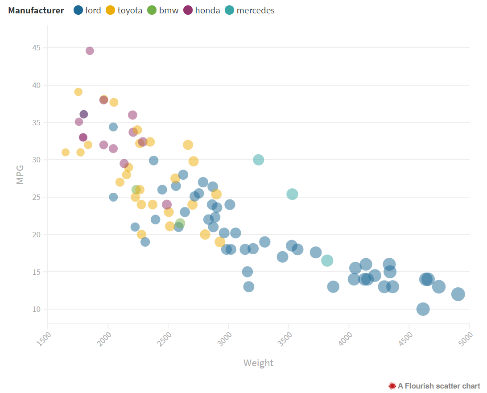

# 02-DataVis-5ways

Assignment 2 - Data Visualization, 5 Ways  
===

The attempted graph: 

Requirements:
- Data positioning: it should be a downward-trending scatterplot as shown.  Weight should be on the x-axis and MPG on the y-axis.
- Scales: Note the scales do not start at 0.
- Axis ticks and labels: both axes are labeled and there are tick marks at 10, 20, 30, etcetera.
- Color mapping to Manufacturer.
- Size mapping to Weight.
- Opacity of circles set to 0.5 or 50%.

Note that some software packages will make it **impossible** to perfectly preserve the above requirements. 
Be sure to note where these deviate.

Readme Requirements
---

A good readme with screenshots and structured documentation is required for this project. 
It should be possible to scroll through your readme to get an overview of all the tools and visualizations you produced.

- Write a paragraph for each visualization tool you use. What was easy? Difficult? Where could you see the tool being useful in the future? Did you have to use any hacks or data manipulation to get the right chart?

Other Requirements
---

0. Your code should be forked from the GitHub repo.
1. Place all code, Excel sheets, etcetera in a named folder. For example, `r-ggplot, matlab, mathematica, excel` and so on.
2. Your writeup (readme.md in the repo) should also contain the following:

- Description of the Technical achievements you attempted with this visualization.
  - Some ideas include interaction, such as mousing over to see more detail about the point selected.
- Description of the Design achievements you attempted with this visualization.
  - Some ideas include consistent color choice, font choice, element size (e.g. the size of the circles).

GitHub Details
---

- Fork the GitHub Repository. You now have a copy associated with your username.
- Make changes to fulfill the project requirements. 
- To submit, make a [Pull Request](https://help.github.com/articles/using-pull-requests/) on the original repository.

Grading
---

Grades on a 120 point scale. 
24 points will be based on your Technical and Design achievements, as explained in your readme. 

Make sure you include the files necessary to reproduce your plots.
You should structure these in folders if helpful.
We will choose some at random to run and test.

**NOTE: THE BELOW IS A SAMPLE ENTRY TO GET YOU STARTED ON YOUR README. YOU MAY DELETE THE ABOVE.**

# R + ggplot2 + R Markdown

R is a language primarily focused on statistical computing.
ggplot2 is a popular library for charting in R.
R Markdown is a document format that compiles to HTML or PDF and allows you to include the output of R code directly in the document.

To visualized the cars dataset, I made use of ggplot2's `geom_point()` layer, with aesthetics functions for the color and size.

I used X website to make this graph

# d3.js 
This is the graph that was made using d3.js. I used the D3.js documentation to create it. Having worked on this after having worked on it in Python, I am starting to appreciate some of the features that JavaScript has that Python does not.

(And so on...)

# Python + Altair 
When I saw that Altair/Vega-lite had a Python version, I decided to give it a try! It did take a lot of debugging to get everything installed and ready to go, but it's kind of cool how you can just export the graph to an html file using Python. It also has a lot of possibilities for interactivity. 

Because this library was created for JavaScript, it was a little bit weird to use JS-like syntax for python. 

To correctly load the csv file, I used to pandas library and I put the data I needed in a dictionary. 

# Python + Matplotlib
Like with Altair, I put the data that was needed in a dictionary for easier use. 

# Google Sheets
I decided to explore how this would be done with Google Sheets, since they do have a graph option. However, I then realized that you can't add transparency to google sheets charts and you also can't change the radious of the circles. Which looks like this:

However, I did find that Google has documentation to use their API with JavaScript! It was pretty cool and I am glad that I looked into it. It was fairly simple to add things to the graph, but I can see how it can get very difficult to do specific things to the graphs. 

# Tableau
It was suprisingly easy to make this graph with Tableau. Here's a screenshot of the settings I used and the graph I created: 

# Flourish
Flourish was also really easy to use! I can see how customizing parts of it might be hard

## Technical Achievements
- **Google API**: Used the Google Graph Documentation to create the chart to allow for the customization
- **Adding Interactivity**: When you hover over the google graph, you can see the specific attributes of the plot

### Design Achievements
- Trying my best to maintain the same color scheme in all of the graphs (except for the Google Graph update with JS) :)
