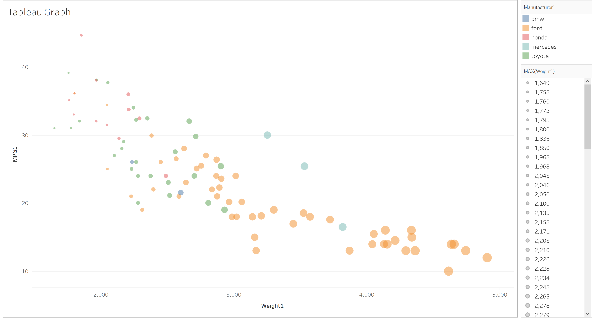

Live Link: http://www.kennyrhodes.com/projects/cs4802/project2

# Tableau

<h5>Tableau is a purpose build design software. I used a free trial and it was a dream to work with. I had never used it but its super easy and a ton of options. Easiest software for graphs I have used by far. It allows users to drag and drop data columns from tons of different file formats and has a very intuitive UI I used the software with pretty much zero Googleing which is extremely impressive. I would use this again.</h5>

# Flourish

<h5>Flourish is a purpose build design software. It is a free online based software. Again never used before but it was super nice to use. Their implementation for the axis ticks did cause me some issues but it was hardly difficult to use. I highly recommend it but it isnt as good as Tableau which basically makes the graphs for you. Second easiest to use.</h5>

# Python + Plotly

<h5>Python is a general purpose programming language. Plotly is a library I have had light experience with over the years, most recently trying to graph a multivariable equation in 3D to better understand some MQP data! For both python enabled graphs I used pandas to create a dataframe of data to work with. It was probably the 3rd easiest tool to use because of the use of dataframes to sort information rather than taking in different lists. I recommend Plotly for sure it makes very pretty and responsive graphs easy. Plotly outputs to a locally hosted browser that can display a graph and provide data about points hovered over.</h5>

# Python + MatPlotLib

<h5>Python is a general purpose programming lang. MatPlotlib is a library I have had light experience with over the years but I am more of a fan of plotly. MatPlotLib outputs directly to a PNG which is nice sometimes, as I had some issues with Plotly working with my browser during this project it did set me back some. It was probably the 4th easiest tool to use.</h5>

# Javascript + D3

<h5>Javascript is a general purpose programming lang. D3 is a library I enjoy but it kinda is a mess to make graphs with. I spent a lot of time searching through the tutorial pages in order to make it work but it was easy to put it on the site. It was the hardest tool to use for this project as the clunky method of adding scales and such was hard. However, I highly recommend it for any web based graphs necause of  its ability to be used directly in a browser to create interactive graphs. </h5>

## Technical Achievements
For the technical achievement this week I had first attempted to provided the csv data through a s3 bucket via the django db.
This simply didnt get done unfortunately due to time constraints but I did get the DNS routing to work for my website
so the URL is more memorable for users of the site! I also added this courses work to my website for real so that employers
and others can see my achievements in the class and otherwise! 

### Design Achievements
I redesigned my site's colorscheme and did my best to center all the graphs on the page. I also used CSS to try and scale them to similar sizes regardless of being on mobile or otherwise.