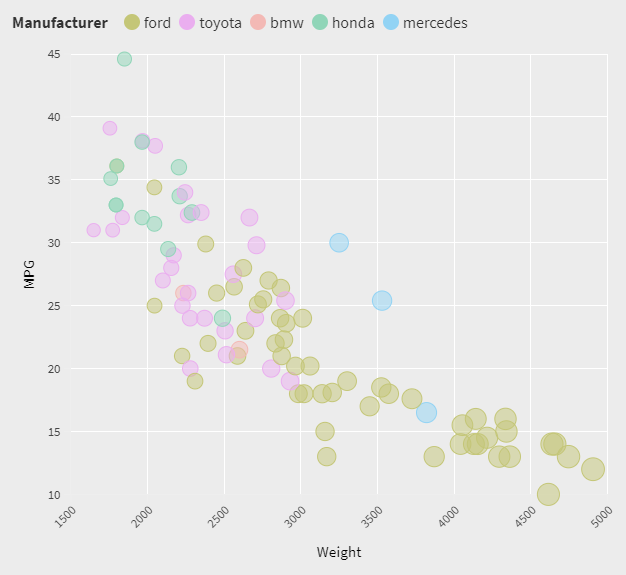

# 02-DataVis-5ways

Assignment 2 - Data Visualization, 5 Ways  
===

Standards
---

- Data positioning: it should be a downward-trending scatterplot as shown.  Weight should be on the x-axis and MPG on the y-axis.
- Scales: Note the scales do not start at 0.
- Axis ticks and labels: both axes are labeled and there are tick marks at 10, 20, 30, etcetera.
- Color mapping to Manufacturer.
- Size mapping to Weight.
- Opacity of circles set to 0.5 or 50%.

Technical & Design
---
I tried to keep the colors and the circle radii as consistent as possible throughout every graph.

# Flourish

Flourish is an extremely easy method of data visualization that relies on a visual interface.

To use it, I uploaded the data file, selected which columns held data I wanted to show, and customized it to my needs (with legends, colors, opacity, gridlines, etc). The axis minimum and maximum were customized, and while premade color palettes exist for the mapping, an easy override option allowed me to handpick colors for each grouping (which is why the colors pretty much match the sample graph). Lastly, the size mapping of the dots was a bit of a struggle. The smallest dot for 5 is very close in size to the largest dot for 405. I ended up realizing that they scaled the dots based on the maximum and minimum, so keeping those numbers close to the actual scale would basically allow for the biggest difference. Although the font is a little different, the closest free option is what I selected (the rest were all serified).

Overall, this tool was extremely easy to use with extremely satisfactory results.

# R + ggplot2

R is a language I am wholly unfamiliar with that is typically used for statistical computing, while ggplot2 is a common library to help make data visualizations in R.

I utilized a ggplot bubble plot to map weight to X, MPG to y, and weight to size. ggplot's `geom_point` was also useful in customizing aesthetics - in particular, the 50% opacity and using color to separate manufacturers.

While this tool combination required a lot of time and effort to understand the syntax, read through the documentation, and find the right commands, it came out with a highly satisfactory result. I believe it will take less time to create similar plots in the future. Maybe.

# D3 + HTML

D3 is a JavaScript library commonly used to manipulate and format documents based on data-driven transformations. HTML is the standard markup language for any documents meant to be displayed in a web browser.

Almost the entirety of this plot uses D3 (HTML was only used for the background color). I got familiar with the overall workings of D3 in the last assignment, so this one did not take nearly as long as the R + ggplot2 one did. I used a large amount of the code from the basic scatterplot documentation (https://www.d3-graph-gallery.com/graph/scatter_basic.html) to get started, while the majority was working on customizing things to better match the original graph or make it look prettier.

No legend or gridlines in this plot, because my brain was shutting down. Sorry.

The hardest part of this piece was actually loading the data. But after some reading, I now know more about localhosting!

# Microsoft Excel

Microsoft Excel is a spreadsheet software with many features including calculation, tables, graphing tools, and conditional formatting.

I haven't really touched Excel in years, so it took me a bit to find where everything was. It was nice that it had a bubble chart option, but it took me a bit to understand how to format and select the data in a way it liked. Otherwise, it was actually extremely easy to customize to be exactly what I wanted with its interface!

No legend, because my brain totally shut off and I forgot to add one. Sorry :(

# Python + Matplotlib + NumPy + Pandas

NumPy is a library for Python that adds support for high-level mathematical functions. Matplotlib is a library for Python that further adds plotting functionalities. Pandas is a Python library that allows for easier data analysis.

A lot of this graph was guessing and checking and hoping that the thing I changed was right. NumPy is a little bit more user-friendly than Matplotlib and provided access to the latter without having to directly use most of its commands. Pandas was primarily used to read and process the data entered through the cars sample file.

Again, no legend, because my eyes kind of hurt and reading is a little hard right now.
