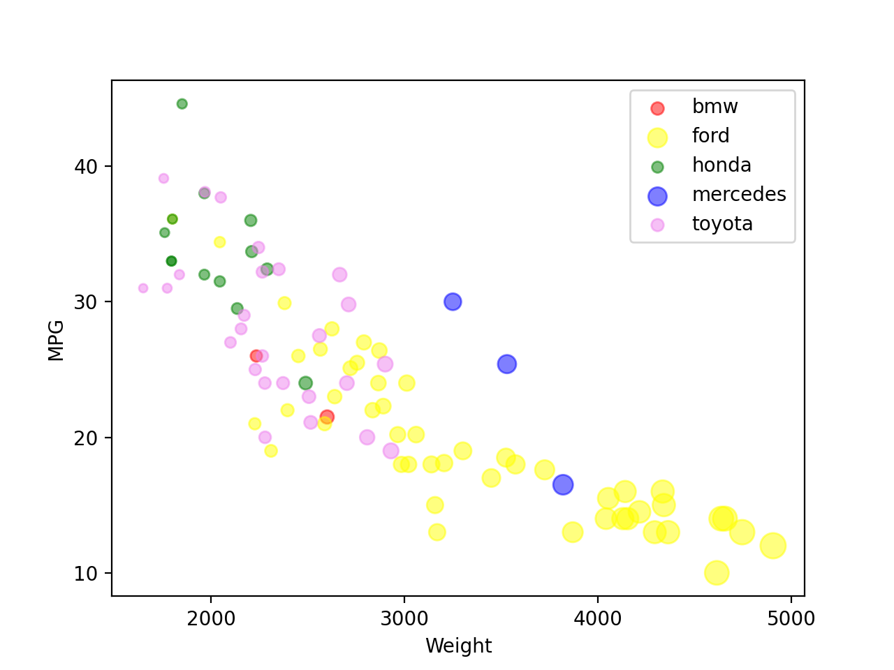

# d3.js

d3.js is a Javascript library that can manipulate webpages based on data.

To visualize the dataset, I created an x and y axis using d3.js's scaleLinear, axisBottom, and axisLeft API's. To create axis labels, I used d3.js to add text SVG elements to the document. Then, to create the dots in the scatter plot, I used d3's data() API to add a dot for each data entry, with a radius and color determined by the weight and manufacturer.

I found it cumbersome to use axes in d3. Regardless of the type of axis that is created, d3 will render the axis at (0,0) by default, requiring the developer to translate the axes to be able to see the axis ticks. Also, after moving the axes, the developer has to translate the dots in the scatter plot by the same amount as they translated the axes. Axes also didn't have enough features for customization. Axes didn't provide labels; I had to create them myself. I also couldn't find a way to define the amount that the axis ticks increased by. Apart from the trouble I had with the axis features, I found that d3 made it easy to dynamically create dots based on the dataset. Adding an attribute to the dots usually required only a few lines of code.

# Matplotlib + Pandas
Matplotlib is a Python library that can create visualizations. Pandas is a Python library used for creating and manipulating data tables.

I firstly used Pandas' read_csv() function to read the csv file into a table. Then, I used its drop_na() function to filter out dataset entries with empty values. I then used Pandas' groupby() function to group the entries by manufacturer. After doing that, I used a list comprehension to convert each group gained from groupby() into a dataframe for that group. For each group, I used dataframe.plot.scatter() (which uses matplotlib) to show a scatter plot for each group in its respective color.

Creating a visualization very quick and simple to set up. By default, the axes had labels and didn't start from zero. Changing the size, color, and opacity of the dots was as simple as adding arguments to the call to dataframe.plot.scatter(). Changing the tick values was also easy to do, as I only needed to call ax.set_xticks() or ax.set_yticks(). It took a little work to display the categories in different colors, however. To achieve this, I had to group the records by manufacturer and then make a plot for each group on the same set of axes.

# Tablesaw
Tablesaw is a Java library for creating data tables, manipulating data tables, and creating visualizations from them.

To create the visualization, I read the csv into a table, then used a query to select only the data records that didn't contain missing data. I calculated the sizes of the dots in a separate column. Then, I added this new column to the table. Then, I used the Plot.show(BubbleChart.create()) API to display the scatter plot.

Creating the plot was mostly simple, but I found a few parts cumbersome. Removing all records with missing values wasn't a direct operation on the table, for example. Instead, I had to make a selection on the columns to select values that weren't missing, then apply the selection to the table. In addition, the BubbleChart API only accepted the name of a column as an argument for the sizes of the dots. As a result, I had to create a new column to pass in sizes for the API. In addition, I wasn't able to change the axis ticks of the plot.

The code for this is available in the java folder, in the form of an IntelliJ project. It is in the java.zip folder, and is also in its unexported form.

# Flourish
Flourish is a web application for creating visualizations.

To create the visualization, I created a bubble chart and then uploaded the csv file. Then, I set columns used for the dots' sizes, the dots' colors, the x axis, and y axis. So far, this tool has been the easiest to use. Getting the colors and sizes I wanted was a quick process, as I didn't have to manipulate the table to do so. Editing the axes' minimum and maximum values were easy. The only issue that I ran into while using this tool was that I couldn't edit how much the axes' ticks increased by.

Below are the settings I used to create the plot:

# Vega-lite
Vega-lite is a Javascript library that can create visualizations.

To create a visualization, one has to create specification for a visualization. In the specification, I defined what data to use, the type of visualization, the sizes of the dots, and the colors of the dots. It was very quick and easy to create the visualization, but it took a while to figure out how to set the opacity of the dots. My only issue while working with Vega-lite was that I wasn't able to set the maximum size of the dots, so the dots' change of size with weight isn't very apparent.

## Technical Achievements
### d3
* Created an animation for the dots to fade in when they appear in the plot.
* Cleaned data by removing data records with no MPG from the dataset.
* Created a tooltip feature that shows a car's name and year when the user hovers over one of the dots.
* Created a feature allowing the user to display the plot with a different maximum X value and Y value.

### matplotlib + Pandas
* Cleaned data by removing data records with no MPG from the dataset.
* Added a legend to the plot.

### Tablesaw
* Cleaned data by removing data records with no MPG from the dataset.

### Design Achievements
### d3
* Changed font to Arial to make the text more appealing to the user.
* The fade in animation was intended to make viewing the plot a more pleasant experience for the user.
* When the user hovers over a dot, it becomes opaque and a black outline is shown around it. This is so that the user knows which dot's information is being shown.
* The feature that updates the maximum X and Y values displays an error message if the user's input is invalid. The error message lets the user know that they should only input numbers to use the features.
* Added a grey background to the plot to make it easier to see the dots. This was done because some of the dots were difficult to see on a white background.

### matplotlib + Pandas
* Added a legend to the plot to let the user know the corresponding manufacturer to each color.